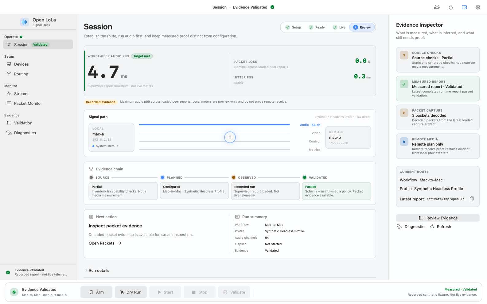

# Open LoLa

<picture>
  <source media="(prefers-color-scheme: dark)" srcset=".github/assets/open-lola-mark-dark.svg">
  
</picture>

Open LoLa is an independent source project for low-latency audio and video
interoperability. The repository contains:

- a macOS Swift package with reusable libraries;
- an `open-lola` command-line program;
- an `open-lola-app` SwiftUI operator application;
- a separate Python Linux compatibility connector;
- report schemas, validators, test fixtures, and release checks.

The application descriptor is: Configure, run, and verify low-latency media
sessions.

Open LoLa is not affiliated with or endorsed by the LoLa project,
Conservatorio di Musica Giuseppe Tartini, or GARR. The established
[LoLa system](https://lola.conts.it/) is licensed software developed by
Conservatorio Tartini with GARR.

This repository is an experimental source alpha. It is not a published
open-source release because [LICENSE](LICENSE) currently grants no rights.
Interfaces, report formats, arguments, and defaults may change.

## Project purpose and scope

The macOS implementation is audio-first. It configures media endpoints,
negotiates sessions, moves audio and video over direct network paths, and
records evidence about each run. The project keeps source validation,
localhost behavior, physical measurements, and reference-peer interoperability
as separate evidence classes.

The Linux package implements a compatibility connector for control exchange,
synthetic media, and subprocess-backed media adapters. It is not a native
low-latency Linux audio or video stack.

## Current capabilities and limitations

| Area | Current implementation |
|---|---|
| macOS package | SwiftPM libraries `OpenLolaCore`, `OpenLolaContracts`, and `OpenLolaAppSupport`; executables `open-lola` and `open-lola-app`; macOS 14 minimum. |
| Direct peer | Session negotiation, UDP audio and video transports, bounded queues, runtime reports, and report validation. |
| Audio | Core Audio inventory and runtime paths, UDP PCM, Opus CELT low-delay mode, AES67/ST 2110-30 packet handling, multichannel routing, drift handling, and receive-buffer policies. |
| Video | AVFoundation capture, raw and JPEG XS transport paths, fragmentation and reassembly, frame timing, multiple-stream staging, and local preview support. |
| External connectors | Source-level LoLa, UltraGrid/MVTP, and JackTrip plans, runners, process adapters, reports, and validators. |
| Linux connector | Python 3.11+ CLI with `selftest`, `status`, `listen`, and `connect` modes. |
| Operator application | SwiftUI Signal Desk for configuration, guarded execution, route status, diagnostics, and report review. |

The following work remains incomplete:

- physical two-Mac latency and stability measurements;
- verified RME MADI and Blackmagic hardware routes;
- reviewed Windows LoLa, UltraGrid, and JackTrip interoperability evidence;
- native low-latency Linux capture and playback;
- peer authentication and media integrity protection;
- distribution signing, notarization, Gatekeeper validation, and clean-Mac
  installation;
- source and documentation licensing approval.

Source tests, synthetic reports, localhost runs, and screenshots do not prove
field interoperability or measured latency.

## Signal Desk

[Open the static Signal Desk demo](https://sebastianspicker.github.io/open-lola/)
uses sanitized fixture data. Every command-capable action is visibly marked as
simulated, and the page does not access local devices, media, files, or network
peers.

<picture>
  <source media="(prefers-color-scheme: dark)" srcset=".github/assets/open-lola-signal-desk-dark.png">
  
</picture>

The checked-in light and dark images are 1586 by 992 pixel offline renders of
the current SwiftUI view hierarchy. They do not show a live media session.

## Requirements and prerequisites

### macOS

- macOS 14 or newer;
- Xcode with SwiftPM and the macOS SDK;
- Xcode 26.6 with Swift 6.3.3 for the pinned primary CI job.

The package links AppKit, AVFoundation, Core Audio, Core Graphics, Core Image,
ImageIO, Core Media, and Uniform Type Identifiers. It has no external SwiftPM
package dependencies.

### Python

- Python 3.11 or newer;
- Python 3.14.6 for the pinned primary verification job;
- `uv` 0.10.7;
- optional `scapy` support through the `pcap` extra.

### Development tools

- `shellcheck` for the complete shell verification lane;
- Docker only for the optional UltraGrid and JackTrip comparison scripts;
- physical media hardware only for hardware and field evidence.

## Installation

There is no published installer or package. Work from a source checkout.

Build the Swift products:

```bash
export OPEN_LOLA_SWIFT_BUILD_PATH=/private/tmp/open-lola-swiftpm-build
export OPEN_LOLA_TEST_OPEN_LOLA_CLI="$OPEN_LOLA_SWIFT_BUILD_PATH/debug/open-lola"

swift build --disable-sandbox \
  --scratch-path "$OPEN_LOLA_SWIFT_BUILD_PATH"
```

Create the locked Python development environment:

```bash
export UV_CACHE_DIR=/private/tmp/open-lola-uv-cache
export UV_PROJECT_ENVIRONMENT=/private/tmp/open-lola-uv-env

uv sync --locked --extra dev
```

The external paths prevent build products, caches, and virtual environments
from entering the checkout.

## Configuration

The Swift CLI uses command-specific arguments rather than a global
configuration file:

```bash
"$OPEN_LOLA_TEST_OPEN_LOLA_CLI" --help
"$OPEN_LOLA_TEST_OPEN_LOLA_CLI" direct-p2p-session-run --help
```

Network commands accept explicit local and remote addresses, ports, device
identifiers, media modes, report paths, and evidence fields. Review every
address and device identifier before using a physical interface.

The Linux connector requires `--local-ip` before its subcommand:

```bash
python3 -m linux_connector.lola_connector.cli --help
```

Subprocess media adapters are opt-in through:

- `--audio-capture-cmd`;
- `--audio-playback-cmd`;
- `--video-capture-cmd`;
- `--video-display-cmd`.

These commands run with the current user's permissions. Use reviewed absolute
executable paths on a controlled host.

Common development environment variables:

| Variable | Purpose |
|---|---|
| `OPEN_LOLA_SWIFT_BUILD_PATH` | SwiftPM scratch directory used by local checks and CI. |
| `OPEN_LOLA_TEST_OPEN_LOLA_CLI` | CLI executable used by verification scripts. |
| `UV_CACHE_DIR` | External `uv` cache directory. |
| `UV_PROJECT_ENVIRONMENT` | External Python environment directory. |
| `OPEN_LOLA_APP_LAUNCH_EVIDENCE_DIR` | Optional output directory for local app verification. |
| `OPEN_LOLA_SKIP_INTERACTIVE_APP` | Skips only the interactive app probe in headless CI when set to `1`. |

Connector-specific variables are documented in [scripts/README.md](scripts/README.md).

## Usage

Inspect the Swift command inventory:

```bash
"$OPEN_LOLA_TEST_OPEN_LOLA_CLI" --help
"$OPEN_LOLA_TEST_OPEN_LOLA_CLI" command-inventory
"$OPEN_LOLA_TEST_OPEN_LOLA_CLI" session-capabilities
```

Build and launch the local macOS application:

```bash
bash scripts/macos/build_and_run.sh run
```

The script creates `dist/OpenLoLa.app` with ad-hoc local signing. The bundle is
not notarized or prepared for distribution.

Run the Linux connector's localhost self-test:

```bash
uv run --locked python -m linux_connector.lola_connector.cli \
  --local-ip 127.0.0.1 selftest --duration 0.25
```

See [linux_connector/docs/quickstart.md](linux_connector/docs/quickstart.md)
for status, listen, connect, and process-backed media examples.

## Repository structure

| Path | Contents |
|---|---|
| `Sources/OpenLolaCore/` | Protocol, transport, media, connector, platform, report, and validation logic. |
| `Sources/OpenLolaContracts/` | Framework-independent shared report contracts. |
| `Sources/COpenLolaAtomics/` | C atomics used by realtime Swift code. |
| `Sources/open-lola/` | Swift CLI command registry and handlers. |
| `Sources/open-lola-app/` | `OpenLolaAppSupport` SwiftUI target, application support, and views. |
| `Sources/open-lola-app-main/` | Application executable entry point. |
| `Sources/opus-1.5.2/` | Vendored Opus source and the local C bridge. |
| `Sources/xs_ref_sw_ed2/` | Vendored JPEG XS reference source. |
| `Tests/OpenLolaCoreTests/` | Swift unit, contract, fixture, CLI, policy, and runtime tests. |
| `linux_connector/` | Python connector, tests, environment helpers, and documentation. |
| `linux_connector/deployment/wsl/` | WSL, Docker, and Windows lab deployment helpers. |
| `.github/assets/` | Versioned identity assets and deterministic documentation images. |
| `.github/workflows/` | CI verification workflow. |
| `scripts/macos/` | macOS app, screenshot, icon, and brand helpers. |
| `scripts/` | Verification, source export, and external-connector comparison tools. |
| `docs/` | Architecture, operation, testing, security, and release references. |

## Development workflow

1. Inspect the affected source, tests, command registration, and documentation.
2. Make the smallest change that preserves report and wire compatibility.
3. Run the narrow tests for the affected subsystem.
4. Run the documentation, boundary, language-specific, and full test gates that
   apply.
5. Report measured results separately from unavailable hardware or external
   checks.

Do not add production dependencies without updating the relevant manifest,
notices, release boundary, and tests.

## Testing

Run the public documentation and repository-boundary checks:

```bash
bash scripts/verify-docs.sh
PYTHONDONTWRITEBYTECODE=1 python3 -m scripts.verify_docs
PYTHONDONTWRITEBYTECODE=1 python3 scripts/verify_source_documentation.py
bash scripts/verify-tracked-boundary.sh
bash scripts/verify-release-hygiene.sh
shellcheck -x scripts/*.sh scripts/lib/*.sh scripts/macos/*.sh linux_connector/deployment/wsl/*.sh
```

Run the Swift suite serially because some tests share process and network
resources:

```bash
swift test --disable-sandbox --no-parallel \
  --scratch-path "$OPEN_LOLA_SWIFT_BUILD_PATH"
```

Run the locked Python checks:

```bash
uv lock --check
uv run --locked --extra dev ruff check \
  linux_connector scripts/verify_docs scripts/lib/*.py
uv run --locked --extra dev python -m mypy --strict \
  linux_connector/lola_connector scripts/verify_docs scripts/lib/*.py
PYTHONDONTWRITEBYTECODE=1 uv run --locked --extra dev \
  python -m pytest -p no:cacheprovider linux_connector/tests
```

The primary CI job runs the combined verification script:

```bash
bash scripts/verify-release-readiness.sh
```

See [docs/testing.md](docs/testing.md) for test categories and external evidence
gates.

## Operation and packaging

There is no supported production deployment. The macOS application is built
and launched locally with `scripts/macos/build_and_run.sh`. The Linux connector is run
from the checkout as a Python module.

From a clean, approved checkout, create an inspection candidate outside the
repository:

```bash
bash scripts/export-release-candidate.sh /private/tmp/open-lola-release
```

The exporter refuses a dirty checkout by default. Setting
`OPEN_LOLA_ALLOW_DIRTY_INSPECTION=1` permits a local inspection export, but the
result is not release provenance and must not be published.

No script in this repository publishes a package or GitHub release. See
[docs/RELEASING.md](docs/RELEASING.md) for the remaining approval and evidence
requirements.

## Troubleshooting

- SwiftPM sandbox denial: rerun with `--disable-sandbox` and an explicit
  scratch path under `/private/tmp`.
- Python cache permission errors: set `UV_CACHE_DIR`,
  `UV_PROJECT_ENVIRONMENT`, `MYPY_CACHE_DIR`, and `RUFF_CACHE_DIR` to writable
  directories outside the checkout.
- Socket test failures: confirm that the host permits loopback listeners before
  classifying `EPERM`, `bindFailed`, or `sendFailed` as source regressions.
- Missing camera, microphone, or local-network access: grant the corresponding
  macOS permission and rerun the exact probe.
- External connector failure: verify the executable path, image reference,
  peer address, port mapping, and local firewall before interpreting a report.
- App launch failure: use `bash scripts/macos/build_and_run.sh --logs` and inspect the
  staged bundle under `dist/OpenLoLa.app`.

## Security considerations

Current control and media protocols do not authenticate peers. Use explicit
bind and peer addresses on an isolated network with trusted operators. Do not
expose listeners to the public internet or an untrusted shared network.

The UltraGrid compatibility passphrase can appear in process metadata and uses
protocol-compatible MD5 key derivation. Do not use a confidential credential.

Treat packet captures, media captures, device identifiers, hostnames, route
details, and runtime reports as potentially sensitive. Follow
[SECURITY.md](SECURITY.md) for vulnerability reporting.

## Contribution guidance

Read [CONTRIBUTING.md](CONTRIBUTING.md) before opening a change. Pull requests
must identify the affected source revision, commands run, unavailable checks,
and the evidence scope of any changed claim.

[SUPPORT.md](SUPPORT.md) describes the current support boundary.
[CODE_OF_CONDUCT.md](CODE_OF_CONDUCT.md) applies to project participation.

## License

[LICENSE](LICENSE) currently grants no rights. Review
[THIRD_PARTY_NOTICES.md](THIRD_PARTY_NOTICES.md) before copying or
redistributing any source or assets.

VERDICT: PARTIAL
