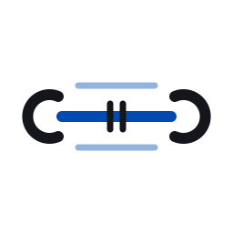
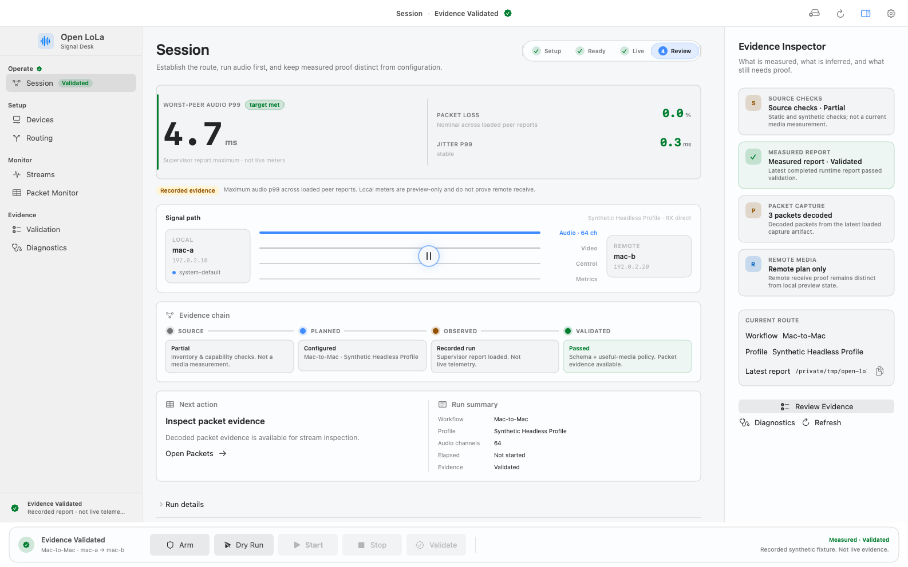
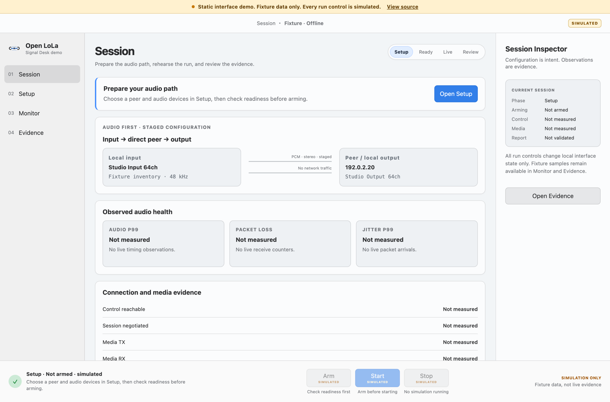
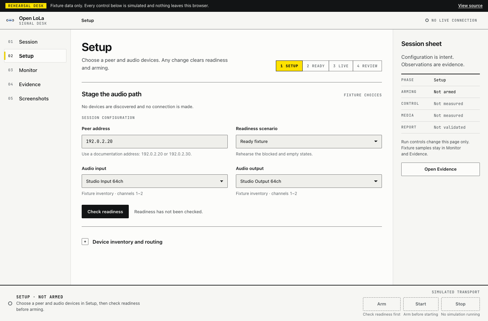
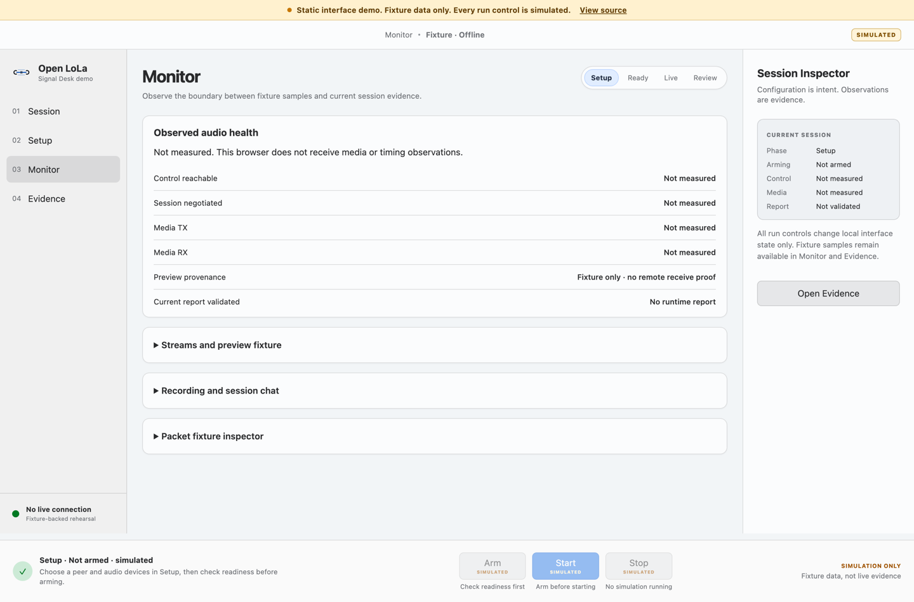
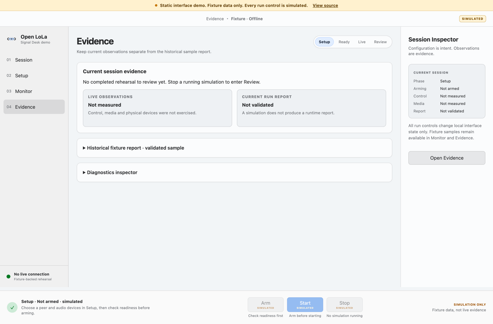

<div align="center">

<picture>
  <source media="(prefers-color-scheme: dark)" srcset=".github/assets/open-lola-mark-dark.svg">
  
</picture>

# Open LoLa

**An independent, experimental source project for configuring, running, and measuring low-latency audiovisual sessions.**


[](LICENSE)

</div>

Open LoLa contains a native **macOS operator application and CLI** and a single **Rust
station** for Windows and native Linux. The two runtimes share protocol and
evidence conventions; they do not share runtime code.

> Open LoLa is not affiliated with or endorsed by the LoLa project,
> Conservatorio di Musica Giuseppe Tartini, or GARR.

## Screenshot tour

The Signal Desk is the macOS operator surface. It keeps configuration, measured
observations, and report validation visually separate, so a synthetic or local
run cannot be mistaken for field evidence.

<picture>
  <source media="(prefers-color-scheme: dark)" srcset=".github/assets/open-lola-signal-desk-dark.png">
  
</picture>

*Offline render of the real SwiftUI hierarchy with a synthetic fixture. It is not a
live measurement.*

Four workspaces carry a session from intent to evidence:

| Workspace | What it is for |
|---|---|
| **Session** | Arm, run, and follow the recorded evidence chain |
| **Setup** | Devices, routing, and the direct-peer connection |
| **Monitor** | Streams, packet fixtures, and local preview |
| **Evidence** | Report validation and diagnostics |

The browser demo mirrors those four workspaces with fixture data. These views are
rendered from [web/demo](web/demo), not from live hardware:

<p align="center">
  
  
</p>
<p align="center">
  
  
</p>

Want to click through it yourself? [web/demo](web/demo) is a static, fixture-backed
walkthrough that runs in any browser. It changes only local interface state: no device
discovery, network access, or native code.

## Status

The repository is a source alpha with a `PARTIAL` product verdict. Local builds,
loopback traffic, synthetic reports, and offline UI renders do not prove physical
latency, device compatibility, reference-peer interoperability, hostile-network safety,
signing, notarization, or distribution readiness. See [current state](docs/current-state.md)
for the exact evidence boundary.

## Components

| Path | Purpose | Technology | Independent use | Documentation |
|---|---|---|---|---|
| `runtimes/macos/` | Operator app, CLI, direct-peer sessions, media adapters, integrations, and evidence | SwiftPM, SwiftUI, AppKit, Core Audio, AVFoundation | Built and run on macOS 14 or later | [Architecture](docs/architecture.md) |
| `runtimes/rust-station/` | Windows and Linux LoLa 2.0 station with native and diagnostic backends | Rust, egui, ALSA, V4L2, PortAudio, XIMEA, Npcap | Cargo package and `rusty-lola` executable | [Rust station](runtimes/rust-station/README.md) |
| `web/demo/` | Fixture-backed Signal Desk walkthrough | Static HTML, CSS, JavaScript | Served by any static file server | This README |
| `tools/` | Local app packaging, asset generation, and source export | Shell and Swift | Invoked from the repository root | [Tool index](tools/README.md) |

The macOS Swift target graph, runtime flows, state ownership, and integration boundaries
are documented in [docs/architecture.md](docs/architecture.md).

## Prerequisites

The macOS build currently uses:

- Xcode 26.6 with Swift 6.3.3;
- stable Rust with Cargo.

Windows is required for the station's XIMEA, PortAudio/ASIO, Npcap, and native
GUI evidence. Native Linux device validation targets Ubuntu 24.04 x86_64;
see [Linux migration and validation](docs/linux-migration.md).

## Quick start

Run the following commands from the repository root.

Build the macOS package outside the checkout and inspect the CLI:

```bash
swift build --disable-sandbox \
  --target open-lola \
  --scratch-path /private/tmp/open-lola-swiftpm-build
OPEN_LOLA_CLI="$(swift build --disable-sandbox \
  --scratch-path /private/tmp/open-lola-swiftpm-build \
  --show-bin-path)/open-lola"
"$OPEN_LOLA_CLI" --help
"$OPEN_LOLA_CLI" session-capabilities
```

In a graphical macOS session, assemble and launch the ad-hoc local test bundle:

```bash
OPEN_LOLA_APP_DIST_DIR=/private/tmp/open-lola-app-dist \
OPEN_LOLA_SWIFT_BUILD_PATH=/private/tmp/open-lola-swiftpm-build \
  bash tools/macos/build_and_run.sh run
```

This helper is for local validation, not distribution signing or notarization.

Run the Rust station self-test (synthetic localhost media):

```bash
cargo run -p rusty-lola --no-default-features -- selftest --duration 0.25
```

Run the Rust station help:

```bash
cargo run -p rusty-lola -- --help
```

Serve the static demonstration:

```bash
python3 -m http.server 4173 --bind 127.0.0.1 --directory web/demo
```

The demonstration changes only local browser state. It cannot discover
devices, launch native software, open media streams, or contact peers.

## Configuration

The runtimes use different configuration systems: macOS operator settings are
persisted in `UserDefaults`, the Rust station layers settings/session files and
CLI overrides for Windows and Linux.
See [docs/configuration.md](docs/configuration.md) for precedence, storage, and
trusted-input boundaries.

## Build checks

Build both runtimes and check the retained scripts:

```bash
make verify
```

`make verify` checks local builds and lint. It does not establish hardware,
peer, signing, or distribution evidence.

## Compatibility and security

Intentional public contracts include SwiftPM product/module names, the native
runtime CLIs, report and persistence formats, the Rust package/settings format,
and documented wire behavior. See
[docs/source-contracts.md](docs/source-contracts.md).

Current control and media paths do not authenticate peers. Use isolated,
trusted networks and reviewed local executables. Read [SECURITY.md](SECURITY.md)
before operating a listener or a process-, DLL-, SSH-, or packet-capture-based
integration.

## Contributing and release policy

Read [CONTRIBUTING.md](CONTRIBUTING.md) before changing an owning boundary.
Source-candidate preparation is documented in [docs/RELEASING.md](docs/RELEASING.md).

First-party source and documentation are licensed under
[Apache-2.0](LICENSE). Third-party obligations are described in
[THIRD_PARTY_NOTICES.md](THIRD_PARTY_NOTICES.md) and [LEGAL.md](LEGAL.md).
