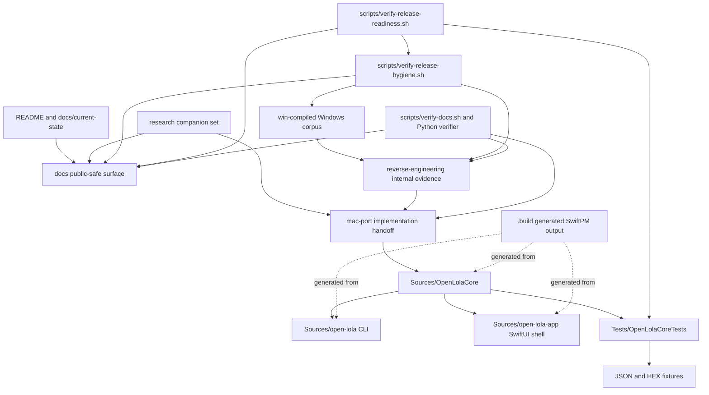
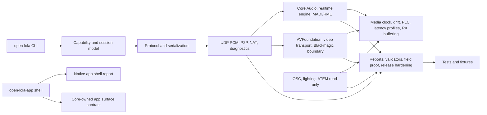

# Module Responsibility Map

Date: 2026-05-04  
Status: source and artifact responsibility map  
Scope: current SwiftPM package, docs, evidence corpus, and generated output  
Verdict: PARTIAL

## Package-Level Responsibility

| Module/component | Purpose | Inputs | Outputs | Dependencies | Related tests | Related documentation | Runtime role | Criticality | Improvement opportunities |
|---|---|---|---|---|---|---|---|---|---|
| `OpenLolaCore` | Shared runtime/report/protocol library. | CLI args after parsing, device inventory, route configs, fixtures, measured reports, app-shell surface contract. | JSON reports, validation verdicts, packets, synthetic smoke outputs, runtime contracts, command inventory JSON, source ownership inventory JSON, schema inventory JSON, realtime path inventory JSON, network route matrix JSON, video/control degrade matrix JSON, app-shell surface probe JSON. | Foundation, AVFoundation, CoreAudio, CoreMedia. | `Tests/OpenLolaCoreTests/*.swift`, `CLICommandInventoryTests.swift`, `SourceOwnershipInventoryTests.swift`, `ReportSchemaInventoryTests.swift`, `RealtimeAudioPathInventoryTests.swift`, `NetworkRouteCommandMatrixTests.swift`, `VideoControlDegradeMatrixTests.swift`, `NativeAppShellTests.swift`. | `docs/architecture/`, `docs/source-contracts/`, `mac-port/`, `docs/review/cli-command-inventory.md`, `docs/review/source-ownership-inventory.md`, `docs/review/report-schema-inventory.md`, `docs/review/realtime-audio-path-inventory.md`, `docs/review/network-route-command-matrix.md`, `docs/review/video-control-degrade-matrix.md`, `docs/review/companions/C11_MACOS_APP_SHELL_RUNTIME_READINESS.md`. | Core implementation and contract layer. | critical | C02 moved low-risk shared support into `Sources/OpenLolaCore/Core/`; keep C02/C05/C06/C07/C11 inventories updated before route, audio-sensitive, AV/control, app-shell, or source-move batches. |
| `open-lola` | Command-line interface for validators, smokes, and run commands. | Shell arguments and file paths. | Console output, report files, validation verdicts, command inventory output, source ownership inventory output, schema inventory output, realtime audio path inventory output, network route matrix output, video/control degrade matrix output, app-shell surface probe output. | `OpenLolaCore`, Foundation, Darwin. | `CLICommandInventoryTests.swift`, `SourceOwnershipInventoryTests.swift`, `ReportSchemaInventoryTests.swift`, `RealtimeAudioPathInventoryTests.swift`, `NetworkRouteCommandMatrixTests.swift`, `VideoControlDegradeMatrixTests.swift`, `NativeAppShellTests.swift`, core tests, C08 matrix tests. | `README.md`, `mac-port/VALIDATION_CHECKLIST.md`, `docs/review/cli-command-inventory.md`, `docs/review/source-ownership-inventory.md`, `docs/review/report-schema-inventory.md`, `docs/review/realtime-audio-path-inventory.md`, `docs/review/network-route-command-matrix.md`, `docs/review/video-control-degrade-matrix.md`, `docs/review/verification-matrix.md`. | User/developer execution surface. | critical | C01 command index, C02 source ownership inventory, C03 validator/schema inventory, C05 route matrix, C06 realtime path inventory, C07 video/control matrix, C10 verification, C11 app-shell probe, and C12 hygiene are implemented; continue higher-risk domain moves only through scoped batches. |
| `open-lola-app` | SwiftUI app shell for runtime/configuration visibility. | Synthetic native app shell report and core-owned surface contract. | Native window UI with overview, configuration, metrics, boundaries, permissions, and launch-probe sections. | SwiftUI, `OpenLolaCore`. | `NativeAppShellTests.swift`. | `docs/architecture/`, `mac-port/milestones/M13_NATIVE_APP_SHELL.md`, `docs/review/companions/C11_MACOS_APP_SHELL_RUNTIME_READINESS.md`. | UI/control shell, not realtime owner. | high | Record real launched-window evidence; keep SwiftUI outside realtime audio/video/control ownership. |
| `OpenLolaCoreTests` | Source-contract and fixture validation suite. | Swift source, JSON/HEX fixtures, script/doc contracts. | Test pass/fail. | Swift Testing/XCTest via SwiftPM test target. | self. | `scripts/README.md`, `mac-port/VALIDATION_CHECKLIST.md`, `docs/review/verification-matrix.md`, `docs/review/release-artifact-hygiene.md`. | Verification surface. | critical | Mirror future source folders, keep C12 script/doc contract tests current, and add hardware/benchmark test lanes. |
| `scripts.verify_docs` | Local documentation/evidence verification harness. | Markdown docs, Windows corpus, reverse-engineering static docs. | Documentation verification pass/fail. | Python stdlib, Bash. | none visible. | `scripts/README.md`. | Docs and evidence gate. | high | Keep as the docs sub-gate under C10 release-readiness verification. |
| `export-release-candidate` | Allowlisted source candidate staging command. | Release manifest allowlist, source tree, public docs, compliance packet, scripts, tests. | Staged candidate directory and C12 hygiene result. | Bash, `cp`, `find`, `date`. | `ReleaseArtifactHygieneContractTests.swift`. | `scripts/README.md`, `docs/review/release-artifact-hygiene.md`, `docs/compliance/release-manifest.md`, `docs/review/verification-matrix.md`. | Release staging tool, not publication approval. | critical | Keep allowlist synchronized with reviewer decisions; continue excluding raw RE, vendor binaries, generated output, and `docs/review/`. |
| `verify-release-hygiene` | C12 repository-policy and optional candidate-directory hygiene gate. | `.gitignore`, `Package.swift`, notices, dependency review, release manifest, staged candidate directory. | Verification pass/fail and final `VERDICT: PASS`; failure on generated output, internal evidence, vendor binaries, package artifacts, local secrets, or dependency/notice drift. | Bash, `find`, `grep`. | `ReleaseArtifactHygieneContractTests.swift`. | `scripts/README.md`, `docs/review/release-artifact-hygiene.md`, `docs/compliance/release-manifest.md`, `docs/compliance/dependency-license-review.md`, `THIRD_PARTY_NOTICES.md`, `docs/review/companions/C12_ARTIFACT_DEPENDENCY_GENERATED_OUTPUT_HYGIENE.md`. | Release artifact hygiene gate. | critical | Keep `export-release-candidate` calling it with `OPEN_LOLA_RELEASE_CANDIDATE`; keep non-destructive. |
| `verify-release-readiness` | Local/CI release-readiness parity gate. | Repo source, docs, scripts, SwiftPM package, C12 hygiene policy, CLI inventory probes, workflow boundary. | Verification pass/fail and final `VERDICT: PASS`. | Bash, Python docs verifier, shellcheck, SwiftPM, C12 hygiene gate. | `VerificationToolingContractTests.swift`, `ReleaseArtifactHygieneContractTests.swift`. | `scripts/README.md`, `docs/review/verification-matrix.md`, `docs/review/companions/C10_VERIFICATION_TOOLING_AND_CI_PARITY.md`, `docs/review/companions/C12_ARTIFACT_DEPENDENCY_GENERATED_OUTPUT_HYGIENE.md`. | Release verification gate. | critical | Keep non-publishing; add only non-mutating probes unless release evidence gates are explicitly provisioned. |

## Functional Source Modules

| Module/component | Purpose | Inputs | Outputs | Dependencies | Related tests | Related docs | Runtime role | Criticality | Improvement opportunities |
|---|---|---|---|---|---|---|---|---|---|
| Capability/session model | Peer identity, capability JSON, session protocol, negotiation, control messages. | Local capability defaults, peer/session metadata. | Capability JSON, negotiation decisions, control/session contracts. | Foundation. | `CapabilitySummaryTests.swift`, `SessionProtocolTests.swift`, `SessionNegotiationTests.swift`, `PeerSessionRunnerTests.swift`. | `docs/architecture/open-lola-protocol.md`, `docs/architecture/e2e-p2p-session.md`. | Negotiates and describes supported runtime modes. | critical | Keep protocol clean-room and versioned; add packet/control diagrams. |
| UDP PCM transport | Packet formats, v2 fragmentation, socket operations, loopback, route runs, route certification. | Audio frames, socket endpoints, route config, DSCP settings, packet fixtures. | UDP packets, route reports, loopback reports, validation verdicts. | Darwin sockets/Foundation. | `UdpPcmPacketTests.swift`, `UdpPcmV2PacketTests.swift`, `UdpPcmRouteReportTests.swift`, `UdpPcmLoopbackLatencyTests.swift`, `UdpMediaTransportTests.swift`. | `docs/architecture/multichannel-transport.md`, `docs/source-contracts/MXX-rme-matrix-multichannel.md`. | Lowest-level network audio transport. | critical | Separate protocol structs from socket/runners; add packet fixture index. |
| P2P/NAT/network diagnostics | Direct P2P, NAT-friendly route, rendezvous/relay fallback, diagnostics, route command matrix. | Peer IDs, host/port config, route measurements, CLI route commands. | Diagnostics, direct session reports, NAT route reports, route evidence-boundary matrix. | UDP sockets/Foundation. | `NetworkDiagnosticsTests.swift`, `NatFriendlyRouteTests.swift`, `MacToMacRouteCertificationTests.swift`, `NetworkRouteCommandMatrixTests.swift`. | `docs/architecture/p2p-networking.md`, `docs/review/network-route-command-matrix.md`, `mac-port/reports/F11*`, `mac-port/reports/F12*`. | Route establishment and validation. | critical | C05 now keeps fastest/direct and NAT/WAN-stable modes separate; next missing proof is measured route evidence. |
| Core Audio and loopback | Core Audio device inventory, audio loopback run/config/helpers. | macOS audio devices, loopback config. | Inventory reports, loopback reports. | CoreAudio. | `CoreAudioInventoryTests.swift`, `AudioLoopbackRunTests.swift`. | `docs/architecture/audio-rme-madi.md`, `mac-port/milestones/M02*`, `M03*`. | Local audio hardware discovery and loopback validation. | critical | Add real device evidence and inventory provenance. |
| Realtime audio engine | Realtime buffers, engine, packet handoff, payload capture ring, synthetic reports, path inventory. | Audio payloads, packet cadence, buffer profile, runtime RX snapshots. | Engine reports, underrun/latency metrics, captured payloads, path inventory JSON. | Foundation, audio contracts. | `RealtimeAudioEngineTests.swift`, `RealtimeAudioPacketHandoffTests.swift`, `RealtimeAudioPathInventoryTests.swift`, `RealtimeAudioEngineFixtures.swift`. | `docs/architecture/latency-first-architecture.md`, `docs/architecture/rx-buffering.md`, `docs/review/realtime-audio-path-inventory.md`. | Audio realtime path contract. | critical | C06 guards runtime/config RX mismatch; next missing proof is measured RME/MADI stress evidence. |
| MADI/RME path | MADI TX/RX/full-duplex, RME fastest path, matrix metadata, receiver mix snapshot. | MADI stream frames, routing metadata, device UIDs. | MADI reports, fastest path reports, mix snapshots. | CoreAudio/audio contracts. | `MadiTransmitTests.swift`, `MadiReceiveTests.swift`, `MadiFullDuplexSessionTests.swift`, `RmeFastestAudioPathTests.swift`. | `docs/architecture/audio-rme-madi.md`, `docs/architecture/rme-madi-routing.md`. | Target professional audio hardware lane. | critical | Add real RME/MADI field reports before PASS. |
| Timing/drift/PLC/latency | Media clock, drift/PLC reports, latency benchmark/tuning/profile contracts, RX impairment simulation. | Clock samples, route timings, impairment config, benchmark reports. | Drift/PLC reports, latency reports, benchmark verdicts. | Foundation, timing math. | `MediaClockTests.swift`, `DriftPlcReportTests.swift`, `LatencyBenchmarkReportTests.swift`, `LatencyProfileTests.swift`, `RxBufferingTests.swift`. | `docs/architecture/av-sync-and-timing.md`, `docs/architecture/latency-profiles.md`, `docs/benchmarks/`. | Latency and sync policy enforcement. | critical | Add measured benchmark ledger and threshold docs. |
| Video capture/transport | AVFoundation capture, video probe/runner/report, transport packet/reassembly, output renderer, multi-video, C07 matrix. | Device/capture config, video frames, route config. | Capture reports, video transport reports, frame packets, reassembled frames, video/control matrix JSON. | AVFoundation, CoreMedia. | `VideoCaptureReportTests.swift`, `VideoTransportReportTests.swift`, `MultiVideoTransportTests.swift`, `MultiVideoStreamNegotiationTests.swift`, `VideoControlDegradeMatrixTests.swift`. | `docs/architecture/video-blackmagic-atem.md`, `docs/architecture/multiple-video-streams.md`, `docs/review/video-control-degrade-matrix.md`. | Subordinate video lane. | high | C07 keeps video degradation explicit; next missing proof is measured Blackmagic evidence. |
| Integrated AV/profile | Integrated AV and profile reports/runs tying audio, video, control, and performance together. | Prerequisite reports, run configuration. | Integrated AV/profile reports. | Audio, video, control, performance modules. | `IntegratedAvReportTests.swift`, `IntegratedAvDegradeFirstTests.swift`, `IntegratedProfileReportTests.swift`, `AVTimestampAlignmentTests.swift`, `VideoControlDegradeMatrixTests.swift`. | `docs/architecture/av-sync-and-timing.md`, `docs/architecture/benchmark-methodology.md`, `docs/review/video-control-degrade-matrix.md`. | End-to-end proof aggregation. | critical | C07 requires prerequisite audio evidence and video-disable-before-audio-latency degradation before integrated PASS. |
| Show control/lighting/ATEM | OSC cue probe/runners, lighting fixture gate, ATEM read-only control, C07 matrix. | UDP OSC config, fixture/control settings, ATEM read-only probe state. | Control reports, gate verdicts, video/control matrix JSON. | Foundation/networking. | `OscCueReportTests.swift`, `LightingFixtureGateTests.swift`, `VideoControlDegradeMatrixTests.swift`, Blackmagic/ATEM tests. | `docs/architecture/lighting-control.md`, `docs/architecture/video-blackmagic-atem.md`, `docs/review/video-control-degrade-matrix.md`. | Optional control lane subordinate to audio. | high | C07 records disarmed defaults; keep destructive/armed control blocked by default. |
| Evidence/report validation | Measurement reports, reference rig, hardware validation, packaging field tests, field-ready proof, release hardening, schema inventory, shared validator output surface. | JSON reports, fixture data, hardware/signing fields, CLI validator command names. | Validation pass/fail, structured proof reports, schema inventory JSON. | Foundation JSON. | `MeasurementReportFixtureTests.swift`, `ReferenceRigReportTests.swift`, `HardwareValidationReportTests.swift`, `PackagingFieldTestTests.swift`, `FieldReadyRuntimeProofTests.swift`, `ReleaseHardeningTests.swift`, `ReportSchemaInventoryTests.swift`. | `docs/compliance/`, `mac-port/reports/`, `docs/review/report-schema-inventory.md`. | Evidence acceptance layer. | critical | Keep the C03 schema inventory updated as report types and validator commands grow. |
| Benchmark/performance | Performance audit, latency benchmark, E2E benchmark, synthetic smokes. | Runtime/measurement reports and synthetic inputs. | Benchmark/audit reports. | Timing, video, audio modules. | `PerformanceAuditTests.swift`, `E2EBenchmarkReportTests.swift`, `LatencyBenchmarkReportTests.swift`. | `docs/benchmarks/`, `docs/architecture/apple-silicon-performance.md`. | Performance proof layer. | high | Separate synthetic and measured benchmark outputs in docs and filenames. |

## Documentation And Evidence Components

| Component | Purpose | Inputs | Outputs | Dependencies | Related tests | Related docs | Runtime role | Criticality | Improvement opportunities |
|---|---|---|---|---|---|---|---|---|---|
| Public docs (`docs/`) | Publication-safe external documentation. | Sanitized research, public standards, original design decisions. | Public docs and roadmap. | Compliance review. | `scripts/verify-docs.sh`. | `docs/README.md`. | None at runtime. | critical | Keep internal links out; define `docs/review` status. |
| Internal Mac port (`mac-port/`) | Implementation handoff, milestones, reports, risks, open questions. | Research, source contracts, validation outputs. | Resumable implementation plans and report notes. | Docs verifier. | `scripts/verify-docs.sh`. | `mac-port/README.md`. | None at runtime. | high | Reduce duplicate milestone snapshots after archive policy. |
| Research (`research/`) | Research companion set and evidence matrix. | Public sources, analysis notes, open probes. | Requirements and SOTA question matrix inputs. | Human review. | Docs verifier required topics. | `docs/background/`. | None at runtime. | high | Keep current/deprecated split visible. |
| Reverse engineering (`reverse-engineering/`) | Internal static Windows evidence and claim matrix. | `win-compiled/`, static tooling outputs. | Evidence matrices, generated packages, compatibility notes. | Python verifier Windows checks. | `scripts.verify_docs.windows_*`. | `reverse-engineering/README.md`. | None at runtime. | critical | Maintain static-only boundary and generated package manifest. |
| Windows corpus (`win-compiled/`) | Preserved legacy binaries/configs for static evidence and benchmark context. | Original Windows runtime artifacts. | Static evidence input only. | RE docs, Python verifier. | Windows evidence checks. | `reverse-engineering/`. | Not executed in this repo. | critical | Exclude from public release and runtime paths unless legally approved. |

## Architecture Diagram

## Runtime Responsibility Diagram

## Cross-Cutting Ownership Notes

- Audio latency ownership is the central constraint. Video, control, UI, and
  recording must remain subordinate to explicit audio profile rules.
- Protocol ownership must be separated from reverse-engineering evidence to
  preserve clean-room boundaries.
- Release ownership crosses code, docs, fixtures, binary corpus exclusion,
  signing/notarization, and legal review.
- Generated output ownership belongs to build hygiene, not source ownership.

VERDICT: PARTIAL
