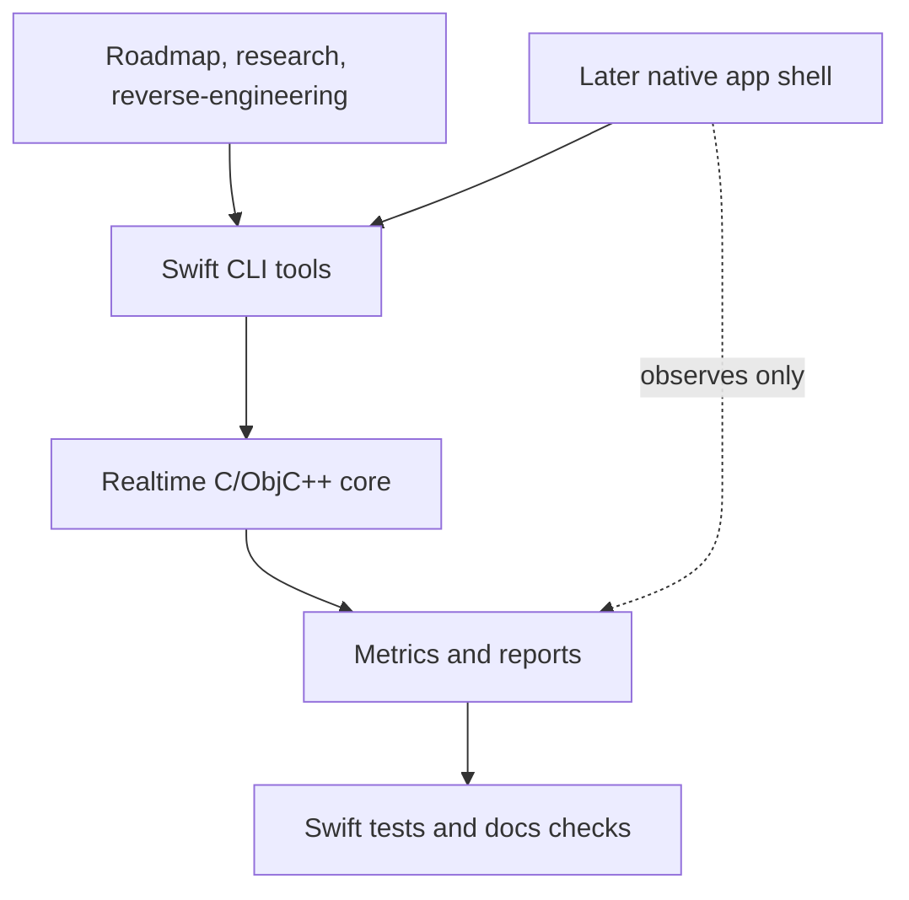

# M00 Evidence Baseline And Repo Scaffold

## Objective

Establish a minimal Mac source scaffold and evidence baseline before feature
code. After this milestone, the repo has a Swift build/test surface and the
documentation links still pass.

## Background/Context

Static fact before M00: the repo had documents and Windows binaries, but no
`Package.swift`, source tree, tests, scripts, or CI config. M00 now adds the
minimal Swift package, source, test, and CLI smoke surface. CI remains out of
scope for this milestone.

## Reverse-Engineering Findings

Strong inference:
[../../reverse-engineering/REVERSE_ENGINEERING_EVIDENCE_MATRIX_2026.md](../../reverse-engineering/REVERSE_ENGINEERING_EVIDENCE_MATRIX_2026.md)
shows Windows LoLa is useful evidence for tiny audio blocks, bounded callback
work, WinPcap media immediacy, and best-effort video. It is not a Mac
compatibility contract.

## Research Findings

Research decision:
[../../research/RESEARCH_AUDIO_ENGINE_2026.md](../../research/RESEARCH_AUDIO_ENGINE_2026.md)
requires Core Audio HAL/AUHAL or `AudioDeviceIOProc`, a callback safety
contract, UDP PCM as the first network lane, and visible validation reports.

## Assumptions

- Swift Package Manager is the first scaffold because the initial work is
  headless tooling.
- The native UI remains out of scope until M13.
- No Windows LoLa wire compatibility code is added in this milestone.

## Dependencies

- macOS with Xcode command line tools.
- Swift toolchain capable of building a small package.
- Current documentation set in `research/`, `reverse-engineering/`, and
  `mac-port/`.

## Affected Modules/Files

- `Package.swift`
- `Sources/`
- `Tests/`
- Future `scripts/` only if needed for documentation checks.
- [../PROGRESS.md](../PROGRESS.md)
- [../VALIDATION_CHECKLIST.md](../VALIDATION_CHECKLIST.md)

## Implementation Plan

1. Add a minimal `Package.swift`.
2. Add one tiny library target for shared model types.
3. Add one CLI executable target that prints a version or capability summary.
4. Add initial tests that fail before the scaffold and pass after it exists.
5. Add a docs link/report check if no external checker is available.
6. Update [../PROGRESS.md](../PROGRESS.md) only after verification passes.

## Test Plan

Before: no `swift build` or `swift test` surface exists.

After:

- `swift build`
- `swift test`
- documentation relative-link check
- topic gate from [../VALIDATION_CHECKLIST.md](../VALIDATION_CHECKLIST.md)

## Validation Method

Record command output and a `VERDICT: PASS`, `VERDICT: FAIL`, or
`VERDICT: PARTIAL` in the M00 handoff or report.

## Acceptance Criteria

- The package builds on macOS.
- Tests pass.
- The scaffold does not include speculative media features.
- Documentation links still pass.
- [../PROGRESS.md](../PROGRESS.md) marks M00 complete only after validation.

## Risks and Mitigations

- R001: no current scaffold. Mitigation: add the smallest package first.
- R003: realtime contract can be diluted early. Mitigation: keep callback code
  out until M02/M03 tests exist.

## Known Blockers

- CI platform and branch policy are not defined in this directory.

## Progress Checklist

- [x] Add `Package.swift`.
- [x] Add minimal sources.
- [x] Add minimal tests.
- [x] Run `swift build`.
- [x] Run `swift test`.
- [x] Run documentation checks.
- [x] Update [../PROGRESS.md](../PROGRESS.md).

## Next Recommended Action

Start M01 by adding report fixture tests before any measurement CLI work.

## Resume here

Continue at
[M01](M01_MEASUREMENT_HARDWARE_NETWORK_PROFILE.md) by creating the fixture
schema and one valid sample report, then add failing tests for missing hardware,
missing route, missing metric, and missing verdict.
