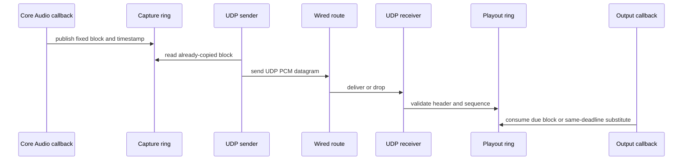

# M04 UDP PCM Packet Contract

## Objective

Define and test the native UDP PCM packet contract: header, sequence, timestamp,
sample format, frames per packet, channel count, and header guard or CRC.

## Background/Context

The fastest network lane sends one audio block per UDP datagram. The contract is
native to Mac fastest mode and does not copy Windows LoLa packet grammar.

## Reverse-Engineering Findings

Static fact:
[../../reverse-engineering/REVERSE_ENGINEERING_EVIDENCE_MATRIX_2026.md](../../reverse-engineering/REVERSE_ENGINEERING_EVIDENCE_MATRIX_2026.md)
shows Windows LoLa uses WinPcap media send and a raw Ethernet/IPv4/UDP builder.
This supports the immediacy principle but does not require a Mac raw-packet API
or LoLa-compatible payload.

## Research Findings

[../../research/RESEARCH_AUDIO_ENGINE_2026.md](../../research/RESEARCH_AUDIO_ENGINE_2026.md)
requires protocol/version, sequence number, sender frame index, sender host
timestamp, sample rate, frames per packet, channel count, sample format, guard
or CRC, and raw PCM payload.

## Assumptions

- BSD UDP sockets are the first transport API.
- One packet equals one audio block in fastest mode.
- The packet contract is versioned from day one.

## Dependencies

- M00 scaffold.
- M01 report/fixture schema.
- M03 selected frame sizes and sample formats.

## Affected Modules/Files

- Future UDP PCM packet module.
- Future packet parser and serializer tests.
- Future fixture files for valid and invalid packets.
- [../EVIDENCE_AND_CONFLICTS.md](../EVIDENCE_AND_CONFLICTS.md)

## Implementation Plan

1. Write packet parser tests for invalid magic, version, length, frame count,
   sample rate, channel count, sample format, sequence, and guard/CRC.
2. Define a fixed-size header.
3. Implement serializer and parser with strict length checks.
4. Add fixtures for supported sample formats.
5. Keep network send/receive threads separate from callback code.

## Test Plan

Before: packet parser tests fail or do not exist.

After:

- serializer/parser tests pass;
- fixture tests pass;
- malformed packet tests reject bad input;
- `swift build` and `swift test` pass.

## Validation Method

Validate packet bytes against fixtures and capture at least one localhost UDP
send/receive smoke test once the CLI exists.

## Acceptance Criteria

- Packet format is documented and versioned.
- Parser rejects truncated, oversized, wrong-version, wrong-format, and
  wrong-guard packets.
- No packet logic blocks or allocates in the audio callback.

Clean-room/publication gate:

- The public protocol description must describe the open-lola-owned UDP PCM
  contract only.
- Do not publish or copy proprietary packet grammar, binary-derived field
  names, offsets, symbols, captures, or compatibility payload layouts.
- Legacy compatibility payloads, if ever promoted, require a separate
  maintainer/legal review and must stay optional.

SOTA 2026 gate:

- Rows: SOTA005, SOTA016, SOTA018, SOTA019 in [../SOTA_2026_OPEN_QUESTION_MATRIX.md](../SOTA_2026_OPEN_QUESTION_MATRIX.md).
- Closure rule: one-block UDP PCM packet contract stays strict, versioned, and independent of relay or adaptive-buffer policies.

## Risks and Mitigations

- R004: packet rate may stress scheduling. Mitigation: M05 measures route
  behavior at target rates.
- R003: parser convenience could leak into callback. Mitigation: parse and
  validate outside callback, publish fixed blocks into rings.

## Known Blockers

- No M04 blockers remain.
- Final fastest-mode sample-format selection remains owned by M03.
- Route performance and packet-rate stress remain owned by M05.

## Progress Checklist

- [x] Add failing packet tests.
- [x] Define header.
- [x] Implement serializer.
- [x] Implement parser.
- [x] Add packet fixtures.
- [x] Add localhost UDP smoke test.
- [x] Update [../PROGRESS.md](../PROGRESS.md).

## Next Recommended Action

Start M05 route certification using the M04 packet fixtures and localhost smoke
path as the packet-contract baseline.

## Resume here

Use `swift run open-lola validate-udp-pcm-packet` and
`swift run open-lola udp-pcm-localhost-smoke` as M05 preflight checks before
adding direct-link packet age, loss, and jitter reports.
