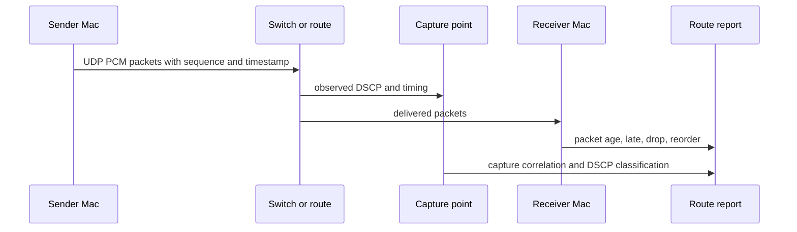

# M05 Mac-To-Mac Route Certification

## Objective

Certify Mac-to-Mac UDP PCM routes across direct link, dedicated switch, and
campus path with p50/p95/p99/max/loss reports.

## Background/Context

Fastest mode is route-certified, not assumed. A route can be accepted only if
packet age stays inside the fixed playout target without automatic buffer
growth.

## Reverse-Engineering Findings

Static fact:
[../../reverse-engineering/REVERSE_ENGINEERING_LOLA_E2E_WORKFLOW_2026.md](../../reverse-engineering/REVERSE_ENGINEERING_LOLA_E2E_WORKFLOW_2026.md)
shows Windows LoLa separated media send/receive from callback playout and used
filtering and fragment reassembly. The Mac route test keeps the same principle:
network recovery must not block audio.

## Research Findings

[../../research/RESEARCH_NETWORK_TIMING_2026.md](../../research/RESEARCH_NETWORK_TIMING_2026.md)
requires endpoint devices, switch path, link rates, VLAN/multicast/broadcast
policy, DSCP requested and observed, queueing behavior, loss, reordering,
jitter, p99, max delay, and fastest-mode verdict.

## Assumptions

- Direct link is the first route.
- Dedicated switch is second.
- Campus path is certified only with packet capture evidence.

## Dependencies

- M01 report schema.
- M03 selected fastest endpoint mode.
- M04 UDP PCM packet contract.
- Two Macs and wired network access.

## Affected Modules/Files

- [../../Sources/OpenLolaCore/UdpPcmRouteCertification.swift](../../Sources/OpenLolaCore/UdpPcmRouteCertification.swift)
- [../../Sources/OpenLolaCore/MacToMacRouteCertification.swift](../../Sources/OpenLolaCore/MacToMacRouteCertification.swift)
- [../../Sources/open-lola/main.swift](../../Sources/open-lola/main.swift)
- [../../Tests/OpenLolaCoreTests/UdpPcmRouteReportTests.swift](../../Tests/OpenLolaCoreTests/UdpPcmRouteReportTests.swift)
- [../../Tests/OpenLolaCoreTests/MacToMacRouteCertificationTests.swift](../../Tests/OpenLolaCoreTests/MacToMacRouteCertificationTests.swift)
- [../../Tests/OpenLolaCoreTests/Fixtures/UdpPcmRoutes/valid/direct-link-pass.json](../../Tests/OpenLolaCoreTests/Fixtures/UdpPcmRoutes/valid/direct-link-pass.json)
- Future packet capture notes.
- [../OPEN_QUESTIONS.md](../OPEN_QUESTIONS.md)

## Implementation Plan

1. Add sender and receiver CLIs for UDP PCM test traffic.
2. Record sender timestamps, receiver packet age, sequence gaps, late packets,
   and drops.
3. Add route labels for direct link, dedicated switch, and campus path.
4. Run marked and unmarked DSCP cases where allowed.
5. Correlate packet capture with receiver reports.
6. Produce route verdicts.

## Test Plan

Before: no network route verdicts exist.

After:

- route report schema and validator tests pass;
- G04 route-certification wrapper fixture and PASS guards validate;
- receiver route runs can record route kind, endpoint labels, interface names,
  packet-capture correlation, DSCP observation/classification, and explicit
  PASS/PARTIAL/FAIL verdict intent;
- PASS rejects localhost routes, documentation IP ranges, missing measured
  duration, packet-count mismatches, placeholder evidence, missing DSCP/capture
  correlation, hidden playout growth, duplicate/reordered packets, and playout
  targets larger than one packet period;
- localhost route smoke emits a PARTIAL report;
- one-shot sender and receiver CLIs exchange one UDP PCM packet;
- direct link report validates;
- dedicated switch report validates where hardware exists;
- campus path report validates where access exists;
- p50/p95/p99/max/loss fields are present;
- `swift build` and `swift test` pass.

## Validation Method

Accept a route only when receiver logs and packet capture agree that packet age
stays within the fixed playout target.

## Acceptance Criteria

- Every route has a verdict: PASS, FAIL, or PARTIAL.
- DSCP classification is honored, rewritten, ignored, harmful, or not tested
  with reason.
- PASS route reports include measured duration and packet-count parity for the
  configured UDP PCM packet mode.
- Route reports do not justify hidden playout growth.

SOTA 2026 gate:

- Rows: Q004, SOTA005, SOTA011, SOTA012, SOTA016, SOTA019, SOTA033, SOTA038 in [../SOTA_2026_OPEN_QUESTION_MATRIX.md](../SOTA_2026_OPEN_QUESTION_MATRIX.md).
- Closure rule: direct UDP baseline and DSCP route classification are captured before campus or relay routes can be accepted.

## Risks and Mitigations

- R004: packet rate may exceed scheduling stability. Mitigation: test target
  sample rates and frame sizes.
- R006: DSCP/PTP/managed path behavior may differ by route. Mitigation: classify
  every route separately.

## Known Blockers

- Requires two Macs and network access.
- Campus packet capture may need administrative coordination.

TODO(human): [M05 campus route access] -> Identify packet-capture points and permissions for Q004 -> [direct link only / dedicated switch / campus path with admin coordination]

## Progress Checklist

- [x] Add sender CLI.
- [x] Add receiver CLI.
- [x] Add physical evidence fields to receiver route reports.
- [x] Add route report schema tests.
- [x] Add G04 route-certification wrapper validator.
- [ ] Certify direct link.
- [ ] Certify dedicated switch.
- [ ] Certify campus path.
- [x] Update [../PROGRESS.md](../PROGRESS.md).

## Next Recommended Action

Run `.build/debug/open-lola udp-pcm-route-run --role receiver ...` on the
receiver Mac with `--route-kind`, endpoint labels, interfaces, packet-capture,
DSCP, and `--verdict pass` evidence fields. Run `.build/debug/open-lola
udp-pcm-route-run --role sender ...` on the sender Mac, record the packet
capture, validate the direct-link route with `open-lola validate-route-report
<path>`, then validate the wrapper with `open-lola
validate-route-certification-report <path>`.

## Resume here

Use the implemented M05 route report schema, route runner, and G04 wrapper to
certify the direct-link route before touching campus network paths. Do not mark
M05 PASS until packet-capture correlation, packet capture artifact paths, and
DSCP classification exist for each accepted physical route.
