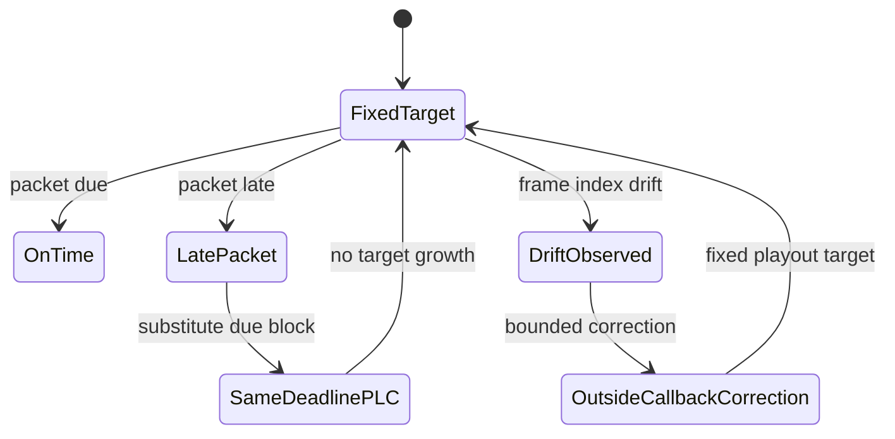

# M06 Drift And Same-Deadline PLC

## Objective

Add drift telemetry and same-deadline PLC policy without increasing default
audio playout latency.

## Background/Context

Two audio devices drift. The fix cannot be hidden buffer growth. Drift
correction and PLC must run outside the callback or within the already-due block
deadline.

## Reverse-Engineering Findings

Strong inference:
[../../reverse-engineering/REVERSE_ENGINEERING_LOLA_E2E_WORKFLOW_2026.md](../../reverse-engineering/REVERSE_ENGINEERING_LOLA_E2E_WORKFLOW_2026.md)
indicates Windows LoLa consumed remote audio from a ring without blocking the
callback. Exact drift behavior remains a runtime gap.

## Research Findings

[../../research/RESEARCH_AUDIO_ENGINE_2026.md](../../research/RESEARCH_AUDIO_ENGINE_2026.md)
requires comparing silence, repeat, Burg/AR, and any ML candidate with no
playout-target increase, plus frame-index and clock-drift telemetry.

## Assumptions

- Silence is the baseline PLC.
- Repeat or simple bounded substitute may be tested before complex PLC.
- Fractional resampling, if used, runs outside the callback.

## Dependencies

- M03 fastest endpoint mode.
- M04 packet timestamps and sender frame index.
- M05 route certification.
- Long-run report schema.

## Affected Modules/Files

- [../../Sources/OpenLolaCore/DriftPlcReport.swift](../../Sources/OpenLolaCore/DriftPlcReport.swift)
- [../../Sources/OpenLolaCore/DriftPlcHelpers.swift](../../Sources/OpenLolaCore/DriftPlcHelpers.swift)
- [../../Sources/OpenLolaCore/DriftPlcFixedTargetCertification.swift](../../Sources/OpenLolaCore/DriftPlcFixedTargetCertification.swift)
- [../../Sources/OpenLolaCore/RealtimeAudioEngine.swift](../../Sources/OpenLolaCore/RealtimeAudioEngine.swift)
- [../../Sources/open-lola/main.swift](../../Sources/open-lola/main.swift)
- [../../Tests/OpenLolaCoreTests/DriftPlcReportTests.swift](../../Tests/OpenLolaCoreTests/DriftPlcReportTests.swift)
- [../../Tests/OpenLolaCoreTests/DriftPlcFixedTargetCertificationTests.swift](../../Tests/OpenLolaCoreTests/DriftPlcFixedTargetCertificationTests.swift)
- [../../Tests/OpenLolaCoreTests/Fixtures/DriftPlcReports/valid/drift-plc-partial.json](../../Tests/OpenLolaCoreTests/Fixtures/DriftPlcReports/valid/drift-plc-partial.json)
- [../../Tests/OpenLolaCoreTests/Fixtures/DriftPlcFixedTargetCertificationReports/valid/g05-drift-plc-certification-partial.json](../../Tests/OpenLolaCoreTests/Fixtures/DriftPlcFixedTargetCertificationReports/valid/g05-drift-plc-certification-partial.json)
- Future 60-minute run report fixture.
- [../RISK_REGISTER.md](../RISK_REGISTER.md)

## Implementation Plan

1. Add drift counters from sender frame index and receiver playout position.
2. Add same-deadline PLC policy options: silence, repeat, and optional bounded
   candidates.
3. Add tests proving PLC does not change playout target.
4. Add long-run report fields for drift slope, correction events, underruns,
   and artifacts.
5. Run 60-minute fixed-target test.

## Test Plan

Before: long run creeps or lacks telemetry.

After:

- unit tests prove target depth does not grow;
- source-level fixed-target jitter-buffer tests prove packet age, late-drop,
  same-deadline PLC, and no hidden target growth;
- source-level clock-drift estimator tests prove bounded outside-callback
  correction events;
- long-run report validates;
- synthetic drift/PLC smoke emits a PARTIAL report;
- G05 fixed-target certification wrapper validates only when it is tied to an
  accepted F02 realtime-engine report, accepted G04 route certification, PASS
  drift/PLC report, and measured same-hardware LoLa baseline comparison;
- 60-minute fixed-target run records drift and PLC behavior;
- `swift build` and `swift test` pass.

## Validation Method

Compare before/after audio metrics for callback p99/max, underruns, drift, and
playout target. Reject any PLC or drift correction that increases default target
depth.

## Acceptance Criteria

- Drift telemetry is visible.
- Same-deadline PLC never waits for retransmission.
- Correction work is outside callback or branch-bounded inside the due block.
- 60-minute report has a verdict.
- G05 certification PASS rejects synthetic route, fixture evidence, missing
  realtime source evidence, and missing or trailing LoLa baseline evidence.

SOTA 2026 gate:

- Rows: SOTA001, SOTA002, SOTA003, SOTA006, SOTA010, SOTA018, SOTA022 in [../SOTA_2026_OPEN_QUESTION_MATRIX.md](../SOTA_2026_OPEN_QUESTION_MATRIX.md).
- Closure rule: drift correction and PLC remain same-deadline, measurable, and unable to grow the default playout target.

## Risks and Mitigations

- R005: drift correction may add artifacts or latency. Mitigation: compare
  policies and reject target growth.
- R003: PLC may become unbounded. Mitigation: tests assert bounded execution
  policy.

## Known Blockers

- Requires stable M05 route.
- Artifact assessment may need human listening notes in addition to metrics.

## Progress Checklist

- [x] Add drift telemetry.
- [x] Add silence baseline.
- [x] Add same-deadline substitute policy tests.
- [x] Add long-run report fields.
- [x] Add G05 fixed-target certification wrapper validator.
- [ ] Run 60-minute fixed-target test.
- [ ] Record artifact notes.
- [x] Update [../PROGRESS.md](../PROGRESS.md).

## Next Recommended Action

Use the accepted F02 realtime-engine report and M05 physical route evidence as
the input for a 60-minute fixed-target drift/PLC report. Validate the resulting report with
`open-lola validate-drift-plc-report <path>`, then validate the G05 wrapper
with `open-lola validate-drift-plc-certification-report <path>`.

## Resume here

Use the implemented M06 report schema, synthetic smoke, and invariant tests to
record a real 60-minute fixed-target run. Do not mark M06 PASS until the report
uses accepted F02 realtime-engine evidence, stable M05/G04 physical route
evidence, records artifact notes, proves the playout target did not grow,
includes a measured same-hardware LoLa baseline comparison, and passes the G05
certification wrapper.
