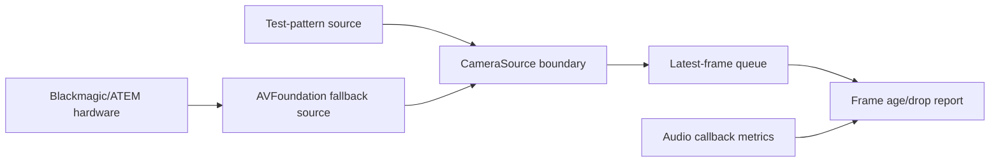

# M08 Blackmagic/ATEM Video Capture Probe

## Objective

Add a Blackmagic/ATEM-first video capture probe using AVFoundation as the
fallback/generic harness where macOS exposes the capture path, plus
test-pattern sources, frame age, and drop-count reporting that proves no audio
impact.

## Background/Context

Video is a best-effort presence and cueing lane. It starts only after the audio
baseline is stable and must degrade before audio timing changes.

## Reverse-Engineering Findings

Static fact:
[../../reverse-engineering/REVERSE_ENGINEERING_EVIDENCE_MATRIX_2026.md](../../reverse-engineering/REVERSE_ENGINEERING_EVIDENCE_MATRIX_2026.md)
shows Windows LoLa v2.0 shipped XIMEA-centered camera support and v1.5 showed a
GPUJPEG branch. These are historical evidence only; XIMEA is not a core Mac
dependency.

## Research Findings

[../../research/RESEARCH_VIDEO_PIPELINE_2026.md](../../research/RESEARCH_VIDEO_PIPELINE_2026.md)
now routes production video through Blackmagic/ATEM inventory first, with
AVFoundation as the fallback/generic harness when macOS exposes the capture
path. The capture report still requires timestamped frames, frame age, dropped
frames, capture format, queue depth, and proof that video activity does not
increase audio callback p99/max.

## Assumptions

- Blackmagic/ATEM is the first production capture target.
- AVFoundation remains the fallback/generic harness for macOS-exposed capture
  paths.
- Test-pattern source exists for deterministic tests.
- Video capture runs outside audio callback resources.

## Dependencies

- M03 fastest endpoint mode.
- M05 or M06 audio metrics baseline.
- macOS camera permissions for real devices.

## Affected Modules/Files

- [../../Sources/OpenLolaCore/VideoCaptureProbe.swift](../../Sources/OpenLolaCore/VideoCaptureProbe.swift)
- [../../Sources/open-lola/main.swift](../../Sources/open-lola/main.swift)
- [../../Tests/OpenLolaCoreTests/VideoCaptureReportTests.swift](../../Tests/OpenLolaCoreTests/VideoCaptureReportTests.swift)
- [../../Tests/OpenLolaCoreTests/Fixtures/VideoCaptureReports/valid/video-capture-partial.json](../../Tests/OpenLolaCoreTests/Fixtures/VideoCaptureReports/valid/video-capture-partial.json)
- [../reports/M08_VIDEO_CAPTURE_2026-05-02.md](../reports/M08_VIDEO_CAPTURE_2026-05-02.md)
- Future optional Desktop Video SDK adapter, only after measured need.

## Implementation Plan

1. Define `CameraSource` boundary with timestamped frame output.
2. Add synthetic test-pattern source.
3. Inventory Blackmagic/ATEM, UVC, DeckLink, UltraStudio, and external capture
   candidates exposed by macOS.
4. Add AVFoundation fallback source with direct sample-buffer handling.
5. Use latest-useful-frame queue policy.
6. Record frame age, queue depth, drop count, and audio callback metrics.
7. Add optional Desktop Video SDK adapter only after measured need.
8. Run capture while audio baseline is active.

## Test Plan

Before: no camera abstraction exists.

After:

- test-pattern source tests pass;
- latest-frame queue tests pass;
- video capture report fixture validates;
- Blackmagic/ATEM inventory reports the exposed macOS capture path or a
  concrete unavailable state;
- video capture PASS requires concrete Blackmagic/ATEM production capture
  evidence, matching AVFoundation device identity when AVFoundation is used,
  and process CPU metrics;
- AVFoundation fallback source and `video-capture-run` are wired behind the
  existing `CameraSource` boundary and collect real sample buffers;
- AVFoundation fallback probe runs on available camera or reports permission
  gap;
- frame age, frame interval, CPU, memory, and drop report validates;
- audio metrics remain unchanged within accepted baseline.

## Validation Method

Compare audio callback p99/max, underruns, and playout target with video off and
video capture on. Reject if capture changes default audio timing.

## Acceptance Criteria

- `CameraSource` is vendor-neutral.
- Test-pattern source works without camera hardware.
- Blackmagic/ATEM target identity is recorded when hardware is present.
- AVFoundation fallback source records frame age and drop counts.
- AVFoundation fallback source records frame interval, process CPU, and process
  resident memory evidence.
- Video capture does not increase audio playout latency.
- Generic cameras and speculative Desktop Video SDK claims cannot satisfy PASS.

Clean-room/SDK gate:

- Public video docs may describe Blackmagic/ATEM requirements, AVFoundation
  behavior, and measured reports, but not binary-derived camera logic or
  proprietary implementation details.
- Desktop Video SDK use remains optional, license-gated, and out of default
  builds unless SDK terms and redistribution constraints are reviewed.
- SDK headers, libraries, samples, or generated artifacts must not be committed
  unless redistribution is explicitly allowed.

SOTA 2026 gate:

- Rows: Q007, SOTA046, SOTA047 in [../SOTA_2026_OPEN_QUESTION_MATRIX.md](../SOTA_2026_OPEN_QUESTION_MATRIX.md).
- Closure rule: Blackmagic/ATEM inventory precedes production capture closure;
  AVFoundation, file-pattern, and synthetic test-pattern remain the generic
  harness; Desktop Video SDK is optional only after measured need.

## Risks and Mitigations

- R007: video may steal CPU/GPU resources. Mitigation: latest-frame queue and
  video-off-before-audio rule.
- R010: camera permission may block tests. Mitigation: test-pattern source and
  explicit permission report.

## Known Blockers

- Real camera hardware and macOS permissions may be unavailable.
- Capture-card latency may differ from built-in camera behavior.

## Progress Checklist

- [x] Define `CameraSource`.
- [x] Add test-pattern source.
- [x] Add Blackmagic/ATEM-first source policy.
- [x] Add AVFoundation fallback source.
- [x] Add AVFoundation sample-buffer collection.
- [x] Add production capture PASS gates.
- [x] Add frame-interval, CPU, memory, and measured audio-impact report fields.
- [x] Add report fixture.
- [ ] Run Blackmagic/ATEM inventory on target hardware.
- [ ] Run audio-off/video-on probe.
- [ ] Run audio-on/video-on probe.
- [x] Update [../PROGRESS.md](../PROGRESS.md).

## Next Recommended Action

Run `video-capture-inventory` with the Blackmagic/ATEM hardware attached, then
run `video-capture-run` on the chosen physical source and compare
audio-off/video-on plus audio-on/video-on against the accepted baseline.

## Resume here

Use [../IMPLEMENTATION_COMPANION.md](../IMPLEMENTATION_COMPANION.md) and
[../../Sources/OpenLolaCore/VideoCaptureProbe.swift](../../Sources/OpenLolaCore/VideoCaptureProbe.swift)
as the live handoff. Run the Blackmagic/ATEM inventory and AVFoundation
fallback capture probe on the chosen physical source, emit a video-only PARTIAL
report, and keep M08 PARTIAL until audio-on/video-on metrics prove no audio
timing increase.
