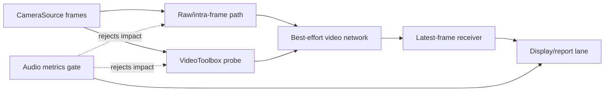

# M09 Native Video Transport

## Objective

Add native best-effort video transport probes and prove raw, intra-frame, or
VideoToolbox video degrades before audio.

## Background/Context

Video transport is not allowed to set audio timing. It may reduce frame rate,
quality, resolution, or turn off before the audio playout target changes.

## Reverse-Engineering Findings

Static fact:
[../../reverse-engineering/REVERSE_ENGINEERING_LOLA_E2E_WORKFLOW_2026.md](../../reverse-engineering/REVERSE_ENGINEERING_LOLA_E2E_WORKFLOW_2026.md)
shows Windows LoLa used raw or MJPEG video TX, fragment reassembly, and GDI/DIB
display. GPUJPEG is proven only in an older CUDA branch.

## Research Findings

[../../research/RESEARCH_VIDEO_PIPELINE_2026.md](../../research/RESEARCH_VIDEO_PIPELINE_2026.md)
requires raw or simple intra-frame video as local baseline and VideoToolbox only
as a measured low-latency probe for bandwidth-constrained paths.

## Assumptions

- M08 provides timestamped frames.
- Audio metrics baseline is active during transport tests.
- Reliable video retransmission protocols are out of fastest-mode scope.

## Dependencies

- M08 camera/test-pattern source.
- M05 route metrics.
- M06 audio/drift metrics where available.
- VideoToolbox framework for encoder probes.

## Affected Modules/Files

- [../../Sources/OpenLolaCore/VideoTransportProbe.swift](../../Sources/OpenLolaCore/VideoTransportProbe.swift)
- [../../Sources/open-lola/main.swift](../../Sources/open-lola/main.swift)
- [../../Tests/OpenLolaCoreTests/VideoTransportReportTests.swift](../../Tests/OpenLolaCoreTests/VideoTransportReportTests.swift)
- [../../Tests/OpenLolaCoreTests/Fixtures/VideoTransportReports/valid/video-transport-partial.json](../../Tests/OpenLolaCoreTests/Fixtures/VideoTransportReports/valid/video-transport-partial.json)
- [../reports/M09_VIDEO_TRANSPORT_2026-05-02.md](../reports/M09_VIDEO_TRANSPORT_2026-05-02.md)
- Future VideoToolbox runtime probe module.

## Implementation Plan

1. Add raw or simple intra-frame sender/receiver for local route tests.
2. Add frame sequence, timestamp, drop, and age reports.
3. Add VideoToolbox probe with realtime settings and frame reordering disabled
   where required.
4. Stress CPU, GPU, and network while audio runs.
5. Implement degradation policy: drop/quality reduction/off before audio target
   changes.

## Test Plan

Before: no frame transport tests exist.

After:

- frame transport fixture tests pass;
- raw/intra-frame probe report validates with bounded fragmentation and
  reassembly accounting;
- degradation policy rejection tests pass;
- VideoToolbox probe report validates or records unavailable status;
- audio metrics remain unchanged under video transport load.

## Validation Method

Run video transport with audio baseline active and compare audio callback p99,
max, underrun, packet-age, and playout-target metrics against video-off baseline.

## Acceptance Criteria

- Video frame age and drop counts are visible.
- Fragmentation and reassembly counts are visible, bounded, and complete.
- VideoToolbox queue depth and frame reordering settings are recorded.
- Video degradation happens before audio buffer growth.
- No video mode is accepted if it increases default audio playout latency.

Clean-room/publication gate:

- The video transport is an original open-lola transport and must not copy
  proprietary video packet layouts, field names, symbols, or binary-derived
  algorithms.
- Public docs may explain frame age, drop policy, queueing, and measured
  degradation behavior; raw internal reconstruction details remain excluded.
- VideoToolbox or other codec use must be justified by public API behavior,
  measured reports, and original tests.

SOTA 2026 gate:

- Rows: SOTA039, SOTA040, SOTA041, SOTA042, SOTA043, SOTA044, SOTA048, SOTA082, SOTA083, SOTA084 in [../SOTA_2026_OPEN_QUESTION_MATRIX.md](../SOTA_2026_OPEN_QUESTION_MATRIX.md).
- Closure rule: raw/intra-frame video is the local baseline; VideoToolbox, JPEG XS, RIST, and SRT require explicit latency and audio-isolation reports.

## Risks and Mitigations

- R007: video may steal resources. Mitigation: degradation policy and audio gate.
- R004: video network traffic may affect UDP PCM. Mitigation: test shared and
  isolated routes separately.

## Known Blockers

- VideoToolbox behavior may depend on hardware encoder availability.
- Raw video may exceed network bandwidth except on controlled local paths.

## Progress Checklist

- [x] Add raw/intra-frame transport probe.
- [x] Add receiver report path.
- [x] Add fragmentation/reassembly report path.
- [x] Add encoded fragment malformed-datagram tests.
- [x] Add incomplete-frame stale-drop reassembler tests.
- [ ] Add VideoToolbox probe.
- [x] Add degradation policy tests.
- [ ] Run audio-plus-video stress.
- [x] Record verdict.
- [x] Update [../PROGRESS.md](../PROGRESS.md).

## Next Recommended Action

Run `open-lola video-transport-run --mode raw` on a physical direct route, then
add VideoToolbox only after the report path has measured route evidence.

## Resume here

Use [../IMPLEMENTATION_COMPANION.md](../IMPLEMENTATION_COMPANION.md) and
[../../Sources/OpenLolaCore/VideoTransportProbe.swift](../../Sources/OpenLolaCore/VideoTransportProbe.swift)
as the live handoff. Keep M09 PARTIAL until a measured raw or intra-frame route
and audio-plus-video stress report prove video degradation happens before any
audio timing change.
