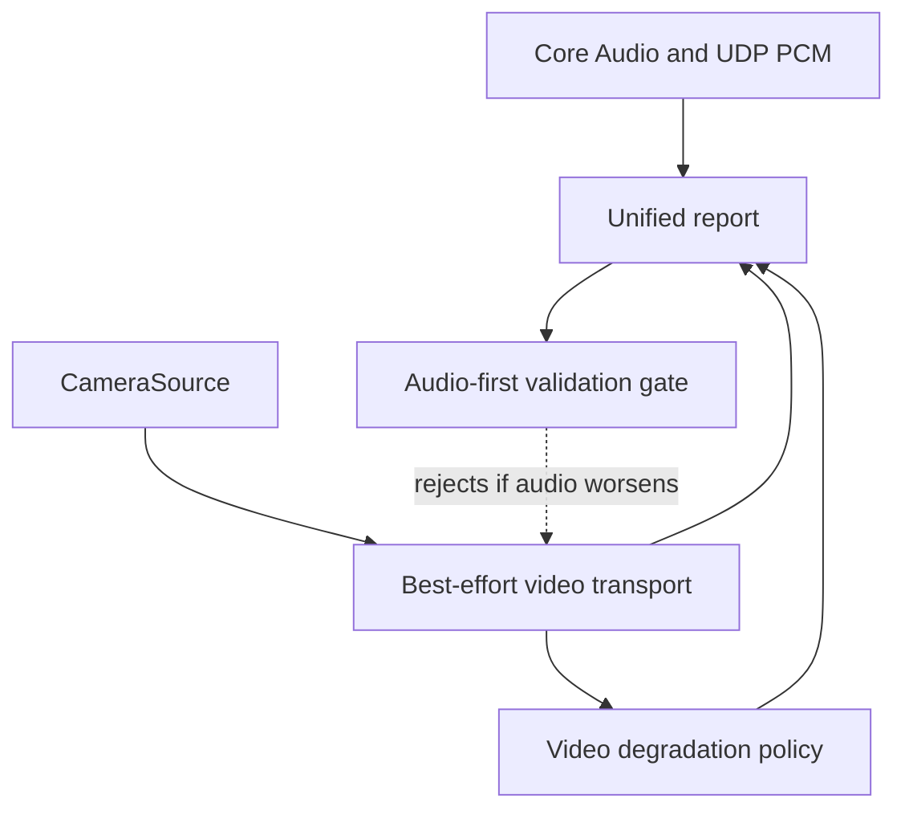

# M10 Integrated Headless A/V

## Objective

Prove integrated headless audio/video coexistence with a 30-minute stress run
that preserves the audio callback baseline.

## Background/Context

Separate audio and video probes are not enough. The integrated headless path
must show that video capture, transport, display/reporting, and degradation do
not affect audio deadline behavior.

## Reverse-Engineering Findings

Strong inference:
[../../reverse-engineering/REVERSE_ENGINEERING_LOLA_E2E_WORKFLOW_2026.md](../../reverse-engineering/REVERSE_ENGINEERING_LOLA_E2E_WORKFLOW_2026.md)
shows Windows LoLa treated audio as the hard latency gate while video was
low-latency but best-effort. The Mac integration keeps that ordering.

## Research Findings

[../../research/RESEARCH_VIDEO_PIPELINE_2026.md](../../research/RESEARCH_VIDEO_PIPELINE_2026.md)
and
[../../research/RESEARCH_AUDIO_ENGINE_2026.md](../../research/RESEARCH_AUDIO_ENGINE_2026.md)
jointly require video to drop, reduce quality, or turn off before audio timing
changes.

## Assumptions

- M05/M06 audio path is stable.
- M08/M09 video probes exist and report frame age/drop counts.
- Headless integration precedes native UI.

## Dependencies

- M05 Mac-to-Mac UDP PCM route certification.
- M06 drift/PLC telemetry where available.
- M08 video capture probe.
- M09 video transport probe.

## Affected Modules/Files

- [../../Sources/OpenLolaCore/IntegratedAvReport.swift](../../Sources/OpenLolaCore/IntegratedAvReport.swift)
- [../../Sources/open-lola/main.swift](../../Sources/open-lola/main.swift)
- [../../Tests/OpenLolaCoreTests/IntegratedAvReportTests.swift](../../Tests/OpenLolaCoreTests/IntegratedAvReportTests.swift)
- [../../Tests/OpenLolaCoreTests/Fixtures/IntegratedAvReports/valid/integrated-av-partial.json](../../Tests/OpenLolaCoreTests/Fixtures/IntegratedAvReports/valid/integrated-av-partial.json)
- [../reports/M10_INTEGRATED_AV_2026-05-02.md](../reports/M10_INTEGRATED_AV_2026-05-02.md)

## Implementation Plan

1. Add a headless runner that starts audio and video lanes together.
2. Keep separate priorities and ownership boundaries.
3. Record audio callback metrics, packet metrics, video frame age, drops, CPU,
   GPU, and network load.
4. Add stress mode for video load.
5. Run 30-minute integrated test and record verdict.

## Test Plan

Before: audio and video run separately.

After:

- integrated runner starts both lanes;
- unified report validates;
- degradation and ownership PASS guards reject unsafe reports;
- run-window overlap and subordinate report/capture-point cross-reference gates
  reject incomplete PASS claims;
- audio-master sync policy rejects video/external clocks and video-induced
  audio waits;
- video frame timing validates monotonic frame identity/timestamps;
- renderer sync rejects stale rendered video and audio-hold events in PASS
  claims;
- 30-minute stress run preserves audio callback p99/max and playout target;
- `swift build` and `swift test` pass.

## Validation Method

Compare integrated run metrics against the last accepted audio-only baseline.
Reject if video changes audio playout target, callback p99/max, or route verdict.

## Acceptance Criteria

- Audio metrics remain within accepted baseline.
- Video metrics are visible and degradation events are recorded.
- Audio, video capture, video transport or preview, OSC, and ATEM report IDs
  are cross-referenced in PASS evidence.
- Audio and video packet-capture points are concrete where transport is used.
- Unified report ends with a verdict.
- No UI code owns realtime media paths.

SOTA 2026 gate:

- Rows: SOTA007, SOTA008, SOTA035, SOTA039, SOTA045, SOTA047 in [../SOTA_2026_OPEN_QUESTION_MATRIX.md](../SOTA_2026_OPEN_QUESTION_MATRIX.md).
- Closure rule: integrated A/V stress proves video, rendering, and control load degrade before audio p99/max or playout target changes.

## Risks and Mitigations

- R007: video may affect audio under load. Mitigation: degradation policy and
  audio-first acceptance gate.
- R004: combined traffic may stress packet scheduling. Mitigation: route reports
  include combined-load case.

## Known Blockers

- Requires stable audio and video probes from prior milestones.
- Hardware stress behavior may vary by Mac model.

## Progress Checklist

- [x] Add integrated runner.
- [x] Add unified report fixture.
- [x] Add degradation event reporting.
- [x] Add run-window and subordinate report/capture-point PASS gates.
- [x] Add audio-master sync, video timestamp, and nearest/latest render gates.
- [x] Run short integrated smoke.
- [ ] Run 30-minute stress.
- [ ] Compare against audio-only baseline.
- [x] Update [../PROGRESS.md](../PROGRESS.md).

## Next Recommended Action

Run the measured 30-minute integrated stress only after M05/M06/M08/M09 runtime
evidence exists.

## Resume here

Use [../IMPLEMENTATION_COMPANION.md](../IMPLEMENTATION_COMPANION.md) and
[../../Sources/OpenLolaCore/IntegratedAvReport.swift](../../Sources/OpenLolaCore/IntegratedAvReport.swift)
as the live handoff. Keep M10 PARTIAL until a measured 30-minute integrated
headless A/V report proves video load does not change audio callback p99/max,
route verdict, or playout target.
