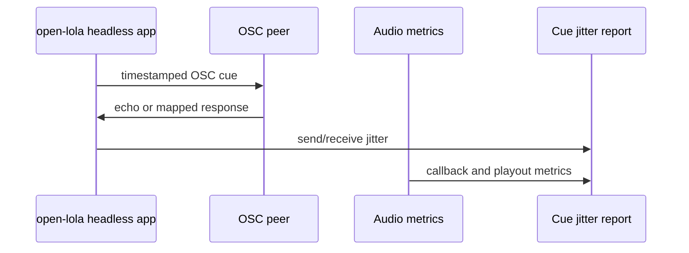

# M11 OSC Show-Control Probe

## Objective

Add an OSC show-control probe with timestamped cue-loop timing and unchanged
audio metrics.

## Background/Context

OSC is the first high-level control protocol because it is public, simple, and
widely supported by show-control tools. Cues can observe time; they cannot own
audio playout.

## Reverse-Engineering Findings

Static fact:
[../../reverse-engineering/REVERSE_ENGINEERING_LOLA_E2E_WORKFLOW_2026.md](../../reverse-engineering/REVERSE_ENGINEERING_LOLA_E2E_WORKFLOW_2026.md)
shows Windows LoLa had plaintext control/chat message strings. That does not
define the Mac OSC contract; OSC is a research-driven show-control lane.

## Research Findings

[../../research/RESEARCH_LIGHTING_SHOW_CONTROL_2026.md](../../research/RESEARCH_LIGHTING_SHOW_CONTROL_2026.md)
adopts OSC 1.0 for first high-level cue/control probes and requires timestamped
cue jitter measurement outside audio callback timing.

## Assumptions

- OSC 1.0 semantics are the default unless a target tool requires otherwise.
- Chataigne or Open Stage Control can be used as the first peer.
- OSC runs outside realtime audio code.

## Dependencies

- M10 integrated headless A/V metrics or at least M05/M06 audio metrics.
- OSC parser/serializer choice.
- Local OSC peer or loopback responder.

## Affected Modules/Files

- [../../Sources/OpenLolaCore/OscCueProbe.swift](../../Sources/OpenLolaCore/OscCueProbe.swift)
- [../../Sources/open-lola/main.swift](../../Sources/open-lola/main.swift)
- [../../Tests/OpenLolaCoreTests/OscCueReportTests.swift](../../Tests/OpenLolaCoreTests/OscCueReportTests.swift)
- [../../Tests/OpenLolaCoreTests/Fixtures/OscCueReports/valid/osc-cue-partial.json](../../Tests/OpenLolaCoreTests/Fixtures/OscCueReports/valid/osc-cue-partial.json)
- [../reports/M11_OSC_CUE_2026-05-02.md](../reports/M11_OSC_CUE_2026-05-02.md)
- [../OPEN_QUESTIONS.md](../OPEN_QUESTIONS.md)

## Implementation Plan

1. Define a minimal OSC cue message with cue ID and timestamp.
2. Add send/receive loopback probe.
3. Add jitter report with p50/p95/p99/max.
4. Add a bounded external-peer handoff report with the selected peer and audio
   baseline ID.
5. Run probe while audio baseline is active.
6. Test with Chataigne or Open Stage Control when available.

## Test Plan

Before: no cue timing tests exist.

After:

- OSC message tests pass;
- loopback jitter report validates;
- cue-count, peer, and audio-impact PASS guards reject unsafe reports;
- audio metrics remain unchanged;
- peer interop report exists or records peer unavailability.

## Validation Method

Compare audio metrics with OSC off and OSC cue loop active. Reject if cue traffic
changes audio callback timing or playout target.

## Acceptance Criteria

- Timestamped OSC cue loop works.
- Cue jitter report includes p50/p95/p99/max.
- Audio callback metrics are unchanged.
- OSC code remains a control lane, not a media scheduler.

SOTA 2026 gate:

- Rows: Q008, SOTA017, SOTA058, SOTA059, SOTA069, SOTA070 in [../SOTA_2026_OPEN_QUESTION_MATRIX.md](../SOTA_2026_OPEN_QUESTION_MATRIX.md).
- Closure rule: OSC 1.0 cue loop starts local, then Chataigne first and Open Stage Control fallback external peer tests measure jitter separately from audio.

## Risks and Mitigations

- R003: control logging could enter realtime path. Mitigation: OSC stays outside
  callback code.
- R007: control load could compete with media under stress. Mitigation: stress
  test with audio metrics active.

## Known Blockers

- First real OSC peer choice may require user input.
- Tool-specific OSC behavior may differ.

## Progress Checklist

- [x] Define OSC cue message.
- [x] Add loopback tests.
- [x] Add jitter report fixture.
- [x] Add bounded external-peer/audio-baseline report writer.
- [ ] Run with audio baseline active.
- [ ] Test one external peer where available.
- [x] Update [../OPEN_QUESTIONS.md](../OPEN_QUESTIONS.md).
- [x] Update [../PROGRESS.md](../PROGRESS.md).

## Next Recommended Action

Run `osc-cue-external-run` with the selected external peer and accepted audio
baseline ID, then replace the PARTIAL handoff with a measured audio-active
external peer run.

## Resume here

Use [../IMPLEMENTATION_COMPANION.md](../IMPLEMENTATION_COMPANION.md) and
[../../Sources/OpenLolaCore/OscCueProbe.swift](../../Sources/OpenLolaCore/OscCueProbe.swift)
as the live handoff. Add live loopback or external peer evidence, then validate
it with `open-lola validate-osc-cue-report <path>`.
