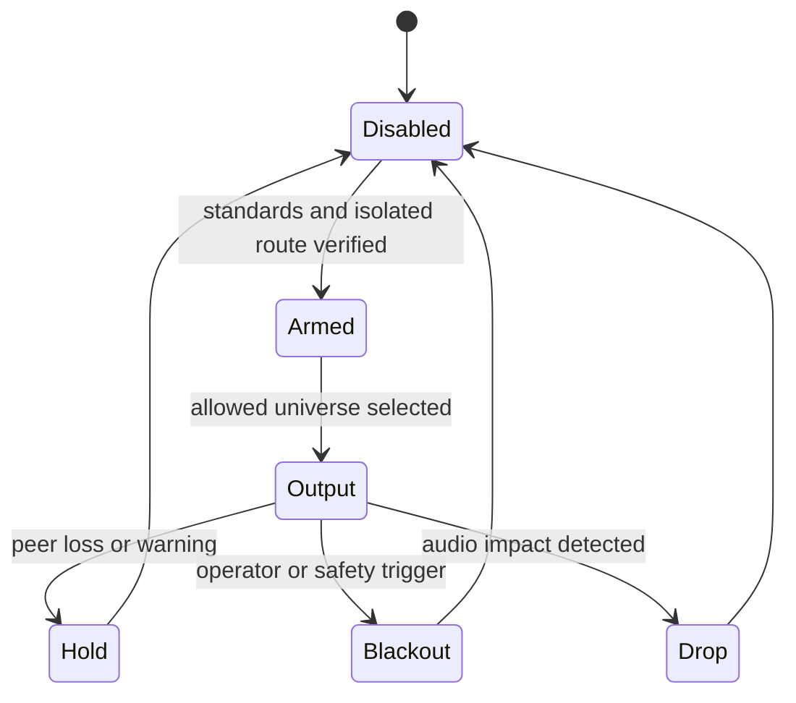

# M12 sACN Art-Net Fixture Gate

## Objective

Gate sACN, Art-Net, and fixture work behind current standards, isolated network
tests, one-universe probes, blackout/hold/drop policy, and no audio impact.

## Background/Context

Lighting traffic can be multicast, broadcast, bursty, or fixture-sensitive.
Direct output is unsafe until standards, network isolation, and failure policy
are explicit.

## Reverse-Engineering Findings

Runtime gap:
[../../reverse-engineering/REVERSE_ENGINEERING_EVIDENCE_MATRIX_2026.md](../../reverse-engineering/REVERSE_ENGINEERING_EVIDENCE_MATRIX_2026.md)
does not provide lighting protocol behavior. Lighting is a new Mac-native lane,
not Windows LoLa compatibility work.

## Research Findings

[../../research/RESEARCH_LIGHTING_SHOW_CONTROL_2026.md](../../research/RESEARCH_LIGHTING_SHOW_CONTROL_2026.md)
requires full standards review for sACN/DMX/RDM/RDMnet/ACN/OTP, Art-Net spec and
licensing review, OLA/QLC+ probes, isolated control networks, and proof that
lighting traffic does not affect audio.

Current source-validation baseline:

- ANSI E1.31-2025 is recorded as the current sACN reference for the M12 gate.
- The official Art-Net site is recorded as the Art-Net reference; credit and
  OEM-code/licensing disposition remain required before release.
- QLC+ and OLA remain the first interop targets before any direct
  DMX-over-IP output.
- Direct output remains disabled until explicit arm, network isolation,
  allowed universe, packet capture, and audio-impact checks all pass.
- `lighting-gate-run` records a bounded PARTIAL safety handoff with the selected
  protocol, interop target, universe, network mode, explicit arm state,
  packet-capture setup fields, audio baseline ID, OSC cue report ID, and
  OSC-first cue workflow evidence without sending packets.

## Assumptions

- OSC from M11 remains the first show-control path.
- sACN/Art-Net direct output is disabled until the gate passes.
- Fixture metadata lookup is setup-time only, never realtime audio.

## Dependencies

- M11 OSC cue probe.
- Isolated lighting network.
- OLA or QLC+ interop target.
- Current standards/spec access and licensing review.

## Affected Modules/Files

- Future lighting safety policy.
- Future one-universe output probe.
- Future fixture metadata import/validation tooling.
- [../RISK_REGISTER.md](../RISK_REGISTER.md)

## Implementation Plan

1. Read and record current protocol documents before implementation. Done for
   source validation; full standards access remains required before product
   claims.
2. Define allowed network, allowed universe, rate limit, and failure policy.
   Done in `LightingSafetyPolicy`.
3. Add one-universe output probe through OLA or QLC+ first. Source report
   contract and bounded handoff writer exist; live output remains deferred.
4. Add packet capture and audio metrics during lighting output. Source report
   fields and PASS guards exist; measured capture remains deferred.
5. Add fixture metadata validation only as offline/setup tooling. Source policy
   gate exists; actual fixture metadata import remains deferred.

## Test Plan

Before: no universe safety model exists.

After:

- standards/spec notes exist for implemented protocol;
- OSC P2P cue workflow evidence exists before fixture-output PASS;
- one-universe isolated output probe report validates;
- blackout/hold/drop policy tests pass;
- audio metrics remain unchanged.

## Validation Method

Run lighting output only on an isolated network, capture packets, and compare
audio metrics against lighting-off baseline.

## Acceptance Criteria

- Direct sACN or Art-Net output is impossible without explicit arm/config.
  Source gate and bounded handoff writer implemented.
- Fixture output PASS requires an OSC cue report reference and a local OLA/QLC+
  owner; direct fixture streaming on the performance link is rejected.
- One-universe test has packet capture and verdict. Report contract implemented;
  measured capture deferred.
- Broadcast/multicast policy is documented. Source policy implemented.
- Lighting output does not increase audio playout latency. PASS guards
  implemented; measured audio-active lighting run deferred.

Clean-room/license gate:

- sACN, Art-Net, DMX, RDM, RDMnet, ACN, and fixture metadata work must cite
  reviewed standards or public vendor documentation before public claims.
- Art-Net credit/OEM-code and any redistribution or attribution requirements
  must be resolved before release.
- Fixture profiles, sample shows, and captures need provenance review before
  they can be included in a public bundle.

SOTA 2026 gate:

- Rows: Q009, SOTA049, SOTA050, SOTA051, SOTA052, SOTA053, SOTA054, SOTA055, SOTA056, SOTA057, SOTA060, SOTA061, SOTA062, SOTA063, SOTA064, SOTA065, SOTA066, SOTA067, SOTA068, SOTA071, SOTA072, SOTA085 in [../SOTA_2026_OPEN_QUESTION_MATRIX.md](../SOTA_2026_OPEN_QUESTION_MATRIX.md).
- Closure rule: lighting and show-control output is blocked until standards/spec notes, isolated network, allowed universe, safety policy, and interop probes exist.

## Risks and Mitigations

- R008: lighting traffic may harm media paths. Mitigation: isolated network and
  allowed universe list.
- R009: protocol specs may be controlled. Mitigation: full-current standards
  gate before direct support.

## Known Blockers

- Safe universe and fixture target may require venue coordination.
- Standards and Art-Net licensing review may be needed before release.

TODO(human): [M12 lighting safety] -> Choose safe isolated universe, network, fixture target, and blackout behavior for Q009 -> [OLA/QLC+ virtual output / isolated physical fixture / defer live fixture output]

## Progress Checklist

- [x] Record standards/spec notes.
- [x] Define allowed universe and network policy.
- [x] Add safety state tests.
- [x] Add bounded safety handoff writer.
- [x] Add OSC-first cue workflow PASS gates.
- [ ] Run one-universe OLA or QLC+ probe.
- [ ] Capture packets.
- [ ] Compare audio metrics.
- [x] Update [../PROGRESS.md](../PROGRESS.md).

## Next Recommended Action

Answer Q009, record the selected handoff with `lighting-gate-run`, then run
QLC+ or OLA on loopback or an isolated lighting network with exactly one
configured universe and packet capture enabled.

## Resume here

Start from `LightingFixtureGate.swift` and `lighting-gate-run`; keep direct
output blocked by default. Add the first measured QLC+/OLA one-universe report,
validate it with `open-lola validate-lighting-gate-report <path>`, and keep
M12 PARTIAL until the report proves unchanged audio timing.
