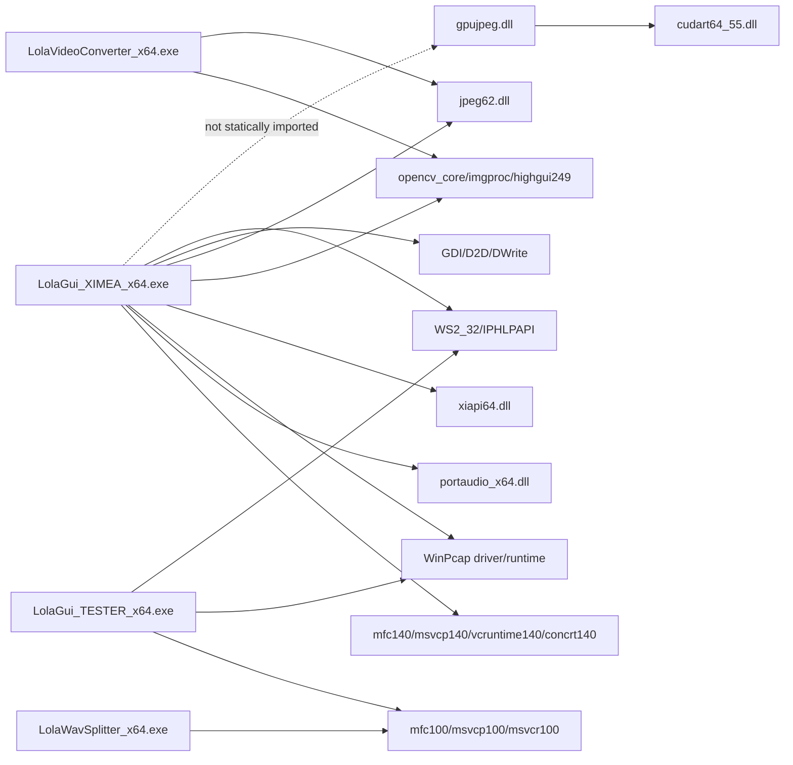
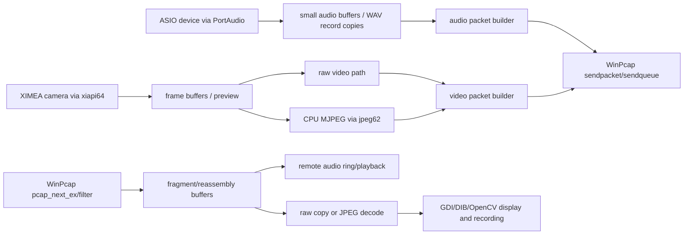
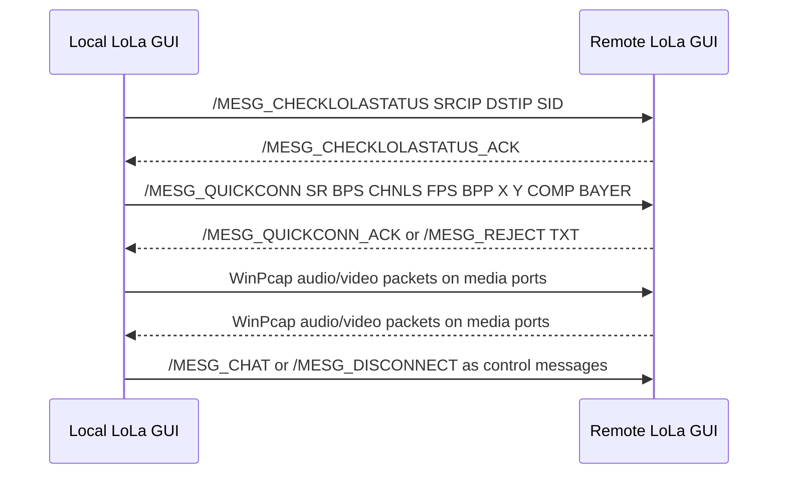

# Mermaid Diagrams

## Module Dependency Graph

```mermaid
flowchart LR
  Main[LolaGui_XIMEA_x64.exe]
  Tester[LolaGui_TESTER_x64.exe]
  Converter[LolaVideoConverter_x64.exe]
  Splitter[LolaWavSplitter_x64.exe]
  Main --> MFC140[mfc140/msvcp140/vcruntime140/concrt140]
  Main --> PortAudio[portaudio_x64.dll]
  Main --> WinPcap[WinPcap driver/runtime]
  Main --> Ximea[xiapi64.dll]
  Main --> OpenCV[opencv_core/imgproc/highgui249]
  Main --> JPEG[jpeg62.dll]
  Main --> GDI[GDI/D2D/DWrite]
  Main --> Winsock[WS2_32/IPHLPAPI]
  Tester --> MFC100[mfc100/msvcp100/msvcr100]
  Tester --> WinPcap
  Tester --> Winsock
  Converter --> OpenCV
  Converter --> JPEG
  Splitter --> MFC100
  GPUJPEG[gpujpeg.dll] --> CUDA[cudart64_55.dll]
  Main -. not statically imported .-> GPUJPEG
```

## Suspected AV TX/RX Pipeline

```mermaid
flowchart LR
  ASIO[ASIO device via PortAudio] --> AudioBuffers[small audio buffers / WAV record copies]
  XimeaCam[XIMEA camera via xiapi64] --> FrameBuffers[frame buffers / preview]
  FrameBuffers --> RawVideo[raw video path]
  FrameBuffers --> CpuMjpeg[CPU MJPEG via jpeg62]
  AudioBuffers --> AudioPackets[audio packet builder]
  RawVideo --> VideoPackets[video packet builder]
  CpuMjpeg --> VideoPackets
  AudioPackets --> PcapTx[WinPcap sendpacket/sendqueue]
  VideoPackets --> PcapTx
  PcapRx[WinPcap pcap_next_ex/filter] --> Reassembly[fragment/reassembly buffers]
  Reassembly --> RemoteAudio[remote audio ring/playback]
  Reassembly --> Decode[raw copy or JPEG decode]
  Decode --> Display[GDI/DIB/OpenCV display and recording]
```

## Suspected Network/Session Flow

```mermaid
sequenceDiagram
  participant Local as Local LoLa GUI
  participant Remote as Remote LoLa GUI
  Local->>Remote: /MESG_CHECKLOLASTATUS SRCIP DSTIP SID
  Remote-->>Local: /MESG_CHECKLOLASTATUS_ACK
  Local->>Remote: /MESG_QUICKCONN SR BPS CHNLS FPS BPP X Y COMP BAYER
  Remote-->>Local: /MESG_QUICKCONN_ACK or /MESG_REJECT TXT
  Local->>Remote: WinPcap audio/video packets on media ports
  Remote-->>Local: WinPcap audio/video packets on media ports
  Local->>Remote: /MESG_CHAT or /MESG_DISCONNECT as control messages
```
