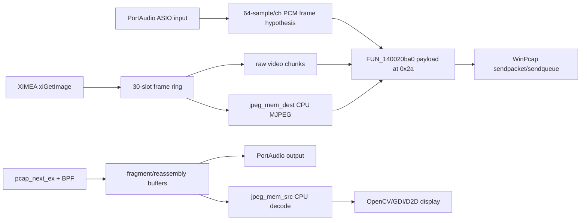

# AV TX/RX Protocol Decoding

## Static Ground Truth

| Finding | Status | Evidence |
|---|---|---|
| Control/session messages are plaintext `/MESG_*` strings. | confirmed | `FUN_14001fb60` builds the templates; `FUN_14001f390` parses command strings and dispatches UI messages. |
| Quick connection negotiates A/V format. | confirmed | `SR`, `BPS`, `CHNLS`, `FPS`, `BPP`, `X`, `Y`, `COMP`, and `BAYER` are in quick-connect and quick-connect ACK templates. |
| Default ports are control 7000, audio 19788, video 19798. | confirmed | `FUN_14002a6e0` reads `socketport` default `7000`, `audioport` default `0x4d4c`, `videoport` default `0x4d56`. |
| Receive filtering targets UDP from peer source to local destination and audio/video ports. | confirmed | `FUN_140016f20` compiles `ip and src host %s and dst host %s and (udp port %d or udp port %d)`. |
| Media packets are built as Ethernet + IPv4 + UDP style frames with payload at offset `0x2a`. | observed/inferred | `FUN_140020ba0` copies payload to `*param_1 + 0x2a`; callers send `payload_length + 0x2a`. |
| Audio packet size formula is `0x2a + channels * 0x80`. | inferred | `FUN_140009bf0` computes `*(int *)(param_1 + 0x54) * 0x80 + 0x2a`. |
| Raw video and CPU MJPEG both use WinPcap sendqueue batching. | confirmed | `FUN_1400115c0` and `FUN_140011c10` call `pcap_sendqueue_alloc`, `pcap_sendqueue_queue`, `pcap_sendqueue_transmit`, and `pcap_sendqueue_destroy`. |
| CPU MJPEG receive path exists. | confirmed | `FUN_1400152d0` calls `jpeg_CreateDecompress`, `jpeg_mem_src`, and `jpeg_read_scanlines` after `pcap_next_ex`. |

## Session Grammar Base

```text
check_status      = /MESG_CHECKLOLASTATUS;SRCIP:<ip>;DSTIP:<ip>;SID:<int>;
check_status_ack  = /MESG_CHECKLOLASTATUS_ACK;SRCIP:<ip>;DSTIP:<ip>;SID:<int>;
quickconn         = /MESG_QUICKCONN;SRCIP:<ip>;DSTIP:<ip>;SID:<int>;SR:<int>;BPS:<int>;CHNLS:<int>;FPS:<int>;BPP:<int>;X:<int>;Y:<int>;COMP:<int>;BAYER:<int>
quickconn_ack     = /MESG_QUICKCONN_ACK;SRCIP:<ip>;DSTIP:<ip>;SID:<int>;SR:<int>;BPS:<int>;CHNLS:<int>;FPS:<int>;BPP:<int>;X:<int>;Y:<int>;COMP:<int>;BAYER:<int>
reject            = /MESG_REJECT;SRCIP:<ip>;DSTIP:<ip>;SID:<int>;TXT:<text>
disconnect        = /MESG_DISCONNECT;SRCIP:<ip>;DSTIP:<ip>;SID:<int>;
switch_on_bb      = /MESG_SWITCH_ON_BB;SRCIP:<ip>;DSTIP:<ip>;SID:<int>;
switch_off_bb     = /MESG_SWITCH_OFF_BB;SRCIP:<ip>;DSTIP:<ip>;SID:<int>;
chat              = /MESG_CHAT;SRCIP:<ip>;DSTIP:<ip>;SID:<int>;TXT:<text>
send_audio_signal = /MESG_SEND_AUDIO_SIGNAL;SRCIP:<ip>;DSTIP:<ip>;SID:<int>
stop_audio_signal = /MESG_STOP_AUDIO_SIGNAL;SRCIP:<ip>;DSTIP:<ip>;SID:<int>
```

Compatibility parser rule: parse by command prefix first, then semicolon-separated
key/value fields. Preserve original command spelling and tolerate absent trailing
semicolon for the two audio-signal messages because the static templates omit it.

## Media Envelope Model

```text
wire_frame =
  ethernet_header[14]
  ipv4_header[20]
  udp_header[8]
  lola_payload[n]

lola_payload starts at wire offset 0x2a.
```

`0x2a` is exactly 42 decimal, matching Ethernet + IPv4 + UDP without options.
The packet builder also calls a Winsock ordinal with `0x1337`; this is most
likely a network-byte-order conversion for a fixed field, but the specific
field must not be named without a byte-level packet fixture.

## Audio TX/RX Base

Static inference:

```text
audio_wire_size = 42 + channels * 128
audio_payload_size = channels * 128
likely samples_per_packet_per_channel = 64 when BPS == 16
```

Implications:

- 1 channel, 16-bit: 128 byte payload, 170 byte wire frame.
- 2 channels, 16-bit: 256 byte payload, 298 byte wire frame.
- 8 channels, 16-bit: 1024 byte payload, 1066 byte wire frame.
- At 48 kHz and 64 samples/packet, the sender emits 750 audio packets/s.
- At 44.1 kHz and 64 samples/packet, the cadence is 689.0625 packets/s.

This is enough to design the compatibility-mode audio frame abstraction,
but not enough to mark the payload byte order, sequence fields, or drift policy
as confirmed. The expected payload is PCM because `BPS`, channel count,
PortAudio/ASIO, and WAV recording paths align; exact endianness is still a
validation item, with little-endian as the Windows-native hypothesis.

## Video TX/RX Base

Confirmed paths:

- `FUN_1400115c0`: raw video sendqueue TX.
- `FUN_140011c10`: CPU MJPEG encode plus sendqueue TX.
- `FUN_1400152d0`: receive, reassembly, optional CPU JPEG decode.
- `FUN_140012ec0`: XIMEA acquisition loop with a 30-slot ring modulo `0x1e`.

Static sendqueue hints:

```text
sendqueue_budget = (chunk_or_encoded_size + 0x32) * 0x1e
packet_payload_offset = 0x2a
video_ring_slots = 0x1e
```

The `0x1e` value is confirmed as 30 in capture/ring logic and sendqueue
sizing. The exact fragment count, sequence numbering, and per-fragment LoLa
header remain to be recovered from byte-level packet fixtures or deeper
decompiler variable recovery.

## Suspected TX/RX Pipeline



## Known Unknowns Blocking "Fully Decoded"

- LoLa media payload header field order and size.
- Sequence number, timestamp, frame ID, and channel marker locations.
- Audio byte order and signedness as observed on the wire.
- Video fragmentation boundary rules for raw and MJPEG modes.
- Drop, realignment, buffer underrun, and clock-drift policy.
- Dynamic loading of `gpujpeg.dll`, if any.
