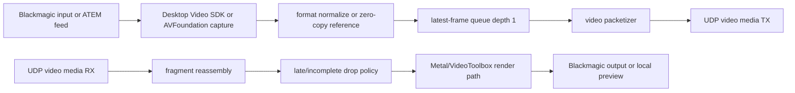

# Blackmagic Video RX/TX Plan

Date: 2026-05-04  
Status: implementation plan from live repository inspection  
Verdict: PARTIAL

## Evidence Labels

| Design choice | Label |
|---|---|
| AVFoundation, CoreMedia, CoreVideo, VideoToolbox, Metal, and Blackmagic Desktop Video SDK | `public API` |
| UDP media, direct LAN, DSCP, PTP-style timestamps, and frame-drop policies | `public standard` |
| open-lola video stream descriptors and media packet fields | `original open-lola design` |
| Physical Blackmagic capture/output latency evidence | `experimentally derived requirement` |
| Raw or intra-frame baseline before compression | `implementation hypothesis` |

## Current Blackmagic Status

| Question | Current answer |
|---|---|
| Is Blackmagic capture implemented? | AVFoundation capture is implemented for macOS-visible devices and classifies ATEM/DeckLink/UltraStudio names as Blackmagic production candidates. Blackmagic Desktop Video SDK is not linked. |
| Is Blackmagic output/render implemented? | Source-level RX/render is implemented with a local preview renderer, bounded pacing/drop metrics, and a Blackmagic output boundary. DeckLink output is not linked, and physical output evidence remains open. |
| Is video TX implemented? | Source-level one-stream TX exists: raw fragments carry stream ID, source role, timestamp basis, pixel format, dimensions, and frame rate, and can be wrapped in the UDP media envelope for loopback socket TX. Physical route evidence remains open. |
| Is video RX implemented? | Source-level RX exists for raw fragments and UDP media-envelope payloads: fragments reassemble by stream ID and frame sequence, duplicates/late/incomplete frames are counted, and synthetic reports include render/output latency. Live peer route evidence remains open. |
| Are multiple camera perspectives supported? | Staged local support exists for test-pattern perspectives. Physical multi-camera Blackmagic/ATEM support remains open. |
| Are multiple simultaneous video streams supported? | Staged local multi-stream support exists through `video-transport-run --stream-count <n> --visible-streams <n>`, currently capped at four test-pattern raw-fragment streams. Physical multi-camera route evidence remains open. |
| Is stream metadata negotiated? | Source-level negotiation exists through `VideoStreamDescription` and `SessionNegotiation`; physical peer-session evidence remains open. |
| Are frame format, resolution, and frame rate negotiated? | Source-level validation rejects unsupported pixel format, resolution, and frame rate. `video-transport-run` also accepts explicit stream ID, source role, pixel format, dimensions, and frame rate. |
| Where is video latency introduced? | Capture queue, frame conversion/copy, packetization, UDP scheduling, reassembly, latest-frame queue, render/output scheduling, and optional encode/decode. Current probes also use synthetic timestamps. |
| Can video interfere with audio? | Current validation rejects PASS if video increases audio p99/max, playout target, underruns, hidden impact, render/output drops, or missing Blackmagic output evidence. The source-level renderer drops video under pressure instead of changing audio targets; live integrated scheduler evidence remains open. |

## Target Pipeline

## API Strategy

Phase 1: AVFoundation path for any Blackmagic device exposed as UVC or camera
input. This keeps the first live capture path dependency-light.

Phase 2: Blackmagic Desktop Video SDK adapter when:

- AVFoundation does not expose the required input/output;
- AVFoundation adds unacceptable latency;
- output to SDI/HDMI through DeckLink/UltraStudio is required;
- exact hardware format control is needed.

Phase 3: VideoToolbox/Metal optimization after raw or intra-frame baseline
measurements show whether compression or GPU conversion helps.

## Video Stream Description

Each stream must negotiate:

- stream ID;
- human label;
- source kind: Blackmagic input, ATEM program, ATEM preview, AVFoundation device,
  test pattern;
- direction: send, receive, bidirectional;
- width, height, frame rate numerator/denominator;
- pixel format;
- transport format: raw, intra-frame, VideoToolbox H.264, VideoToolbox HEVC;
- max packet bytes and fragment count;
- queue depth and drop policy;
- output target: Blackmagic output, local preview, record-only, disabled.

## Latency Policy

- Default queue depth is one.
- Video frames carry capture timestamps and monotonically increasing frame
  sequence numbers.
- Receivers drop incomplete, stale, duplicate, or too-late frames.
- Video never waits for audio and never requests audio buffer growth.
- Under load, reduce or disable video before changing audio latency.

## Affected Files

Active source files:

- `Sources/OpenLolaCore/Video/VideoStreamDescription.swift`
- `Sources/OpenLolaCore/Video/VideoMediaSocket.swift`
- `Sources/OpenLolaCore/Video/VideoOutputRenderer.swift`
- `Sources/OpenLolaCore/Video/BlackmagicOutputBoundary.swift`
- `Sources/OpenLolaCore/Video/VideoCaptureAVFoundation.swift`
- `Sources/OpenLolaCore/Video/VideoCaptureRunner.swift`
- `Sources/OpenLolaCore/Video/VideoCaptureReport.swift`
- `Sources/OpenLolaCore/Video/VideoTransportPacket.swift`
- `Sources/OpenLolaCore/Video/VideoTransportReassembly.swift`
- `Sources/OpenLolaCore/Video/VideoTransportRunner.swift`
- `Sources/OpenLolaCore/Video/VideoTransportReport.swift`
- `Package.swift`

Planned adapter names, not active source contracts:

- BlackmagicDeviceInventory.swift
- BlackmagicCaptureAdapter.swift
- BlackmagicOutputAdapter.swift

## Tests

- Blackmagic/AVFoundation device inventory classification;
- Desktop Video SDK adapter unavailable/linked states;
- stream descriptor negotiation;
- format mismatch rejection;
- frame fragment encode/decode with stream ID, source role, timestamp basis,
  dimensions, pixel format, and frame rate;
- UDP media envelope video loopback TX;
- late and incomplete frame drop;
- receiver latest-frame policy;
- output renderer smoke with fake frames;
- Blackmagic output boundary compile/runtime fallback;
- audio-impact guard under video-active reports.

## Benchmarks

- capture callback-to-queue latency;
- capture-to-packet latency;
- packetization copy count and memory bandwidth;
- RX reassembly latency;
- render/output latency;
- VideoToolbox encode/decode latency if enabled;
- CPU/GPU/memory cost for each format;
- audio callback p99/max with video active.

## Resume here

Run physical Blackmagic/ATEM capture, RX/render, and video-route probes. The
source-level stream description, staged multi-stream raw transport, fragment
metadata, UDP media-envelope TX loopback, bounded RX reassembly, local
render/output policy, and latency report fields are implemented, but PASS still
needs hardware capture/output plus audio-on/video-on benchmark evidence.

VERDICT: PARTIAL
