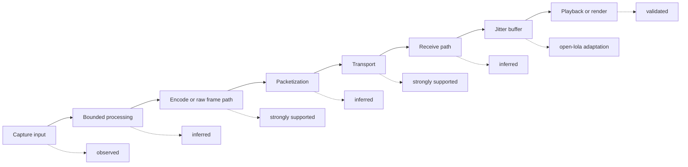

# LoLa-Style AV Architecture

Date: 2026-05-03  
Status: publication-safe architecture summary  
Scope: conceptual TX/RX flow only

## Safety Boundary

This document describes architecture-level behavior. It does not publish
private symbols, function names, addresses, binary excerpts, proprietary packet
fields, or exact recovered implementation logic.

Internal notes informed only the safe evidence labels in the diagram; the
public text stays at component and responsibility level.

## Architecture Flow

## Stage Labels

| Stage | Stage label | Publication-safe finding | open-lola implication |
|---|---|---|---|
| Capture input | observed | The design is organized around direct audio/video device input rather than a general-purpose streaming server. | Keep capture close to hardware and measure real device behavior. |
| Bounded processing | inferred | Processing appears constrained so that media deadlines dominate feature work. | Keep realtime work bounded and reject latency-growing defaults. |
| Encode or raw frame path | strongly supported | Audio favors a low-overhead path; video can use CPU JPEG-like or raw/near-raw frame handling where evidence permits. | Treat codec work as subordinate to audio timing. |
| Packetization | inferred | Media is packet-oriented and deadline-sensitive. | Keep packet contracts small, testable, and fixture-backed. |
| Transport | strongly supported | A direct media path is favored over high-latency adaptive streaming behavior. | Default to measured wired routes before adding resilient WAN modes. |
| Receive path | inferred | RX handling prioritizes timely delivery over complete reconstruction. | Drop or mark late media instead of expanding default latency. |
| Jitter buffer | open-lola adaptation | Small fixed buffering is the safest public design lesson. | Validate zero or one receive-block targets before increasing depth. |
| Playback or render | validated | open-lola validates playback/render contracts through reports and fixtures. | Keep validation artifacts tied to observable output. |

## Adaptation Boundary

The public model is intentionally not byte-exact. It preserves the lessons that
matter for open-lola: audio-first scheduling, bounded work, small buffering,
separate media responsibilities, and explicit validation labels.

VERDICT: PARTIAL
