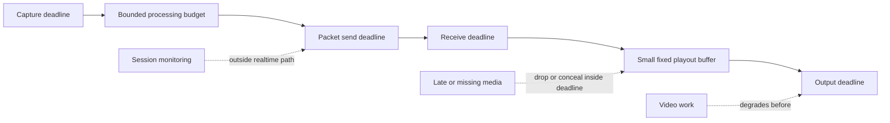

# LoLa-Style Latency Analysis

Date: 2026-05-03  
Status: publication-safe latency model  
Scope: why the system appears fast and how open-lola validates that lesson

## Safety Boundary

This analysis publishes timing principles, not proprietary algorithms or
field-level packet logic.

Internal evidence is reduced here to timing principles and validation paths;
the underlying implementation detail remains unpublished.

## Timing And Buffering Model

## Why The Original Design Appears Fast

| Factor | Claim label | Publication-safe explanation | open-lola validation path |
|---|---|---|---|
| Minimal buffering | strongly supported | Low-latency behavior depends on avoiding adaptive buffer growth in the default path. | Loopback and route reports must show the selected playout target. |
| Predictable packet timing | inferred | Packet cadence appears tied to media deadlines rather than background batching. | Packet fixtures and route probes must preserve block/frame cadence. |
| Low-overhead media path | strongly supported | Direct media handling avoids general streaming stacks that trade latency for resilience. | Benchmark direct UDP PCM before adopting resilient modes. |
| Audio-first scheduling | strongly supported | Audio timing is the primary user-visible deadline. | Integrated AV proof must show video does not increase audio playout latency. |
| Constrained feature scope | inferred | Nonessential features are kept away from the critical media path. | CLI/report surfaces separate measurement from realtime callbacks. |
| Video degrades before audio timing | inferred | Video loss or frame degradation is preferable to audio deadline growth. | Integrated reports must record video degradation separately from audio timing. |
| Direct device/network path | strongly supported | Low latency depends on device and route behavior, not only application code. | Route certification records wired path, loss, jitter, and verdict. |
| Latency-over-resilience trade-off | open-lola design decision | Fastest mode accepts less resilience to preserve timing. | WAN, relay, and retransmission modes stay outside the fastest default. |

## Practical Rule

The fastest mode is not the most feature-rich mode. For open-lola, any
resilience mechanism that expands default audio playout latency must be an
explicit non-default mode with its own verdict.

## Remaining Risks

- Real hardware may reject the smallest requested buffer sizes.
- Network paths may rewrite or ignore priority markings.
- Peer interoperability remains unvalidated until controlled tests exist.
- Video format work can still starve audio if implementation boundaries are not
  measured.

VERDICT: PARTIAL
