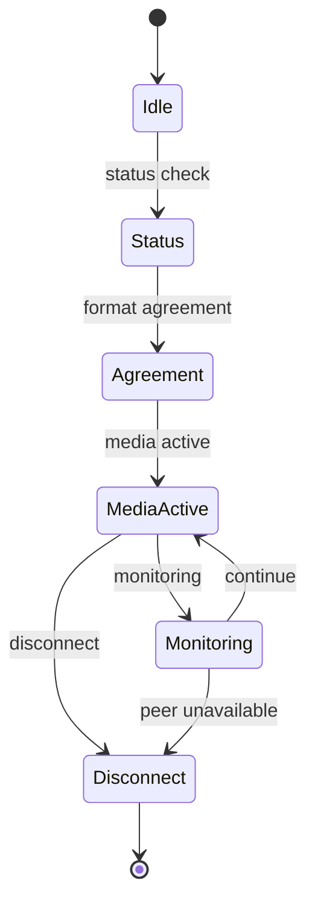

# LoLa-Style Networking Model

Date: 2026-05-15  
Status: publication-safe network/session model  
Scope: conceptual control, session, and media behavior

## Safety Boundary

This document avoids proprietary message names, exact message templates, port
numbers, packet byte maps, payload fields, and captured packet data.

Internal observations are summarized only as control/media separation and
deadline pressure; private message grammar remains outside this file.

## Public Model

The safe network model separates a lightweight control/session layer from the
deadline-sensitive media path.

| Path | Role | Publication-safe behavior | Claim label |
|---|---|---|---|
| Control/session | Establish peer status, media intent, format agreement, monitoring, and disconnect. | Lightweight messages coordinate whether media should be active. | strongly supported |
| Media | Carry audio and video data on a packet-oriented path. | Media is loss-sensitive and deadline-sensitive. | strongly supported |
| Receive filtering | Keep incoming media scoped to the active peer/session. | Filtering is described conceptually only. | inferred |
| Monitoring | Report health without driving the realtime callback. | Monitoring must not increase media deadline pressure. | open-lola design decision |

## Session Lifecycle

## Network Design Lessons

- Keep session/control traffic separate from media deadlines.
- Reply to peer status checks on the peer's control path after connection; the
  2026-05-15 Swift Windows LoLa probe showed this is required for the Windows
  check action to report the Mac responder as running.
- Treat media as packet-oriented and time-sensitive.
- Filter receive traffic to the intended session without publishing exact
  grammar.
- Prefer explicit route certification over assuming a campus or ISP path is
  usable.
- Label loss, jitter, peer behavior, and interoperability as validation gates.

## open-lola Adaptation

open-lola uses open packet contracts for its own tests and reports. Legacy
compatibility work may compare those contracts against sanitized evidence, but
public docs do not publish proprietary grammar.

VERDICT: PARTIAL
