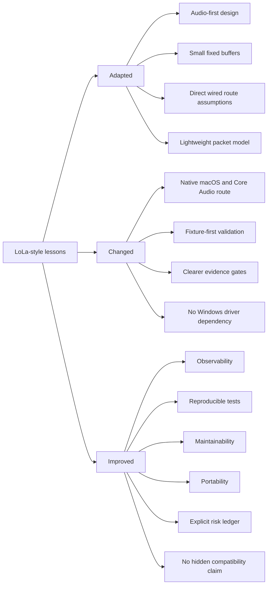

# Open Lola Deviations And Improvements

Date: 2026-05-03  
Status: publication-safe adaptation map  
Scope: what open-lola adapts, changes, and improves

## Evidence Boundary

The map keeps only public-safe lessons, deviations, and improvements; internal
evidence stays outside the publication lane.

This document separates architecture lessons from open-lola changes. It does
not publish proprietary implementation details.

## Adaptation And Improvement Map

## Adapted

| Area | Adapted lesson | open-lola use |
|---|---|---|
| Audio-first design | Audio timing is the primary deadline. | Video, lighting, and monitoring must not grow default audio latency. |
| Small fixed buffers | Minimal buffering is central to fast behavior. | Buffer depth is measured and reported. |
| Direct wired route assumptions | Fastest mode depends on predictable paths. | Route certification separates LAN, campus, ISP, relay, and future modes. |
| Lightweight packet model | Media should avoid unnecessary transport overhead. | open-lola packet contracts stay small and fixture-backed. |

## Changed

| Area | Change | Reason |
|---|---|---|
| Native macOS/Core Audio route | Use macOS-native audio APIs instead of legacy Windows device paths. | The target implementation must match the host platform. |
| Fixture-first validation | Treat fixtures and reports as the first compatibility surface. | Public claims need reproducible evidence. |
| Clearer evidence gates | Split validated, inferred, and future-work claims. | Prevents false-green compatibility language. |
| No Windows driver dependency | Do not require legacy Windows capture or packet drivers for open-lola core behavior. | Keeps the Mac port maintainable and testable. |

## Improved

| Area | Improvement | Practical effect |
|---|---|---|
| Observability | Machine-readable reports expose timing, route, and feature state. | Failures are inspectable. |
| Reproducible tests | Fixtures validate contracts before hardware is available. | Progress is measurable without pretending hardware proof exists. |
| Maintainability | Public docs avoid private symbols and raw recovered detail. | Contributors can reason from architecture and tests. |
| Portability | Hardware and network assumptions are explicit. | New hosts can be evaluated by reports. |
| Explicit risk ledger | Partial and blocked states are normal. | Unknowns remain visible. |
| No hidden compatibility claim | Compatibility remains scoped and labeled. | Maintainer review can focus on evidence gaps. |

## Summary

open-lola adapts the low-latency architecture lessons, changes the platform and
validation strategy, and improves observability. It does not publish or claim a
proprietary reimplementation.

VERDICT: PARTIAL
