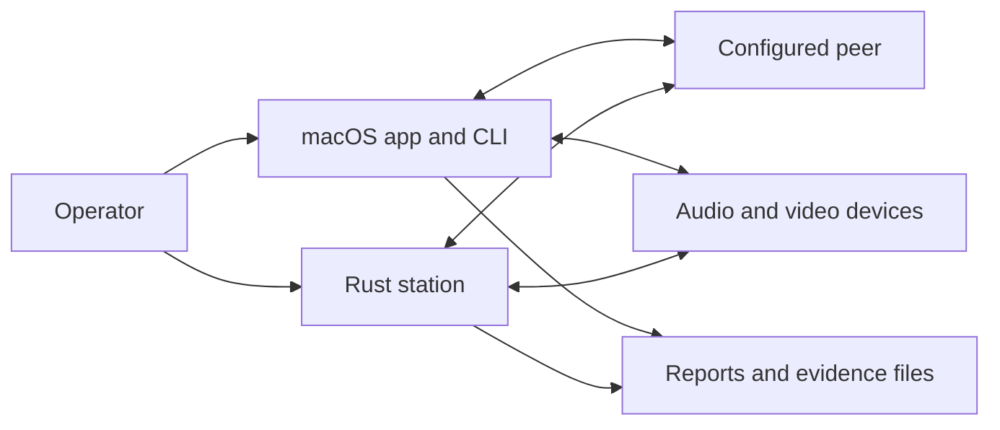
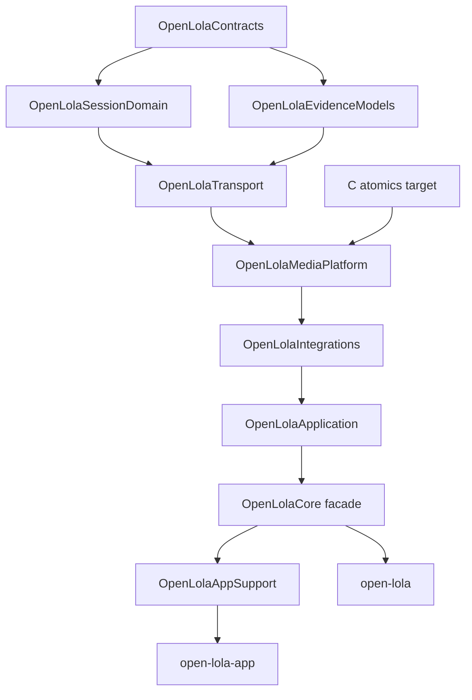

# Architecture

Open LoLa is a polyglot source repository for configuring, running, and
evaluating bounded low-latency audiovisual sessions. It holds two runtime
implementations and local packaging tools. This document maps the component
boundaries, the macOS target graph, the principal runtime flows, and the
invariants that keep the two runtimes independent.

The runtimes communicate through documented protocols and files; they do not
import one another.

## System context

An operator drives either runtime. Each runtime talks to a configured peer and
to local audio and video devices, then writes reports and evidence files. Those
artifacts are evidence, not configuration authorities.

`runtimes/macos` is the primary native operator runtime. `runtimes/rust-station`
is the Windows and native Linux station: Windows uses PortAudio/ASIO and XIMEA,
Linux uses ALSA and V4L2, and diagnostic media is always an explicit selection.
The public source tree does not bundle the synthetic compatibility corpus or
the Opus and JPEG XS codec implementations.

## Repository boundaries

| Boundary | Responsibility | Build or execution unit |
|---|---|---|
| `Package.swift`, `runtimes/macos/` | macOS libraries, CLI, and app | SwiftPM package |
| `runtimes/rust-station/` | Station protocol, configuration, devices, transport, UI, and session lifecycle | Cargo package `rusty-lola` |
| `tools/` | Local bundle assembly, asset generation, and source export | Repository scripts |
| `web/demo/` | Fixture-backed interface walkthrough | Static files |

Build output, caches, captures, reports, local packages, editor and agent state,
private material, and `archive/` are not architecture inputs or release content.
The source-candidate path policy lives in
`tools/release-boundary-policy.txt`.

## macOS target graph

SwiftPM targets are enforced dependency boundaries:

Arrows show the principal layering; every target may also import any target
below it (for example, `OpenLolaApplication` imports all lower modules).

| Target | Owns |
|---|---|
| `OpenLolaContracts` | Framework-free shared vocabulary: verdicts, run modes, JSON coding, and the CLI key/value argument syntax |
| `OpenLolaSessionDomain` | Side-effect-free session policy; depends only on contracts |
| `OpenLolaEvidenceModels` | Reusable reports and validators; depends only on contracts |
| `OpenLolaTransport` | Sockets, packet movement, NAT/network diagnostics, and transport policy. It may use system networking and process APIs, but not UI or media frameworks |
| `OpenLolaMediaPlatform` | Device, realtime-audio, video, camera-permission, and codec adapters |
| `OpenLolaIntegrations` | Bridges to external systems: LoLa, UltraGrid, JackTrip, and NMP connector families (`Connectors/`), ATEM/OSC/lighting show control (`Control/`), and the managed child-process runner (`Process/`). It cannot import `OpenLolaApplication` |
| `OpenLolaApplication` | Composition: CLI command bodies (`CLI/`), direct-peer session orchestration (`Session/`), media and benchmark runners (`Media/`, `IntegratedAV/`), evidence reports and validators that combine several domains (`Evidence/`), capability summaries, and the app-shell engine the SwiftUI app drives (`AppShell/`) |
| `OpenLolaCore` | A re-export facade and the stable public product. Internal modules can move behind it without changing what product consumers import. The product also includes the C atomics target |
| `OpenLolaAppSupport` | SwiftUI/AppKit presentation (`Sources/OpenLolaAppSupport`) |
| `open-lola`, `open-lola-app` | Executable targets that perform final composition; each directory also holds its Info.plist and entitlements |

The SwiftPM manifest defines the target DAG and import boundaries.

Inside `OpenLolaApplication`, the media, evidence, and direct-peer folders
reference each other at the feature level: benchmark runners produce reports that
the evidence validators consume, and session runners reuse media timing policy.
They stay together in one target on purpose. Splitting them would need
behavioural rewrites that the current test coverage cannot protect. New code for
a connector, show-control protocol, or external process belongs in
`OpenLolaIntegrations`. New code that combines several domains into a runnable
command or report belongs in `OpenLolaApplication`.

## Principal macOS runtime flow

The app follows configuration, preflight, explicit arm, execution, monitoring,
and evidence review. The UI stores operator settings, builds a validated
execution plan, and starts the CLI through a managed child process. Each run uses
a unique token. A zero process exit is not enough: the controller also requires
the selected report to exist, be current, carry the expected token, and pass its
validator.

Direct-peer execution then follows this ownership direction:

1. application policy parses configuration and validates capabilities;
2. session-domain types negotiate peers, streams, profiles, and lifecycle;
3. media adapters capture or synthesize frames, and codecs transform payloads;
4. transports packetize, send, receive, filter, and reassemble media;
5. device or preview adapters consume accepted frames; and
6. report models record observed values before validators classify the result.

Device, socket, process, filesystem, codec, and UI effects stay at explicit
adapters. Reports may describe missing evidence; they must never create it.

## Rust station

The Rust binary dispatches CLI commands into configuration, protocol, transport,
device, session, and egui layers. Windows defaults request XIMEA video and
PortAudio/ASIO audio; Linux defaults request ALSA and V4L2. Both fail when the
selected native backend or exact device format is unavailable, and diagnostic
media must be selected explicitly. Control, audio, and video use fixed LoLa
ports; the media plane can use ordinary UDP or Npcap where the platform and
adapter support it.

Settings defaults are overlaid by an optional settings file, an optional session
profile, and explicit CLI values. The station can dynamically load native
libraries, so the search path is an execution trust boundary documented in
[SECURITY.md](../SECURITY.md) and [configuration.md](configuration.md).

Transport owns bounded packet movement; device adapters own native handles and
cancellation; session supervision owns start/stop and ordered finalization.
Capture/encoding and bounded recording workers keep device waits and file writes
away from audio scheduler deadlines. Protocol values and negotiation policy stay
independent of egui and native media, and typed controller snapshots and
commands connect the session runtime to presentation.

Native Linux adapters compile independently of the optional `gui` feature. ALSA
uses nonblocking direct hardware PCMs with exact negotiation; V4L2 uses bounded
MMAP buffers and finite polling. Inventory is capability evidence only. See
[Linux migration](linux-migration.md).

## State and persistence

- The macOS app persists operator choices through `UserDefaults`; selected UI
  sections use SwiftUI scene/application storage. Logs and generated evidence
  use operator-selected or cache-based filesystem paths.
- The Rust station reads and writes its documented settings and session formats.
  Tracked camera catalogs are package resources; local DLLs and runtime output
  are not.
- Reports, packet captures, and external proof bundles are evidence artifacts,
  not configuration authorities.

See [configuration.md](configuration.md) for precedence and safe inputs, and
[source-contracts.md](source-contracts.md) for compatibility surfaces.

## External and security boundaries

The runtimes integrate with Core Audio, AVFoundation, optional vendored codecs,
native Windows DLLs, ALSA, V4L2, Npcap, SSH/SCP, and configured network peers.
Current wire paths do not provide peer authentication or media confidentiality
and integrity. Operation therefore assumes trusted hosts, reviewed executables,
controlled paths, and isolated networks. [SECURITY.md](../SECURITY.md) defines
the operating boundary.

## Build and release boundaries

The root Makefile composes language-specific checks. SwiftPM, Cargo, and the
Python tooling remain independently testable, and the static demo is not part of
a native runtime.

macOS bundle scripts create ad-hoc-signed local test artifacts. The repository
has no automated deployment or publication command. A release candidate is a
source allowlist exported outside the checkout and checked against the release
policy; it still requires explicit approval and the applicable external
evidence. See [RELEASING.md](RELEASING.md).

## Invariants and non-goals

- The two runtimes remain implementation-independent.
- Session policy remains framework-free and side-effect-free.
- Transport does not own UI or device/media frameworks.
- Vendored trees are not first-party product-logic locations.
- Synthetic, localhost, source, and offline-render evidence never establishes
  physical or reference-peer behavior.
- This source alpha does not claim a supported distribution, hostile-network
  security, or certified hardware operation.
