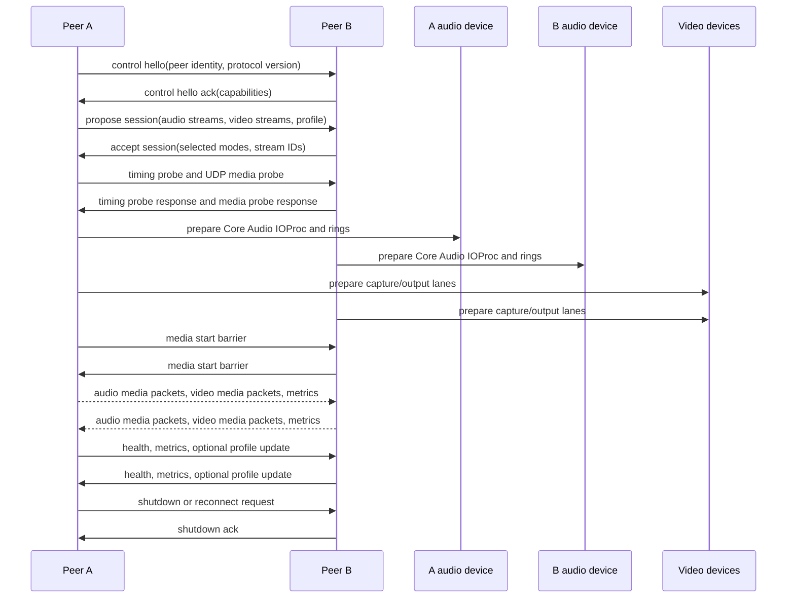
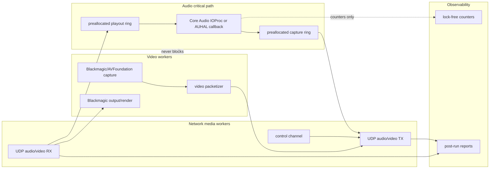
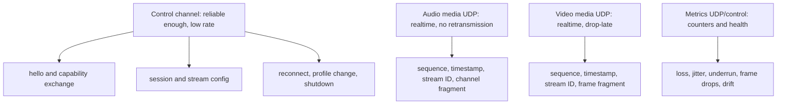

# End-to-End P2P Session Architecture

Date: 2026-05-04  
Status: M06 source-level direct P2P session and UDP media contract implemented; live AV field session still open  
Verdict: PARTIAL

## Evidence Labels

| Design choice | Label |
|---|---|
| Core Audio HAL, AudioDeviceIOProc, AVFoundation, VideoToolbox, and Blackmagic Desktop Video SDK boundaries | `public API` |
| UDP-first media transport, DSCP, PTP, AVB, RTP-style sequence/timestamp concepts | `public standard` |
| open-lola control messages, stream IDs, and media packet structures | `original open-lola design` |
| Hardware PASS gates and latency thresholds | `experimentally derived requirement` |
| Direct LAN/direct IP as the gold-standard profile | `implementation hypothesis` |

## Repository Assessment

The current Swift package has substantial validation and probe contracts, but it
does not yet implement a complete full-duplex peer session that moves live MADI
audio plus live Blackmagic video end to end.

Current implemented or partially implemented source surfaces:

- `Sources/OpenLolaCore/Audio/CoreAudio/CoreAudioInventoryReader.swift`: read-only Core Audio
  device inventory, stream/channel counts, sample rates, buffer candidates,
  latency, safety offsets, and clock domain.
- `Sources/OpenLolaCore/Audio/Routing/AudioLoopbackRun.swift`: same-device
  AudioDeviceIOProc loopback probe with callback timing and input-to-output copy.
- `Sources/OpenLolaCore/Network/UDP/UdpPcmPacket.swift`: UDP PCM v1 packet encode/decode
  with explicit sample rate, frames, channel count, sample format, sequence, and
  host-time timestamp.
- `Sources/OpenLolaCore/Network/UDP/MultichannelTransport.swift` and
  `Sources/OpenLolaCore/Network/UDP/UdpPcmV2Packet.swift`: source-level multichannel
  negotiation, channel descriptors, v2 channel-range fragmentation, and
  reassembly.
- `Sources/OpenLolaCore/Audio/Realtime/RealtimeAudioPacketHandoff.swift`: preallocated block
  handoff metrics, but current packet emission is silence and not live audio
  payload.
- `Sources/OpenLolaCore/Timing/RxBuffering.swift`: Direct, Small, Adaptive, and
  Stable/WAN RX buffer profiles with visible latency cost.
- `Sources/OpenLolaCore/Video/VideoCaptureAVFoundation.swift`: AVFoundation inventory,
  Blackmagic-first device classification, and sample-buffer capture probe.
- `Sources/OpenLolaCore/Video/VideoTransportPacket.swift` and
  `Sources/OpenLolaCore/Video/VideoTransportRunner.swift`: raw test-pattern frame
  fragmentation, UDP socket send/receive, and reassembly; not live Blackmagic
  TX/RX.
- `Sources/OpenLolaCore/NatFriendlyRoute*.swift`: self-hosted UDP rendezvous,
  direct traversal smoke, relay fallback, and byte-exact UDP loopback; not a
  complete AV session model.
- `Sources/OpenLolaCore/Network/UDP/UdpMediaTransport.swift`: direct UDP media envelope and
  loopback socket transport for payload type, stream ID, sequence number,
  timestamp, and loss/jitter metrics.
- `Sources/OpenLolaCore/Network/P2P/PeerSessionRunner.swift`: source-level direct manual
  peer session runner, media start/stop boundaries, reconnect state, shutdown,
  advisory audio metadata exchange, and stream-ID audio routing into the MADI
  receive source contract.
- `Sources/OpenLolaCore/Network/P2P/DirectPeerSessionSocketRunner.swift`: socket-backed
  local and manual-address control JSON exchange, advisory RME/channel metadata
  exchange, UDP `audioTiming` media probe exchange, plus UDP media path runner
  for M06 report evidence.
- `Sources/OpenLolaCore/Network/P2P/DirectPeerMeshTopologyReport.swift`:
  source-level three-or-more-peer endpoint topology and directed route report;
  this validates mesh shape without starting a multi-peer media runtime.
- `Sources/OpenLolaCore/Network/P2P/DirectPeerMeshRuntimeReport.swift`:
  localhost all-pairs mesh runtime report; it routes UDP PCM v2 audio fragments
  across every directed peer pair and validates complete reassembly metrics.
- `Sources/OpenLolaCore/Core/PeerIdentity.swift`, `SessionProtocol.swift`,
  `SessionControlMessage.swift`, `AudioStreamDescription.swift`,
  `VideoStreamDescription.swift`, and `SessionNegotiation.swift`: source-level
  peer identity, capability documents, deterministic control JSON, session
  proposal/acceptance, stream ID validation, two-or-more-peer media endpoint
  topology validation, latency-profile agreement, and shutdown/error state
  handling.

Current gaps:

- no two-machine control-channel socket proof; M06 now has local socket-backed
  control JSON, advisory metadata, UDP timing probes, and UDP media run evidence;
- no physical runtime mesh proof for more than two simultaneous peers, although
  accepted configurations, `direct-p2p-mesh-topology-synthetic-smoke`, and
  `direct-p2p-mesh-runtime-localhost-smoke` now validate two-or-more-peer
  endpoint topology and localhost all-pairs UDP PCM v2 delivery;
- no live full-duplex MADI media graph from Core Audio input to network to Core
  Audio output;
- no audio RX path that writes negotiated multichannel payload to device output;
- no DeckLink/Blackmagic SDK capture or output adapter;
- no live Blackmagic video media sender/receiver path;
- no runtime multiple simultaneous video stream sender/receiver path;
- no physical cross-peer clock model beyond packet timestamps, UDP timing probes,
  drift estimates, and report contracts;
- no measured direct LAN reconnect proof or cross-peer health benchmark.

## Target Lifecycle

## Threading Model

## Session Model

The source-level M02 session model is explicit and original to open-lola:

- `PeerIdentity`: stable peer ID, display label, implementation version,
  optional signing/public-key field for later authenticated profiles.
- `CapabilitySet`: supported audio hardware, audio transport modes, video
  hardware, video transport modes, latency profiles, RX profiles, and network
  limits.
- `SessionProposal`: selected peer roles, direct addresses, control/media ports,
  latency profile, audio streams, video streams, and benchmark mode.
- `SessionConfiguration`: accepted stream IDs, sample rates, formats, channel
  counts, video formats, MTU, timing mode, and buffer mode.
- `PeerSessionLifecycleState`: idle, handshaking, configured, mediaStarting,
  running, recovering, shuttingDown, closed, failed.
- `SessionControlMessage`: hello, capabilities, proposal, accept, reject,
  advisory audio metadata, media start, media pause, metrics, error, and
  shutdown messages encoded as deterministic JSON.
- `UdpMediaPacket`: UDP media envelope with payload type, stream ID, sequence
  number, timestamp, and nested UDP PCM v2 or video fragment payload.

## Control And Media Channels

Control can initially be TCP or UDP-with-ack because it is outside the audio
deadline. Media remains UDP-first. QUIC can be evaluated for control only after
direct IP is working.

## Affected Files

Implemented M02/M06 source files:

- `Sources/OpenLolaCore/Core/PeerIdentity.swift`
- `Sources/OpenLolaCore/Protocol/SessionProtocol.swift`
- `Sources/OpenLolaCore/Protocol/SessionControlMessage.swift`
- `Sources/OpenLolaCore/Protocol/SessionNegotiation.swift`
- `Sources/OpenLolaCore/Audio/CoreAudio/AudioStreamDescription.swift`
- `Sources/OpenLolaCore/Video/VideoStreamDescription.swift`
- `Sources/OpenLolaCore/Network/P2P/PeerSessionRunner.swift`
- `Sources/OpenLolaCore/Network/P2P/DirectPeerSessionSocketRunner.swift`
- `Sources/OpenLolaCore/Network/UDP/UdpMediaTransport.swift`
- `Sources/OpenLolaCore/Core/OpenLolaCLI.swift`
- `Sources/open-lola/main.swift`
- `Sources/open-lola/Commands/Network/NetworkCommands.swift`
- `Tests/OpenLolaCoreTests/SessionProtocolTests.swift`
- `Tests/OpenLolaCoreTests/SessionNegotiationTests.swift`
- `Tests/OpenLolaCoreTests/PeerSessionRunnerTests.swift`
- `Tests/OpenLolaCoreTests/UdpMediaTransportTests.swift`
- `Tests/OpenLolaCoreTests/ReconnectionTests.swift`

Still planned runtime files:

- AudioMediaSocket.swift
- `Sources/OpenLolaCore/Video/VideoMediaSocket.swift`
- SessionCommands.swift
- tests under `Tests/OpenLolaCoreTests/*Session*Tests.swift`

Existing files to extend:

- `Package.swift`
- `Sources/open-lola/main.swift`
- `Sources/open-lola/Commands/Network/NetworkCommands.swift`
- `Sources/OpenLolaCore/Network/UDP/MultichannelTransport.swift`
- `Sources/OpenLolaCore/Network/UDP/UdpPcmV2Packet.swift`
- `Sources/OpenLolaCore/Video/VideoTransportPacket.swift`
- `Sources/OpenLolaCore/Audio/Realtime/RealtimeAudioEngine.swift`
- `Sources/OpenLolaCore/Audio/Realtime/RealtimeAudioPacketHandoff.swift`
- `Sources/OpenLolaCore/Timing/RxBuffering.swift`

## Acceptance Boundary

This architecture reaches PASS only when two peers can:

- negotiate one bidirectional MADI audio stream each way;
- negotiate at least one bidirectional or unidirectional video stream;
- run direct IP media with audio TX/RX active simultaneously;
- keep audio callback p99/max within the selected latency profile;
- keep underruns, overruns, late packets, and drift within measured thresholds;
- degrade video before changing audio buffering;
- recover from peer restart or network interruption without hanging callbacks;
- shut down without leaked device callbacks, sockets, or worker threads.

## Resume here

Next implementation step: run the M06 direct LAN/manual-address smoke on two
peers and attach packet timing evidence. Keep source loopback separate from
PASS evidence for physical MADI and direct LAN transport.

VERDICT: PARTIAL
