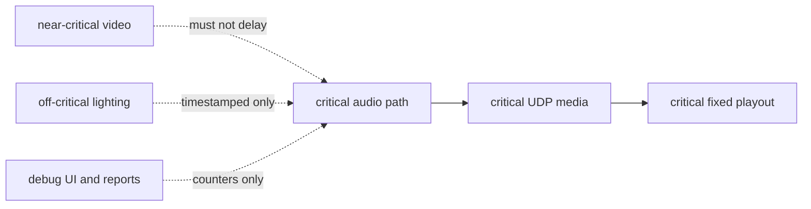

# Latency Budget

Date: 2026-05-04  
Status: publication-safe latency budget with multichannel/RX planning  
Verdict: PARTIAL

## Evidence Labels

| Design choice | Label |
|---|---|
| Audio as the critical product deadline | `original open-lola design` |
| Initial numeric targets before reference-rig evidence | `implementation hypothesis` |
| Core Audio inventory, analog loopback, and packet-capture validation | `experimentally derived requirement` |
| Video, lighting, UI, recording, and relay work outside the fastest path | `original open-lola design` |

## Budget Rule

Audio latency is the product requirement. Video, lighting, UI, recording,
reliability, and compatibility features are subordinate to the audio deadline.

All numbers below are targets for the fastest direct peer-to-peer profile. They
are not PASS claims until measured on the reference rig.

## Audio Budget

| Component | Initial target | Class | Validation |
|---|---:|---|---|
| Audio interface buffer | 16/32/64 frames = 0.33/0.67/1.33 ms at 48 kHz | critical path | Core Audio inventory and loopback matrix |
| Capture safety/device latency | <= 0.5-1.5 ms measured | critical path | analog loopback |
| Callback handoff | <= 0.1 ms | critical path | callback timing and allocation probe |
| Packetization | <= 0.1 ms | critical path | packetization benchmark |
| Direct LAN packet age | <= 0.3-1.0 ms | critical path | two-Mac packet capture |
| Jitter/playout target | 0-1 audio block | critical path | route and realtime engine report |
| Drift/PLC correction | no target growth; outside callback | critical path | M06 drift/PLC report and fixed-target tests |
| Playback safety/device latency | <= 0.5-1.5 ms measured | critical path | analog loopback |
| Corrected one-way audio | aspirational <= 5 ms on direct LAN | critical path | impulse/test-tone loopback |

The acceptance threshold is the fastest stable measured mode, not the smallest
buffer a device reports.

## Latency Profiles

| Profile | Buffer target | 48 kHz block time | 96 kHz block time | Default RX target | PASS boundary |
|---|---:|---:|---:|---:|---|
| Safe Low Latency | 32 frames, fallback 64 | 0.667 ms / 1.333 ms | 0.333 ms / 0.667 ms | 0-1 packet | broad stable profile |
| Ultra Low Latency 16 | 16 frames | 0.333 ms | 0.167 ms | 0-1 packet | explicit RME/direct opt-in |
| Extreme Low Latency 8 | 8 frames | 0.167 ms | 0.083 ms | 0-1 packet | experimental only until physical proof |

These figures are only the audio block duration. A report must add device
latency, safety offsets, packetization, network packet age, RX target, drift/PLC
behavior, and playback latency before making an end-to-end claim.

`LatencyProfileBudget` now calculates the block duration, packet rate, payload
bytes per packet, payload bytes per second, and default direct RX cost for each
profile. The calculator is source-shape evidence only until the same profile is
attached to a measured benchmark or tuning report.

## RX Buffer Budget

| RX mode | Target | Added latency class | Fastest PASS eligible |
|---|---:|---|---|
| Direct / no extra buffer | 0-1 packet | minimum | yes |
| Small RX buffer | 1-2 packets | visible small cost | only if profile allows |
| Adaptive RX buffer | min 1, max 4 or configured | variable visible cost | no for fastest direct PASS |
| Stable/WAN buffer | configured ms or 8-16 packets | continuity-first cost | no |

Every RX target change must be measured in frames, packets, and microseconds.
Hidden growth invalidates fastest audio PASS.

## Multichannel Cost Rule

Multichannel transport adds bandwidth, packetization, and pacing pressure. A
multichannel report must state:

- selected channel count;
- sample format;
- bytes per audio deadline;
- fragment count per deadline;
- maximum datagram size;
- sender packetization CPU;
- receiver mix cost;
- max stable channel count for the selected frame size.

MADI-scale operation is accepted only when the fragment count fits the audio
deadline and no datagram relies on IP fragmentation.

## Video Budget

| Component | Initial target | Class | Validation |
|---|---:|---|---|
| Capture | one frame period minimum reality | near-critical | frame-age report |
| Encode/decode | raw = 0; compressed < 1 frame if used | optional | VideoToolbox or SDK benchmark |
| Transport | latest complete frame only | near-critical | packet-captured route |
| Render/output | drop stale frames | near-critical | frame-age and display smoke |

Video must drop quality or frames before it changes audio buffering.

## Lighting Budget

| Component | Initial target | Class | Validation |
|---|---:|---|---|
| OSC cue timing | <= 2-5 ms local jitter | off critical path | loopback and external peer report |
| sACN/Art-Net output | <= 25 ms cue-to-output target | off critical path | isolated fixture or bridge report |
| Safety/blackout policy | no media impact | optional | lighting gate report |

## Debug And Fallback Budget

Debug traces, UI, logging, recording, compatibility relay, and fallback codecs
are debug-only or optional. They must report their cost and must not run on the
audio callback path.

## Critical-Path Map

## Resume here

Continue with [benchmark-methodology.md](benchmark-methodology.md), attach
measured `LatencyProfileEvidence` to RME/direct-route reports, and keep each
measurement report classifying components as critical, near-critical,
off-critical, optional, or debug-only.

VERDICT: PARTIAL
