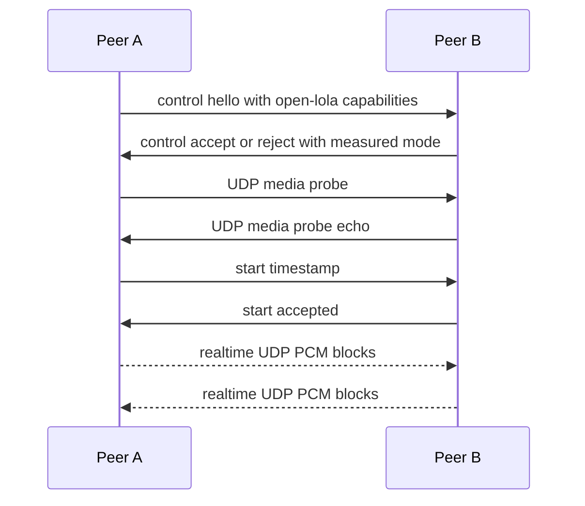

# Latency-First Architecture

Date: 2026-05-03  
Status: publication-safe latency-first architecture  
Verdict: PARTIAL

## Evidence Labels

| Design choice | Label |
|---|---|
| Core Audio, AVFoundation, VideoToolbox, Blackmagic/ATEM, and driver-visible device APIs | `public API` |
| UDP, OSC, Art-Net, sACN, PTP, AVB, AES67, RAVENNA, and Dante references | `public standard` |
| Fastest audio path as the default architecture | `original open-lola design` |
| Zero or one receive block until measurement rejects it | `implementation hypothesis` |
| Physical benchmark reports as PASS evidence | `experimentally derived requirement` |

## Goal

The fastest profile is the default. Features that increase audio latency are
optional, measurable, and disabled until the benchmark says otherwise.

Priority order:

1. Lowest possible audio end-to-end latency.
2. Reliable, low-latency video that never steals the audio deadline.
3. Lighting/control as a secondary synchronized path.

## Lowest-Latency Audio Pipeline

```mermaid
flowchart LR
    RMEIn[RME or low-latency Core Audio input]
    Capture[AudioDeviceIOProc capture]
    TxRing[Preallocated TX ring]
    Packet[Open-lola UDP PCM packetizer]
    Network[Direct UDP path]
    Rx[Nonblocking UDP receiver]
    Playout[Zero or one-block playout ring]
    Playback[AudioDeviceIOProc playback]
    RMEOut[RME or low-latency Core Audio output]

    RMEIn --> Capture --> TxRing --> Packet --> Network --> Rx --> Playout --> Playback --> RMEOut
```

Audio callback rules:

- no blocking I/O;
- no heap allocation;
- no locks where avoidable;
- no logging except lock-free counters;
- no video, lighting, UI, recording, or packet retransmission work.

## Audio Capture Path

Use Core Audio HAL through `AudioDeviceIOProc` or AUHAL. The preferred hardware
path is a single non-aggregate professional interface, initially RME MADI or a
compatible device visible to Core Audio. Sample-rate conversion is rejected for
the fastest profile.

## Audio Transmit Path

The callback writes captured frames into a preallocated single-producer,
single-consumer handoff. A media sender thread packetizes fixed audio blocks
into an original open-lola UDP PCM format. Socket setup must complete before
audio starts.

## Audio Receive And Playback Path

The receiver validates sequence, timestamp, sample rate, frame count, channel
count, and format. Playback uses a fixed target of zero or one receive block.
Late media is dropped or replaced by same-deadline PLC; playback never waits
for retransmission.

The M06 source path keeps this target explicit: fixed-target jitter handling
queues only the due packet block, reports packet age and sender/receiver frame
drift, and emits same-deadline PLC events without changing the target depth.

## Clocking And Synchronization

Audio is the master clock. Packets carry sender frame position and monotonic
host time. Drift estimation and correction happen outside the audio callback.
PTP, AVB, AES67, RAVENNA, and Dante are benchmarked compatibility modes, not
default assumptions.

## Packetization And Transport

Media uses minimal UDP framing by default. The packet format is an original
open-lola design and must remain fully documented. It must not reproduce a
proprietary LoLa wire format.

## Peer Discovery And Session Setup

Manual direct IP configuration is the gold standard. A small control channel
may negotiate protocol version, sample rate, frame size, channel count, sample
format, and endpoint addresses. Discovery and NAT traversal are optional and
must not complicate the direct media path.

## Video Path

Video capture is Blackmagic/ATEM/DeckLink/UltraStudio first where available,
with AVFoundation as the macOS fallback. The video path uses latest-frame
queues, drops late frames, and never increases audio playout latency. Raw or
intra-frame transport is the first benchmark target; VideoToolbox is optional
only after CPU, latency, and queue-depth measurements.

## Lighting And Control Path

OSC is the first control protocol. Art-Net and sACN are allowed only behind
explicit safety gates, isolated networking, and local fixture ownership. Cue
timestamps may be aligned to the audio clock, but lighting never blocks media.

## Monitoring And Telemetry

Realtime paths expose counters only. Reports are written after the run and
include packet age, jitter, packet loss, underruns, dropped frames, CPU load,
memory allocation warnings, and thread scheduling warnings.

## Fallback Modes

Fallbacks are allowed only when labeled:

- larger audio buffers;
- QUIC or TCP control transport;
- NAT traversal or relay;
- compressed video;
- recording;
- GUI monitoring;
- live lighting output.

Fallbacks are never the fastest default.

## Integrated Profile Contract

M12 keeps the release profile explicit rather than implicit:

- `fastest-audio` is the default profile and contains no optional video or
  lighting/control feature.
- `audio-video`, `audio-lighting`, and `audio-video-lighting` are opt-in
  profiles with measured latency-cost fields.
- The integrated profile aggregates subordinate audio, route, video, A/V, and
  lighting/control verdicts without flattening them into a single hidden status.
- PASS requires physical measured PASS evidence for every subordinate lane and
  every benchmark matrix row.
- Degradation order is video quality, video frame rate, optional lighting
  disable, optional video disable, then audio latency only as the last resort.

## Resume here

Continue with [latency-budget.md](latency-budget.md), then make the benchmark
schema enforce the critical-path classification.

VERDICT: PARTIAL
