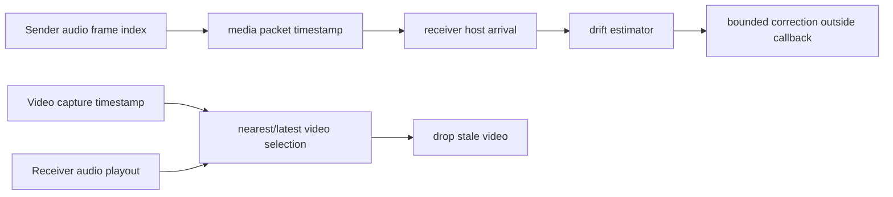

# AV Sync And Timing

Date: 2026-05-04  
Status: source-level timing model implemented; physical sync evidence pending  
Verdict: PARTIAL

## Evidence Labels

| Design choice | Label |
|---|---|
| mach continuous time, Core Audio host time, CoreMedia timestamps, and device latency fields | `public API` |
| PTP, RTP-style timestamps, direct UDP timing probes, and jitter metrics | `public standard` |
| Audio-master sync and video drop-nearest policy | `original open-lola design` |
| Drift, PLC, and latency profile PASS gates | `experimentally derived requirement` |
| PTP as optional external reference, not first implementation dependency | `implementation hypothesis` |

## Objective

Keep audio as the master clock. Video aligns to audio when possible, but video is
never allowed to block audio, increase audio playout target, or request hidden
buffer growth.

## Current State

Implemented:

- audio packets carry sender frame index and sender host-time timestamp;
- route reports compute packet age, jitter, late, duplicate, and reordered
  counts;
- M05 full-duplex source reports estimate drift from sender frame deltas versus
  receiver playout frame deltas;
- fixed-target PLC report contracts reject retransmission waits and hidden
  playout growth;
- integrated AV reports reject non-audio master policies and video-induced
  audio waits.
- bounded M05 correction events are recorded with
  `changedInsideAudioCallback == false`.
- `MediaClockAnchor` maps sender frame indexes to monotonic host time for
  source-level timing tests.
- `MediaTimingPacket` records stream ID, sequence number, observed payload type,
  sender frame index, remote sender time, local observation time, and timestamp
  origin for audio and video packet observations.
- `MediaClockDriftEstimator` reports peer offset and drift slope with the
  M05-compatible `outsideCallback` correction boundary.
- `AVSyncPolicy` and `AVTimestampAligner` keep audio as master while allowing
  video to render, defer, or drop.
- `VideoTransportReport.avSync` records audio route age, video frame age, AV
  offset, jitter, drift, sync decision counts, and explicit timestamp origins.
- `integrated-av-run --video-transport-report <path>` validates a measured
  `video-transport-run` report and carries its frame age, receiver drop count,
  packet-capture point, source format, and frame identity range into the M10
  integrated A/V aggregate. The local aggregate remains `PARTIAL` until the
  audio baseline, RME device, Blackmagic/ATEM source, external control, and
  30-minute physical run are present.

Missing:

- physical cross-peer timing packet exchange in the live media runtime;
- peer clock offset/drift estimator in the physical media runtime;
- audio playout clock correction applied to real RX buffers;
- video presentation policy bound to negotiated audio timeline;
- measured PTP/external-clock evidence.

## Timing Model

Each peer tracks:

- local monotonic host time;
- audio device sample counter;
- sender frame index;
- receiver playout frame index;
- packet arrival time;
- estimated peer offset;
- estimated drift slope;
- correction events scheduled outside the callback.

## Audio Drift Policy

- Direct Audio First uses fixed target frames and same-deadline PLC.
- Clock correction is scheduled outside the callback.
- No retransmission wait for realtime audio.
- No adaptive RX target in fastest PASS mode.
- Sample-rate mismatch rejects session unless explicitly using a non-fastest
  conversion profile.

## Video Sync Policy

- Video frame timestamps are compared to receiver audio playout time.
- Render latest useful frame.
- Drop stale, late, duplicate, and incomplete frames.
- Optional frame pacing runs on video worker, not audio callback.
- Multi-stream views can display asynchronous latest frames; audio remains master.
- Direct Audio First uses zero audio delay for video and drops/degrades video
  before changing audio playout.
- Balanced AV renders frames inside the negotiated alignment window and defers
  future video frames on the video side.
- Multi-Video Performance uses a tighter window and drops stale video before it
  can create audio pressure.

## Report Contract

Every AV timing report must identify:

- audio timestamp origin;
- video timestamp origin;
- audio route age percentile metrics;
- video frame age percentile metrics;
- AV offset percentile metrics;
- AV jitter percentile metrics;
- drift offset and slope, when enough timing packets exist;
- whether any audio delay was added for video.

PASS-level video reports require `avSync`; partial source fixtures and
localhost measured aggregates may remain `PARTIAL` until real device timing
evidence exists.

## Tests

- `MediaClockTests`
- `AVTimestampAlignmentTests`
- `ClockDriftSimulationTests`
- `VideoTransportReportTests`
- Existing M05 drift/PLC tests for fixed-target audio behavior.

## Benchmarks

- peer clock offset error over direct cable;
- drift slope over 30 and 60 minutes;
- correction event frequency;
- audio underrun count under drift;
- video frame age distribution relative to audio playout;
- PTP/no-PTP comparison where hardware supports it.

VERDICT: PARTIAL
