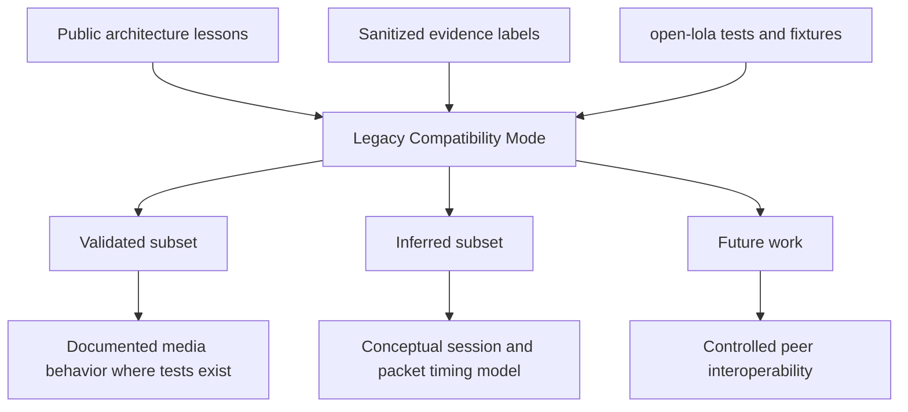

# Open Lola Compatibility Scope

Date: 2026-05-15  
Status: publication-safe compatibility boundary  
Scope: Legacy Compatibility Mode as a constrained, validated subset

## Definition

Legacy Compatibility Mode is a constrained subset of behavior that open-lola can
validate without publishing proprietary implementation detail. It is not a
drop-in Windows LoLa replacement and not a promise of peer interoperability.

Current compatibility verdict: `PARTIAL`.

Current Swift Windows LoLa evidence: constrained live probing on 2026-05-15
validated post-connect status responses and outbound generated AV behavior for
the tested configuration only. Windows reports the Mac Swift responder as
running, generated video is visible, and Windows-side audio buffer realignment
was reduced by roughly 90% after Swift live audio and video TX were split into
separate paced loops. This does not upgrade the lane to full compatibility:
Swift still needs Windows-originated media capture, inbound media decode, and
controlled peer validation.

## Compatibility Architecture

## Supported In This Public Scope

- Public/session-level concepts.
- Validated fixture parsing for open-lola-owned formats.
- Documented media behavior where open-lola tests exist.
- Constrained live Swift-to-Windows behavior where the tested peer session is
  explicitly described.
- Sanitized architecture and timing lessons.
- Explicitly labeled inferred or future-work areas.

## Unsupported In This Public Scope

- Drop-in Windows LoLa replacement claims.
- Licensing or access-control behavior.
- Proprietary packet grammar.
- Vendor driver replication.
- Unvalidated peer interoperability.
- Private strings, function names, byte layouts, or binary excerpts.

## Non-Goals

- Circumvention of licensing or access controls.
- Secret extraction.
- Proprietary reimplementation.
- Publishing captured proprietary payloads.
- Hiding uncertainty behind broad compatibility language.

## Validation Criteria

| Criterion | Required evidence | Claim upgrade allowed |
|---|---|---|
| Controlled interoperability test | Maintainer-approved peer test with publication-safe notes. | `inferred` to `validated` for the tested behavior only. |
| Sanitized packet analysis | Redacted or synthetic packet evidence with no proprietary payload disclosure. | `hypothesis` to `strongly supported` when independently corroborated. |
| Fixture-based validation | open-lola fixture passes and report validation. | `open-lola design decision` or `validated` for open-lola-owned behavior. |
| open-lola implementation tests | Passing tests for runtime contracts. | `validated` for implemented open-lola behavior. |

## Claim Rules

- Use `validated`, `strongly supported`, `inferred`, `hypothesis`,
  `open-lola design decision`, or `future work`.
- Never claim drop-in compatibility without peer tests.
- Keep Legacy Compatibility Mode `PARTIAL` until runtime, packet, and peer
  evidence cover the relevant behavior.

VERDICT: PARTIAL
