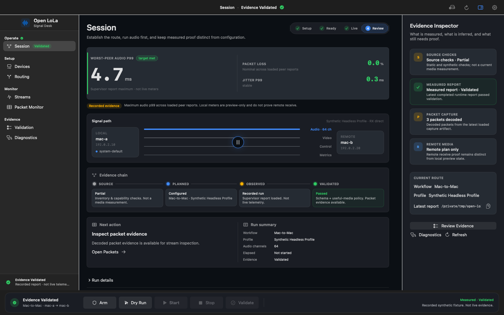

# Design System: Open LoLa Signal Desk

Date: 2026-07-24
Status: current macOS source-alpha design system
Verdict: PARTIAL

## 1. Overview

### Interface model

Signal Desk is a native macOS control surface for configuration, runtime state,
and evidence review. The interface follows the operator sequence: connect the
path, verify readiness, run the session, monitor audio first, then review
measured evidence. Repository implementation structure remains secondary.

The design is compact but not cramped. Native macOS navigation, toolbar, inspector, disclosure, focus, and window behavior carry most of the interaction model. Custom surfaces are reserved for latency evidence and the persistent transport. The system explicitly rejects generic SaaS dashboard metric cards, gamer or neon terminal rooms, glassmorphism, gradients, glow, implementation jargon at the primary level, optimistic status, and setup hidden inside wizards.

### Key characteristics

- Native, quiet, and keyboard-capable.
- Audio-first, with video and control visually subordinate.
- One persistent transport and one clear next action.
- Provenance is visible wherever a measurement appears.
- Dense technical detail is available through inspectors and disclosures.

### Instrument Console (Session workspace)

Source-alpha Session layout follows the Instrument Console hierarchy:

1. Latency instrument (`AppLatencyHeroView`): worst-peer audio p99 as the
   sole large mono readout; loss and jitter as supporting gauges; green leading
   accent only when the measured target is met.
2. Phase rail (`AppSessionPhaseRail`): Setup → Ready → Live → Review.
3. Signal path (`AppConnectionTopologyView`): thick cobalt audio path,
   quieter video/control, central timing gate.
4. Evidence chain (`AppSessionEvidenceChain`): Source → Planned → Observed
   → Validated with earned green only on validated pass.
5. Next action + run summary, then progressive execution and logs.
6. Evidence Inspector card stack and the sole transport dock remain outside
   the scroll content.

The current SwiftUI source and the reference renders below are the active
authority for this implemented layout.

### Current reference renders

| Light appearance | Dark appearance |
|---|---|
|  |  |

These 1586×992 images are deterministic offline renders of the real SwiftUI
hierarchy with fixed source/synthetic state. They document visual structure and
appearance only; they are not app-launch, live-media, latency, hardware, or
interoperability evidence.

## 2. Identity

### Naming hierarchy

- Master brand and app name: Open LoLa.
- Workspace descriptor: Signal Desk. Never present it as a separate product.
- Public descriptor: Configure, run, and verify low-latency media sessions.
- Technical identifiers: retain native forms such as `OpenLolaCore`,
  `open-lola`, `open-lola-app`, and `OPEN_LOLA_*`.

The name is always written “Open LoLa” in public prose. Do not flatten it to
“Open Lola,” capitalize it as “OPEN LOLA,” or use the old repository suffix as
a product name.

### Signal-path mark

The mark is a compact diagram of the product contract: two open endpoints, one
strong straight audio path, two quieter auxiliary media paths, and a central
timing gate. It is deliberately not a decorative waveform. Signal Cobalt is the
only accent; semantic green, amber, and red never appear in the brand mark.

- Keep clear space equal to one endpoint radius on every side.
- Use the mark at 24px or larger in general UI; the app icon supplies the
  purpose-built smaller representations.
- Do not rotate, glow, gradient-fill, animate, recolor, or separate the timing
  gate from the path.
- Pair the mark with live “Open LoLa” text. Do not rasterize the product name
  into ordinary documentation or interface labels.

Canonical sources and generated outputs live in `.github/assets/`:

- `open-lola-mark-light.svg` and `open-lola-mark-dark.svg` for adaptive use;
- `open-lola-app-icon.svg` and generated `OpenLoLa.icns` for the macOS bundle;
- `open-lola-social-preview.svg` and its generated 1280×640
  `open-lola-social-preview.png`;
- the light and dark Signal Desk reference renders below.

Run `scripts/macos/generate_brand_assets.sh --check` to prove that the checked-in ICNS
and social-preview PNG match their sources.

### Independence statement

The first substantial public description must state that Open LoLa is an
independent interoperability project and is not affiliated with or endorsed by
the LoLa project, Conservatorio di Musica Giuseppe Tartini, or GARR. Link the
established [LoLa system](https://lola.conts.it/) without borrowing its logo,
colors, or claims. This wording is attribution and positioning, not name or
trademark clearance.

## 3. Colors

The palette is a system-adaptive neutral field with one cobalt interaction accent and narrowly scoped semantic colors.

### Primary

- Signal Cobalt (`#004AB3` light / `#408CFF` dark): selection, primary actions, focus, and active connection progress.

### Neutral

- Cool Canvas (`#F2F5F7` light / `#0B0D10` dark): the window content plane.
- Instrument Surface (`#FBFCFE` light / `#14161B` dark): grouped controls and inspector content.
- Raised Readout (`#EEF1F4` light / `#1C2026` dark): measured evidence and nested readouts.
- Armed Amber (`#8C3800` light / `#F27900` dark): armed, incomplete, and operator-attention states.
- Verified Green (`#006E24` light / `#2EC752` dark): only evidence-backed healthy or validated outcomes.
- Stop Red (`#C70000` light / `#FF4540` dark): failure and destructive Stop actions only.

### Color rules

The Proven Color Rule. Green is earned by current validated evidence; configuration readiness and process activity use cobalt or amber.

The One Accent Rule. Cobalt is the only non-semantic accent and should remain sparse enough to establish the next action immediately.

## 4. Typography

Display Font: SF Pro Display (system fallback)
Body Font: SF Pro Text (system fallback)
Label/Mono Font: SF Mono for numeric evidence and identifiers only

Character: Familiar macOS typography keeps the surface utilitarian and legible. Weight and spacing establish hierarchy; decorative type does not belong in an operational tool.

### Hierarchy

- Display (semibold, 26px, 1.15): workspace title only.
- Headline (semibold, 17px, 1.25): major groups and primary status.
- Title (semibold, 15px, 1.3): panels, disclosures, and actionable headings.
- Body (regular, 13px, 1.4): instructions, explanations, and field content.
- Label (semibold, 11px, 1.25): evidence scope, field labels, and compact status; sentence case.
- Metric (bold mono, 26px, 1.1): latency, jitter, loss, time, packet counts, ports, and identifiers.

### Typography rules

The Numbers-Only Mono Rule. Never use monospaced type as an aesthetic theme; reserve it for values whose alignment or exact identity matters.

## 5. Elevation

The system is flat by default. Depth comes from native window layers, tonal surface changes, one-pixel separators, the macOS inspector, and the system's navigation material. Shadows are not a general-purpose styling tool. On macOS 26 and later, Liquid Glass is used only for the persistent transport floating above content; earlier systems use regular material with a one-pixel border.

### Elevation rules

The Layer-By-Function Rule. A surface may float only when it remains persistent while the content beneath it changes. Content cards do not receive glass, glow, or decorative shadows.

## 6. Components

### Buttons

- Shape: native rounded rectangle (6px equivalent), never a forest of capsules.
- Primary: Signal Cobalt with system foreground and 6px × 12px effective padding; one primary action per local context.
- Hover / Focus: system-native feedback and focus ring; never scale or bounce operational controls.
- Secondary / Destructive: bordered native controls; Stop alone uses Stop Red.

### Chips

- Style: status chips are exceptional, compact, and include icon plus text; most status is rendered as a normal label or row.
- State: color always accompanies a shape, icon, and explicit status word.

### Cards / Containers

- Corner Style: 8px for evidence or genuine semantic groups; 14px for the transport dock.
- Background: Instrument Surface or Raised Readout according to hierarchy.
- Shadow Strategy: none at rest; use tonal layering and one-pixel borders.
- Border: adaptive black/white low-opacity one-pixel separator.
- Internal Padding: 16px, with 12px for compact readouts.

### Inputs / Fields

- Style: native macOS controls and selection behavior.
- Focus: system focus ring, complete keyboard traversal, and an adjacent visible label.
- Error / Disabled: explicit reason in help or supporting copy; runtime-locked inputs remain readable.

### Navigation

The native sidebar groups Session, Setup, Monitor, and Evidence. Settings belongs in the native Settings scene. The selected workspace persists across launches, Packets remains discoverable before a capture exists, and global section-name search is not presented as content search.

### Persistent Transport

The dock is the only visible main-window Arm, Start, and Stop surface. It combines execution state, route identity, critical controls, measured-evidence state, and disabled-action reasons. It adapts to a compact icon control set before clipping.

## 7. Usage rules

### Use

- Follow Setup → readiness → Arm → Start → Monitor → Review as the primary flow.
- Show “Not measured” in the same location as missing metrics; never replace it with source or synthetic values.
- Identify the worst-peer audio p99 metric and state that completed report evidence is not live telemetry.
- Preserve light, dark, increased-contrast, Reduce Motion, keyboard, and VoiceOver behavior.
- Use 4/8/12/16/24/32px spacing and adaptive layouts before truncating controls.
- Reveal ports, paths, commands, artifacts, and raw logs progressively.

### Avoid

- Do not build a generic SaaS dashboard from equal-weight metric cards.
- Do not make a gamer or neon terminal room with oversized monospace, saturated outlines, or permanent pulsing.
- Do not use glassmorphism, gradients, or glow on content cards; Liquid Glass belongs only on persistent system-level controls.
- Do not put implementation jargon ahead of the operator's task or evidence state.
- Do not show optimistic status: process running is not media healthy, local preview is not remote receive proof, and exit zero is not complete evidence.
- Do not hide the route inside a wizard or require Settings to configure a session.
- Do not duplicate Arm, Start, or Stop in banners, footers, cards, or contextual panels.
