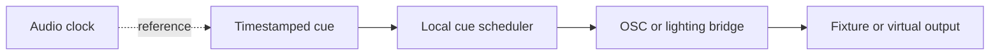

# Lighting And Control Plan

Date: 2026-05-21
Status: source-level OSC cue and lighting safety-gate contracts implemented; physical bridge evidence pending
Verdict: PARTIAL

## Evidence Labels

| Design choice | Label |
|---|---|
| OSC, MIDI, Art-Net, sACN, and DMX bridge references | `public standard` |
| Lighting as a secondary synchronized path | `original open-lola design` |
| Explicit arming, network isolation, and capture-point recording | `experimentally derived requirement` |
| Audio-clock cue timestamps without callback-path lighting work | `implementation hypothesis` |

## Objective

Lighting and show control are secondary synchronized streams. They support a
performance workflow but never block audio or video media paths.

## Protocol Order

| Protocol | Role | Default? | Safety requirement |
|---|---|---:|---|
| OSC | first cue/control path | yes | timestamped cue reports and audio-impact check |
| MIDI | optional local control | no | local scheduling and no media-thread work |
| Art-Net | fixture output | no | isolated network, explicit arm, packet capture |
| sACN | fixture output | no | isolated network, explicit arm, packet capture |
| DMX bridge | fixture ownership | optional | prefer OLA/QLC+ before direct fixture output |

## Sync Model

The cue timestamp may reference the audio clock, but cue scheduling is local and
off the audio callback path.

## Current Source Status

- OSC cue message parsing, UDP loopback/external report shapes, timing samples,
  jitter summaries, and audio-impact PASS guards are implemented.
- Lighting fixture safety policy, sACN/Art-Net standard evidence, explicit arm
  state, isolated-network gates, universe allowlists, packet-capture evidence,
  fixture metadata policy, and audio-impact PASS guards are implemented.
- `osc-cue-external-run`, `lighting-gate-run`, `validate-osc-cue-report`, and
  `validate-lighting-gate-report` are active CLI/report contracts.
- Source and synthetic reports remain implementation evidence only. Physical
  `PASS` still requires an available external OSC peer, isolated lighting
  target or bridge, packet capture, local fixture ownership, and audio-active
  comparison evidence.

## Safety Gates

Live fixture output requires:

- explicit arming;
- isolated or approved network;
- universe and destination recorded;
- blackout, hold, and drop behavior chosen;
- packet capture point recorded;
- no direct fixture streaming on the performance media link unless explicitly
  benchmarked and approved.

## Validation

Required measurements:

- OSC loopback jitter;
- external peer availability;
- cue-to-output timing;
- packet loss and jitter on the lighting network;
- audio callback comparison with lighting off and on;
- fixture or bridge owner recorded.

## Resume here

Close physical OSC cue timing and the isolated bridge/fixture run before any
Art-Net or sACN `PASS`. Keep lighting output behind the existing safety gate
until Q009 is answered with real bridge ownership, capture point, network mode,
and audio-impact evidence.

VERDICT: PARTIAL
