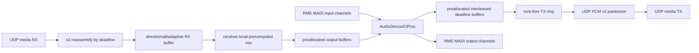

# Full MADI RX/TX

Date: 2026-05-21
Status: source-level MADI TX/RX and socket-backed full-duplex report path implemented; physical RME evidence pending
Verdict: PARTIAL

## Evidence Labels

| Design choice | Label |
|---|---|
| Core Audio HAL, AudioDeviceIOProc, AUHAL, device UID, channel layout, buffer size, sample rate, and clock domain | `public API` |
| UDP, DSCP, PTP, direct LAN, and packet-capture methodology | `public standard` |
| UDP PCM v2 channel fragments and receiver-local mix snapshots | `original open-lola design` |
| RME MADI PASS gates and long-run channel-count matrix | `experimentally derived requirement` |
| RME or compatible MADI interface as first target | `implementation hypothesis` |

## Current MADI Status

| Question | Current answer |
|---|---|
| Do we currently transmit multiple audio channels? | Source-level UDP PCM v2 can packetize arbitrary negotiated channel counts from captured payload slabs. Physical RME MADI TX and live media socket evidence are still pending. |
| Do we currently receive multiple audio channels? | Source-level MADI RX validates v2 fragments, reassembles 2/8/16/32/64-channel payloads, applies receiver-local mix snapshots, and exposes ready playout blocks. Physical Core Audio/RME output evidence is still pending. |
| Is RX symmetric with TX? | Source-level TX/RX symmetry exists for negotiated channel count, sample rate, sample format, channel map, and full-duplex source-session metrics. Live full-duplex device RX/TX is not yet physically proven. |
| Are channel counts negotiated? | `SessionNegotiation` and `AudioTransportNegotiation` negotiate channel counts for v2 and fall back to stereo v1 where required. Physical peer-to-peer proof remains pending. |
| Is channel metadata transmitted? | `SessionControlMessage.audioMetadata` can carry an advisory `RmeMatrixMetadataSnapshot` on the control plane. Playback does not depend on metadata availability. |
| Are sample rate, sample format, and layout explicit? | Packet headers include sample rate and sample format; channel layout is negotiated in the session contract, with advisory metadata updates kept off the audio media path. |
| Where are stereo assumptions hardcoded? | Legacy v1 fixtures and helper probe packets still default to 48 kHz, 32 frames, 2 channels, int16. The MADI TX IOProc handoff now takes explicit channel count, sample format, and selected channel maps. |
| Where are buffers copied unnecessarily? | Audio IOProc copies input to output with `memcpy`; packet encode/decode converts `DataProtocol` to `[UInt8]`; v2 packetizer/reassembler copies payload bytes into `Data` and `[UInt8]`. |
| Where is latency introduced? | Core Audio hardware buffers and safety offsets, packetization, UDP scheduling, RX target frames, same-deadline PLC, and any hidden device/driver buffering. Current probes also use sleeps and user-space pacing, which are not realtime media paths. |

## Target Audio Pipeline

## Implementation Requirements

- Same-device full-duplex Core Audio path first.
- Selected/all channel capture based on negotiated channel set.
- Stable channel ordering from Core Audio stream order plus user/public metadata.
- Explicit sample rate, sample format, frames per packet, and channel count.
- Float32 native path preferred if Core Audio exposes float buffers; int16 only
  when explicitly selected and benchmarked.
- No sample-rate conversion in Direct Audio First.
- No heap allocation, file IO, blocking socket IO, logging, or locks in the audio
  callback.
- Preallocate audio deadline buffers, packet slabs, counters, and route/mix
  snapshots before `AudioDeviceStart`.
- Network send/receive workers own sockets. The callback only pushes/pops bounded
  memory already prepared for realtime use.
- RX buffering is visible in frames, packets, and microseconds.

## Affected Files

Implemented source-level files:

- `Sources/OpenLolaCore/Audio/MADI/MadiTransmit.swift`
- `Sources/OpenLolaCore/Audio/MADI/MadiReceive.swift`
- `Sources/OpenLolaCore/Audio/MADI/MadiFullDuplexTypes.swift`
- `Sources/OpenLolaCore/Audio/MADI/MadiFullDuplexRuntime.swift`
- `Sources/OpenLolaCore/Audio/MADI/MadiFullDuplexReport.swift`
- `Sources/OpenLolaCore/Protocol/SessionControlMessage.swift`
- `Sources/open-lola/Commands/Audio/MadiFullDuplexCommands.swift`
- `Tests/OpenLolaCoreTests/SessionProtocolTests.swift`
- `Tests/OpenLolaCoreTests/MadiTransmitTests.swift`
- `Tests/OpenLolaCoreTests/MadiReceiveTests.swift`
- `Tests/OpenLolaCoreTests/MadiFullDuplexSessionTests.swift`

Still required for physical Core Audio completion:

- selected RME/Core Audio device ownership for same-device full-duplex IO;
- measured callback-facing deadline buffers and audio payload rendering;
- bounded realtime handoff between Core Audio callbacks and UDP media workers;
- physical loopback/output evidence proving the source-level TX/RX path on
  real RME MADI hardware.

Related existing files:

- `Sources/OpenLolaCore/Audio/Realtime/RealtimeAudioEngine.swift`
- `Sources/OpenLolaCore/Audio/Realtime/RealtimeAudioBuffers.swift`
- `Sources/OpenLolaCore/Audio/Realtime/RealtimeAudioPacketHandoff.swift`
- `Sources/OpenLolaCore/Audio/Routing/AudioLoopbackRun.swift`
- `Sources/OpenLolaCore/Network/UDP/MultichannelTransport.swift`
- `Sources/OpenLolaCore/Network/UDP/UdpPcmV2Packet.swift`
- `Sources/OpenLolaCore/Audio/MADI/RmeFastestAudioPath.swift`
- `Sources/OpenLolaCore/Audio/Routing/ReceiverMixSnapshot.swift`
- `Sources/open-lola/Commands/Network/NetworkCommands.swift`

## Tests First

1. Failing tests for 64-channel capture deadline copy into a preallocated buffer: implemented.
2. Failing tests for v2 packetization preserving all channel samples: implemented.
3. Failing tests for v2 RX reassembly into output-channel order: implemented.
4. Failing tests for receiver-local identity mix and selected downmix policy:
   implemented.
5. Failing tests proving sample-format mismatch rejects packetization before
   send: implemented.
6. Failing tests proving callback-facing methods expose allocation warning
   counters: implemented.
7. Failing tests for underrun, overrun, late, duplicate, reordered, and fragment
   loss counters: partially implemented across realtime and RX buffering tests.
8. Failing tests for full-duplex TX/RX session metrics, drift correction events,
   sample-rate mismatch, video-disabled startup, and overrun policy:
   implemented.

## Benchmark Plan

- Callback duration p50/p95/p99/max at 8, 16, 32, 64, and 128 frames.
- One-way analog loopback latency at 48, 96, and 192 kHz where supported.
- Full-duplex TX/RX stability at 2, 8, 16, 32, 48, 56, and 64 channels.
- UDP media age and jitter on direct cable.
- Direct RX versus Small, Adaptive, and Stable/WAN RX costs.
- Memory allocations on callback and packetizer hot paths.
- CPU core occupancy and scheduling wakeup jitter.

## Acceptance Criteria

- RME or compatible MADI input/output device visible and selected by UID.
- Same-device full-duplex IOProc starts and stops cleanly.
- 64-channel selected mode passes synthetic packetization and physical loopback
  tests.
- No hidden playout target growth.
- Zero underruns and overruns in the accepted Direct Audio First profile.
- Audio RX and TX run simultaneously for the required field duration.
- Receiver mix/routing is applied from precomputed snapshots outside the callback.
- Machine-readable report ends with `VERDICT: PASS` only when physical evidence
  exists; otherwise `VERDICT: PARTIAL`.

## Full-Duplex Runtime Evidence

- `MadiFullDuplexAudioPair` rejects sample-rate, sample-format,
  frames-per-packet, and channel-count mismatches unless asymmetric routing is
  explicitly configured.
- `MadiFullDuplexSession` composes `RealtimeAudioPacketHandoff` TX with
  `MadiReceiveEngine` RX and reports both sides in one metrics object.
- `MadiFullDuplexSocketRunner` binds a local UDP socket, sends UDP PCM v2
  fragments to the reciprocal peer, receives reciprocal fragments, and renders
  the receive side through the same `MadiReceiveEngine`. When configured with
  `--receiver-mix swap-stereo`, the report records receiver-mix route count,
  revision, output channels, rendered blocks, and whether the mix stayed
  outside the audio callback.
- `MadiFullDuplexClockDriftSimulator` records sender/receiver frame deltas,
  drift slope, and bounded correction events outside the callback.
- `MadiReceiveOverrunPolicy` supports deterministic `dropNewest` and
  `dropOldest` bounded-pool behavior.
- `madi-full-duplex-synthetic-smoke`, `madi-full-duplex-run`, and
  `validate-madi-full-duplex-report` expose the M05 CLI surface.
- Reciprocal two-peer runs must flip `--local-stream-id` and
  `--remote-stream-id` so each receiver accepts the other peer's stream.
- Use `--remote-port` when the reciprocal peer is not listening on the same UDP
  port as the local bind port, including localhost probes.

VERDICT: PARTIAL
