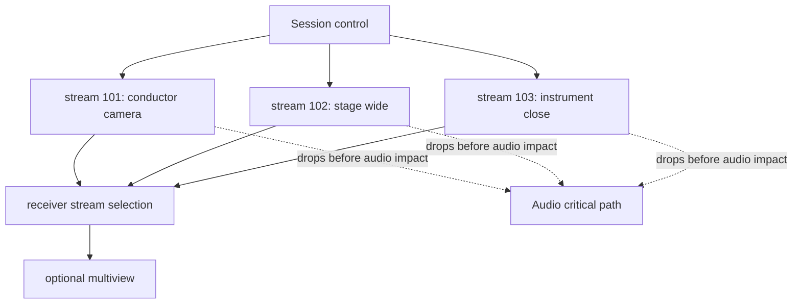

# Multiple Video Streams

Date: 2026-07-15
Status: staged multi-perspective runtime implemented
Verdict: PARTIAL

## Evidence Labels

| Design choice | Label |
|---|---|
| Blackmagic Desktop Video SDK, AVFoundation, CoreVideo, Metal, and VideoToolbox | `public API` |
| UDP media, stream IDs, direct LAN, and latest-frame drop policies | `public standard` |
| open-lola stream IDs, stream descriptors, and per-stream drop policy | `original open-lola design` |
| Per-stream latency and CPU/GPU/memory acceptance | `experimentally derived requirement` |
| Audio-protected multi-video profile | `implementation hypothesis` |

## Objective

Support multiple camera perspectives without allowing video to compromise audio
latency. The implementation now negotiates multiple stream descriptors, reports
per-stream metrics, and can run a bounded staged localhost transport with
`video-transport-run --stream-count <n> --visible-streams <n>`. Physical PASS
still requires real multi-input hardware and audio-active benchmark evidence.

## Stream Model

## Requirements

- globally unique stream IDs inside a session: implemented in session
  negotiation;
- per-stream enable/disable: implemented through disabled descriptors and
  `captureEnabled`;
- per-stream capture source: represented by role and source label;
- per-stream format and transport mode: represented and validated;
- per-stream queue depth: represented and validated;
- per-stream drop policy: source-level priority dropper plus M09 late and
  backpressure counters;
- receiver-side selected stream and optional multi-view layout: implemented in
  `VideoReceiverSelection` and `VideoMultiViewLayout`;
- per-stream metrics: captured, sent, received, dropped, late, rendered, packet,
  queue, and estimated bandwidth counters are reported;
- aggregate audio-priority evidence is explicit: model-only runs report
  `audioPriorityEvidence: notMeasured` with no `audioPriorityProtected` value;
  PASS validation requires a measured protected result.
- staged runtime: `video-transport-run` can send one to four test-pattern raw
  fragment streams over the socket-backed UDP path and emits
  `m09-multi-video-transport-run` for multi-stream probes.

## ATEM And Blackmagic Mapping

Supported source concepts:

- one Blackmagic input device per stream;
- multiple DeckLink inputs where hardware exposes them;
- ATEM program feed as one stream;
- ATEM preview feed if exposed by hardware/API;
- operator-defined logical perspectives mapped to physical sources.

The first pass should not send every possible ATEM input unless the hardware and
SDK expose low-latency independent feeds and the network benchmark proves it.

## Scheduling Policy

Profiles:

- Direct Audio First: at most one low-latency video stream; all video can drop.
- Balanced AV: one or two streams if audio metrics remain unchanged.
- Multi-Video Performance: multiple streams with per-stream budget and hard audio
  protection.
- WAN Stable: fewer frames, lower resolution, and larger media buffers where
  necessary; audio remains the master.

## Affected Files

- `Sources/OpenLolaCore/Video/VideoStreamDescription.swift`
- `Sources/OpenLolaCore/Video/MultiVideoStreams.swift`
- `Sources/OpenLolaCore/Video/VideoTransportReport.swift`
- `Sources/OpenLolaCore/Video/VideoTransportMultiStreamRuntime.swift`
- `Sources/OpenLolaCore/Video/VideoTransportRunner.swift`
- `Sources/OpenLolaCore/Protocol/SessionNegotiation.swift`
- `Tests/OpenLolaCoreTests/MultiVideoStreamNegotiationTests.swift`
- `Tests/OpenLolaCoreTests/MultiVideoTransportTests.swift`

## Tests

- duplicate stream IDs reject session;
- zero, one, and multiple streams negotiate successfully under the right
  profile;
- disabled stream sends no media;
- receiver stream selection ignores disabled streams;
- incomplete frames are dropped per stream by the M09 reassembler;
- staged `video-transport-run` emits per-stream counters and multi-view
  selection for multi-stream localhost probes;
- per-stream metrics do not merge counters;
- lower-priority frames drop first under pressure;
- Multi-Video Performance keeps audio p99/max and playout targets unchanged for
  PASS.

## Benchmarks

- one, two, and four stream CPU/GPU/memory cost;
- per-stream capture-to-render latency;
- aggregate network throughput;
- audio callback timing under each stream count;
- frame drop distribution by stream priority.

VERDICT: PARTIAL
