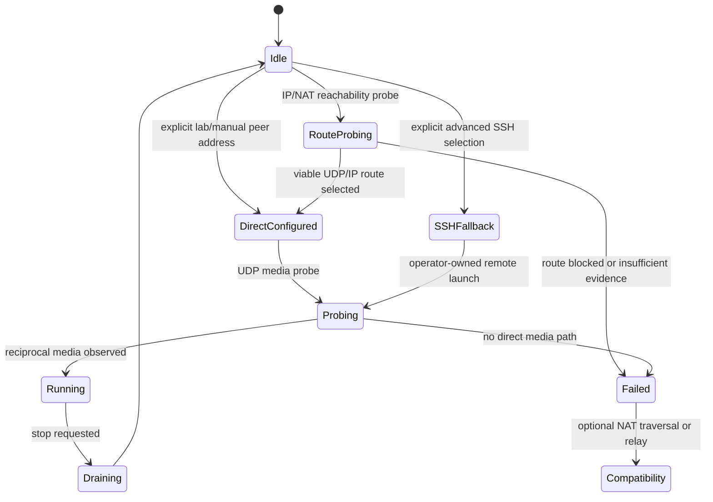

# P2P Networking

Date: 2026-05-03  
Status: publication-safe transport design  
Verdict: PARTIAL

## Evidence Labels

| Design choice | Label |
|---|---|
| Direct UDP, TCP, QUIC, and RTP-like references | `public standard` |
| Original open-lola UDP PCM media packet | `original open-lola design` |
| Manual direct IP as the gold-standard profile | `implementation hypothesis` |
| NAT traversal, relay, and compatibility modes | `compatibility requirement` |
| Packet-capture and route-labeled benchmark closure | `experimentally derived requirement` |

## Design Rule

Direct UDP over measured viable routes is the fastest media path. Normal
mac-to-mac setup first collects IP/NAT route evidence and peer reachability
classification; manual known-peer addresses and SSH are lab or advanced paths.
The native app mirrors this boundary: Mac-to-Mac is the default IP/NAT
preflight-first workflow, LoLa is a distinct external connector workflow, and
JackTrip/UltraGrid are shown only as external connector contracts until app
launchers exist.

## Transport Strategy

| Mode | Role | Default? | Reason |
|---|---|---:|---|
| Direct UDP | realtime audio and video media | yes | minimal framing, no stream head-of-line blocking, no retransmission waits |
| IP/NAT route probe | mac-to-mac connection establishment | yes | records reachability, NAT/firewall behavior, failure reasons, and whether direct UDP/IP is viable before media state is trusted |
| UDP control | optional session/control | optional | simple same-path probing and capability exchange |
| TCP | configuration and non-realtime control | optional | reliable, simple, not on media path |
| QUIC | WAN/control compatibility experiment | no | useful transport features, but extra machinery for fastest media |
| RTP-like framing | interoperability experiment | no | public standard shape, but not needed for first open-lola proof |
| Relay/forwarder | NAT fallback | no | compatibility-only and likely extra latency |
| SSH orchestration | advanced/lab fallback | no | may be blocked by institutional policy and must not be assumed or selected silently |

## App Workflow Modes

| App mode | Runtime status | Normal controls | Advanced controls |
|---|---|---|---|
| Mac-to-Mac | launchable after plan/preflight gates | workflow, peers, required device selection, validation/status | ports, buffers, Opus/CELT transport, JPEG-XS compression, report paths, SSH fallback |
| LoLa | launchable through the external LoLa connector | workflow, local/Windows endpoints, validation/status | ports, media/payload settings including AVFoundation JPEG-XS |
| JackTrip | not launchable from the app | unavailable notice | external connector/NMP contracts only |
| UltraGrid | not launchable from the app | unavailable notice | external connector/NMP contracts only |

## Media Packet Requirements

The open-lola media packet is an original design. It should contain only what
the receiver needs on the deadline:

- version;
- stream kind;
- sequence number;
- sender frame index;
- nonzero sender monotonic timestamp;
- sample rate or frame rate;
- block or fragment index;
- payload length;
- payload bytes.

No proprietary packet field, byte order, grammar, or control message may be
copied into this protocol.

## Loss And Jitter

Realtime media uses sequence numbers and timestamps for detection, not recovery
waits. Audio does not retransmit on the fastest path. Video may request a later
keyframe only in an optional compressed mode, and that request must not affect
audio timing.

For raw/intra-frame video, receivers reassemble only a complete current frame.
If a newer frame starts before the older one completes, the older frame is
dropped and later fragments from it are treated as stale.

## Transport Error Handling

UDP, NAT, RTP-shaped, and direct peer paths must fail loudly:

- configuration, socket setup, protocol validation, and malformed packet
  handling throw typed errors;
- nonblocking receive helpers may return `nil` only when no packet is currently
  available;
- socket, decode, validation, and background task failures propagate to the
  caller;
- debug logging may add context, but it does not replace thrown errors;
- partial reports represent missing external evidence or environmental limits,
  not swallowed runtime failures.

## Session Lifecycle

## LAN And WAN Profiles

LAN/direct-link mode is the gold standard. Switched LAN, campus LAN, WAN, NAT,
and relay paths are separate benchmark profiles. Results from one route do not
certify another route.

## Required Benchmarks

- UDP echo RTT and estimated one-way time;
- packet age at receiver;
- jitter p50/p95/p99/max;
- loss and late packet counts;
- DSCP classification where used;
- packet capture correlation;
- CPU and allocation warnings;
- route labels and capture points.

## Resume here

Continue with [mac-to-mac-connection.md](mac-to-mac-connection.md)
before changing mac-to-mac setup defaults. The fastest media proof remains
direct two-Mac UDP audio, but setup must not assume direct SSH or manual
known-peer reachability. The app/operator handoff now defaults to
`mac-to-mac-connection-preflight-run`, and executed two-peer supervisor runs
with `--require-preflight true` must validate a passing
`MacToMacConnectionEstablishmentReport` before child media processes start.
SSH execution remains an explicit advanced fallback with operator intent and a
reason recorded in the launch arguments.

VERDICT: PARTIAL
