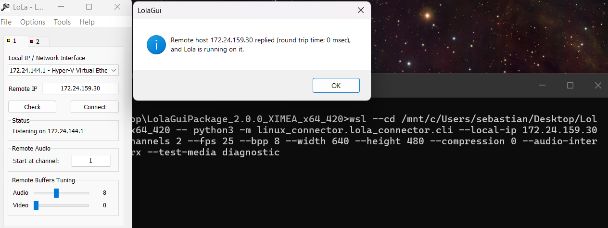
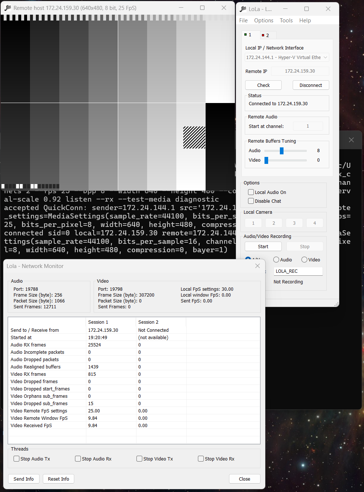

# LoLa Linux Connector Compatibility Seed

This package is a Linux-side compatibility seed for LoLa 2.0.0 XIMEA interoperability. It implements the recovered control, audio, and video packet behavior needed for Windows LoLa to connect to a Linux peer and exchange synthetic or process-backed media.

Current status: the connector is validated as a working LoLa 2.0 compatibility seed for control and synthetic bidirectional audio/video. It is not yet a production Linux LoLa application because native low-latency Linux audio/video backends still need to be completed and validated on target hardware.

## Quick Commands

Run from `<LOLA_PACKAGE_DIR>`, the directory that contains `linux_connector/`.

```bash
python -m linux_connector.lola_connector.cli --local-ip 127.0.0.1 selftest --duration 0.25
```

Probe a Windows LoLa peer:

```bash
python -m linux_connector.lola_connector.cli --local-ip <LINUX_LOLA_IP> status <WINDOWS_LOLA_IP>
```

Listen for Windows LoLa and transmit synthetic diagnostic audio/video:

```bash
python -m linux_connector.lola_connector.cli \
  --local-ip <LINUX_LOLA_IP> \
  --sr 44100 --bps 16 --channels 2 \
  --fps 25 --bpp 8 --width 640 --height 480 --compression 0 \
  --audio-interval-scale 0.92 \
  listen --rx --test-media diagnostic --duration 20
```

## Validation Screenshots

Windows LoLa status check confirming the WSL/Linux connector replied:



Windows LoLa receiving the Linux diagnostic video card with Network Monitor counters showing complete audio/video reception:



## Documentation

The canonical documentation lives in [docs/index.md](docs/index.md).

Start with:

- [Quickstart](docs/quickstart.md) for self-test, status probe, listen/connect, and synthetic media.
- [WSL Lab Setup](docs/wsl-lab-setup.md) for same-machine Windows/WSL validation.
- [Windows Validation](docs/windows-validation.md) for acceptance gates.
- [Troubleshooting](docs/troubleshooting.md) for symptom-led debugging.
- [Protocol Reference](docs/protocol-reference.md) for ports, control messages, audio, video, and transport behavior.
- [Roadmap](docs/roadmap.md) for production Linux backend work.

## Repository Layout

- `lola_connector/`: connector package and runtime.
- `env/`: WSL and lab helper scripts.
- `tools/`: packet capture and diagnostic helpers.
- `tests/`: protocol and codec tests.
- `docs/`: canonical public documentation.
- `process_artifacts/`: private/local reverse-engineering and lab artifacts; ignored except for its README.

## Public Boundary

Public docs summarize externally observable behavior, packet fields, validation procedures, and connector source written for this project. Raw process output, decompiler text, captures, binary artifacts, and environment-specific lab material should stay under `process_artifacts/` unless deliberately reviewed for publication.
