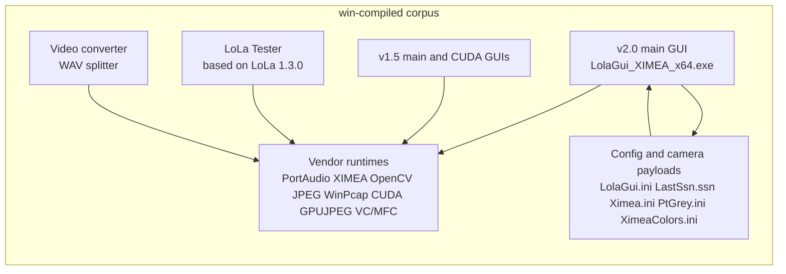
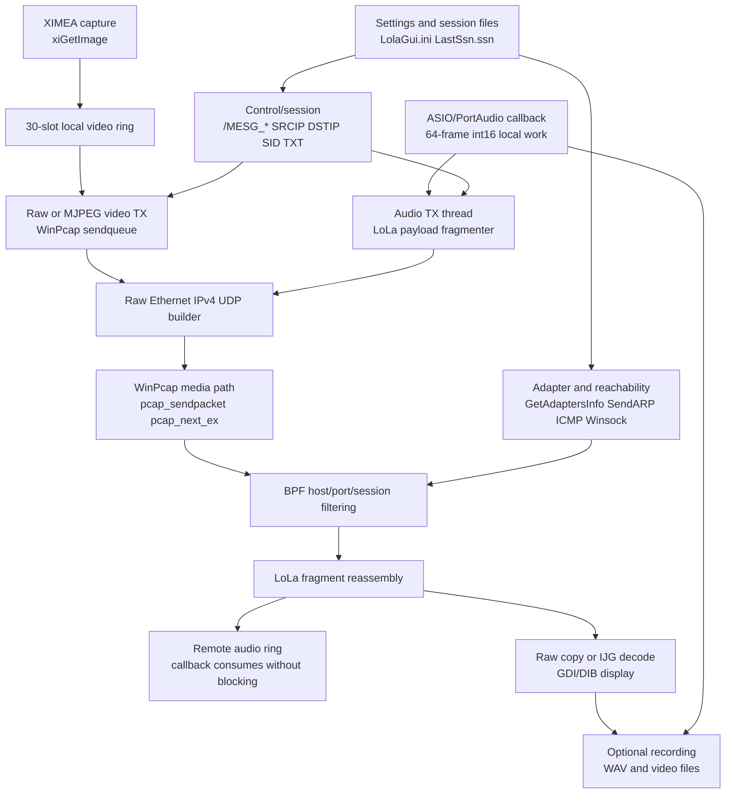

# Open Lola Reverse Engineering: E2E Workflow 2026
Verdict: PARTIAL

Back to private index:
[README.md](README.md)

Date: 2026-05-02  
Status: internal static-evidence ledger, current after public boundary restructure
Evidence:
[REVERSE_ENGINEERING_EVIDENCE_MATRIX_2026.md](REVERSE_ENGINEERING_EVIDENCE_MATRIX_2026.md)

## System Map

Static fact: `LolaGui_XIMEA_x64.exe` is the active analyzed v2.0 live GUI. The
tester and helper tools remain useful evidence, but they are not the current
XIMEA live-camera GUI.

## End-To-End Workflow

Strong inference: the runtime shape is local settings and adapter setup, status
or quick-connect control, active audio/video media, optional chat/bounce-back or
generated-signal control, monitoring/recording, and disconnect.

## Initialization And Control

Static fact: v2.0 settings and session evidence includes `.\LolaGui.ini`,
`.\LastSsn.ssn`, `.\XimeaColors.ini`, `CAMERAFILES/Ximea.ini`,
`InputAudioDevName`, `InputVideoCameraFile`, `UseGpuJpegDecOnCuda`,
`OptimizeJpegDecompression`, `socketport`, `audioport`, `videoport`,
`VideoTxWinPcap`, `WinPcap_SetMinToCopy`, and `RxPacketFiltering`.

Static fact: recovered defaults include `socketport=7000`, `audioport=19788`,
`videoport=19798`, `WinPcap_SetMinToCopy=10`, and `RxPacketFiltering=1`.

Static fact: `FUN_14001fb60` builds v2.0 status, quick-connect ACK/reject,
disconnect, bounce-back, chat, and generated-audio-signal messages.
`FUN_14001f390` parses/dispatches matching message names. Visible fields
include `SRCIP`, `DSTIP`, `SID`, media parameters, and `TXT`.

Static fact: the generated audio signal control surface is visible through
`/MESG_SEND_AUDIO_SIGNAL` and `/MESG_STOP_AUDIO_SIGNAL` builder/parser evidence.

Runtime gap: the exact control transport/framing remains unproven because no
Windows peer or packet capture was used.

## Network Setup

Static fact: v2.0 imports WinPcap functions including `pcap_findalldevs_ex`,
`pcap_findalldevs`, `pcap_open`, `pcap_compile`, `pcap_setfilter`,
`pcap_setmintocopy`, `pcap_next_ex`, `pcap_sendpacket`,
`pcap_sendqueue_alloc`, `pcap_sendqueue_queue`, `pcap_sendqueue_transmit`,
and `pcap_sendqueue_destroy`.

Static fact: v2.0 imports Winsock helpers `getaddrinfo`, `freeaddrinfo`,
`getnameinfo`, and `inet_pton`; IP Helper evidence covers `GetAdaptersInfo`,
`SendARP`, `IcmpCreateFile`, `IcmpSendEcho`, and `IcmpCloseHandle`.

Static fact: `FUN_140016f20` opens the selected WinPcap device, applies
`WinPcap_SetMinToCopy`, and compiles/sets either `ip and udp` or a
source/destination host plus audio/video UDP port BPF filter.

## Audio Path

| Stage | Evidence level | Static finding |
|---|---|---|
| Device setup | Static fact | PortAudio/ASIO imports and Ghidra caller clusters cover device enumeration, `PaAsio_GetAvailableBufferSizes`, and `Pa_OpenStream`. |
| Callback block | Strong inference | Recovered open path carries 64-frame int16 behavior and `44100.0`; 48 kHz strings exist but runtime compatibility is unproven. |
| Local work | Static fact | Callback disassembly shows capture/monitor gain scaling, ping-pong capture buffers, remote ring copy/clear, recording-ring copies, and event signaling. |
| TX | Static fact | `FUN_140009bf0` serializes audio and calls `pcap_sendpacket` through the LoLa fragment/raw packet path. |
| RX | Static fact | `pcap_next_ex` receive loop feeds fragment reassembly and a fixed remote playback ring consumed by the callback without blocking. |

Strong inference: LoLa chooses dropout over callback blocking. Network recovery,
video quality, and recording do not own the audio deadline in the static design.

## Video Path

| Stage | Evidence level | Static finding |
|---|---|---|
| Camera setup | Static fact | XIMEA imports and caller clusters cover `xiOpenDevice`, `xiSetParam*`, `xiStartAcquisition`, and `xiGetImage`. |
| Capture handoff | Static fact | Capture loop writes into a local multi-slot frame ring before send/display work. |
| Raw TX | Static fact | `FUN_1400115c0` and nearby code use WinPcap send queues for raw video frames. |
| MJPEG TX | Static fact | `FUN_140011c10` combines IJG/libjpeg compression with WinPcap send queues. |
| RX/reassembly | Static fact | `FUN_1400152d0` combines `pcap_next_ex`, host/port/session filtering, fragment reassembly, raw copy, and IJG/libjpeg decode. |
| Display/recording | Static fact | GDI/DIB caller clusters cover `CreateDIBSection`, `SetDIBColorTable`, and `StretchBlt`; recording surfaces are present. |

Static fact: v2.0 proves CPU IJG/libjpeg for the live main-binary MJPEG path.
The v1.5 CUDA GUI proves the older GPUJPEG branch, but v2.0 main has no static
`gpujpeg.dll` import/caller cluster.

## E2E Interpretation

Static fact: audio and video share a LoLa fragmenter and raw Ethernet/IPv4/UDP
packet builder, then diverge on payload serialization and post-reassembly
handling.

Strong inference: audio is the hard latency gate; video is low-latency but
best-effort; control/session is application logic; helper tools are
offline/support surfaces.

Runtime gaps:

- Exact byte-for-byte media packet grammar.
- Live control framing and transport.
- Packet loss and late-packet behavior under real WinPcap drivers.
- XIMEA/PtGrey/ASIO hardware timing.
- 48 kHz operation against a Windows LoLa peer.
- Activation validation.
