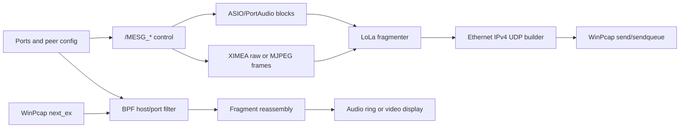

# Mac-Only Runtime Limitations And Future Windows Validation

Back to private index:
[../README.md](../README.md)

Date: 2026-05-03  
Status: runtime-equivalent reconstruction from static evidence
Verdict: PARTIAL

## Hard Boundary

This document reconstructs likely runtime contracts without running Windows
LoLa. It is not proof of live behavior. The Mac-only phase can reconstruct
loader dependencies, call clusters, config keys, control message shapes,
packet-building hypotheses, fragmentation/reassembly roles, and timing
assumptions. It cannot prove driver timing, ASIO callbacks, XIMEA/PtGrey camera
behavior, WinPcap packet scheduling, loss handling, reconnect behavior, or
interop with a real Windows LoLa peer.

## M04 Behavior Reconstruction

| Area | Reconstructed contract | Evidence level | Validation state |
|---|---|---|---|
| Config loading | Working-directory `.ini`/`.ssn` files configure device, port, media, recording, and network settings. | Static fact | Mac-confirmable through strings/imports; runtime overrides future only. |
| Session/control | Plaintext `/MESG_*` records include `SRCIP`, `DSTIP`, `SID`, media settings, and optional `TXT`. | Static fact | Parser/builder fixtures can be synthetic now; transport framing future only. |
| Audio path | PortAudio/ASIO opens low-buffer audio; callbacks do bounded copy/gain/ring work; TX sends through WinPcap. | Strong inference | Static cluster confirmed; real ASIO buffer timing future only. |
| Video path | XIMEA capture feeds local ring; TX uses raw or CPU MJPEG; RX reassembles raw or IJG-decoded frames. | Strong inference | Static cluster confirmed; camera/display timing future only. |
| Fragmentation | Audio and video share a raw Ethernet/IPv4/UDP packet builder and LoLa fragment/reassembly layer. | Static fact for path | Byte grammar remains inferred until captures exist. |
| Timing model | Audio is the deadline owner; video can drop/degrade; control/session is outside the audio callback deadline. | Strong inference | Needs Windows/hardware load validation. |

## Control Grammar Recovery

Embedded strings expose these message templates:

| Message | Visible fields | Mac-side fixture status |
|---|---|---|
| `/MESG_CHECKLOLASTATUS` | `SRCIP`, `DSTIP`, `SID` | Synthetic builder/parser fixture can be created. |
| `/MESG_CHECKLOLASTATUS_ACK` | `SRCIP`, `DSTIP`, `SID` | Synthetic builder/parser fixture can be created. |
| `/MESG_QUICKCONN` | `SRCIP`, `DSTIP`, `SID`, `SR`, `BPS`, `CHNLS`, `FPS`, `BPP`, `X`, `Y`, `COMP`, `BAYER` | Synthetic parser can validate field presence and numeric coercion. |
| `/MESG_QUICKCONN_ACK` | Same media fields as quick connect | Synthetic round-trip fixture can be created. |
| `/MESG_REJECT` | `SRCIP`, `DSTIP`, `SID`, `TXT` | Synthetic text escaping/failure fixture needed. |
| `/MESG_DISCONNECT` | `SRCIP`, `DSTIP`, `SID` | Synthetic fixture can be created. |
| `/MESG_SWITCH_ON_BB` | `SRCIP`, `DSTIP`, `SID` | Bounce-back runtime meaning future only. |
| `/MESG_SWITCH_OFF_BB` | `SRCIP`, `DSTIP`, `SID` | Bounce-back runtime meaning future only. |
| `/MESG_CHAT` | `SRCIP`, `DSTIP`, `SID`, `TXT` | Synthetic fixture can be created. |
| `/MESG_SEND_AUDIO_SIGNAL` | `SRCIP`, `DSTIP`, `SID` | Generated-signal runtime behavior future only. |
| `/MESG_STOP_AUDIO_SIGNAL` | `SRCIP`, `DSTIP`, `SID` | Generated-signal runtime behavior future only. |

Open runtime questions:

- Whether control messages travel over UDP, TCP, OSC-like framing, or another
  socket convention in every state.
- Whether delimiters, terminators, or escaping rules exist beyond the visible
  semicolon-delimited format strings.
- Whether `SID` is random, monotonic, session-local, or operator-derived.
- Whether rejection/disconnect/chat text accepts arbitrary semicolon payloads.

## Network And Packet Model

Static evidence supports this model:

Mac-side packet reconstruction can safely produce synthetic fixtures with
confidence labels:

| Structure | Current confidence | Safe synthetic work |
|---|---|---|
| Ethernet/IP/UDP envelope | High for existence | Generate normal Ethernet/IPv4/UDP frames in fixtures. |
| Audio/video port split | High for defaults `19788` and `19798` | Separate fixture streams by port. |
| Control port | High for default `7000` string/config evidence | Keep control fixtures separate from media fixtures. |
| LoLa payload header | Medium | Model candidates only; do not claim byte compatibility. |
| Fragment sequence fields | Medium | Build explicit candidate fields and alternate interpretations. |
| Timestamp/sample counters | Low/medium | Treat as hypotheses until captures validate. |
| Loss/reconnect behavior | Runtime gap | No Mac-side proof without Windows peer/captures. |

## M05 AV TX Pipeline

Reconstructed TX flow:

1. Settings/session state chooses local device, remote host, media ports,
   buffer sizes, compression mode, and filtering flags.
2. ASIO/PortAudio callback produces audio blocks and signals TX without owning
   slow work.
3. XIMEA capture feeds local frame rings; raw or CPU MJPEG video payloads are
   prepared outside the audio deadline.
4. Audio/video payloads enter a shared fragmenter and raw Ethernet/IPv4/UDP
   builder.
5. Audio uses `pcap_sendpacket`; video uses WinPcap send queues for raw or
   MJPEG paths.

Confidence: high for static path existence, medium for exact scheduling,
runtime gap for timing.

## M06 AV RX Pipeline

Reconstructed RX flow:

1. WinPcap reads packets through `pcap_next_ex`.
2. BPF filters select UDP traffic by host and audio/video ports when configured.
3. LoLa fragment reassembly reconstructs audio/video payloads.
4. Audio enters a remote playback ring consumed by the callback without
   blocking.
5. Video is copied raw or decoded through IJG/libjpeg, then displayed with
   GDI/DIB surfaces and optionally recorded.

Confidence: high for static path existence, medium for reassembly semantics,
runtime gap for packet loss, late frames, and reconnect behavior.

## Static Timing Model

The defensible Mac-only timing model is qualitative:

| Timing surface | Static interpretation | Future proof gate |
|---|---|---|
| Audio callback | Must stay bounded; LoLa requires 32 or 64 sample buffer settings. | ASIO runtime trace on Windows hardware. |
| Audio TX | Sends immediately enough to justify WinPcap/raw packet design. | Packet capture with callback-to-wire timestamps. |
| Video TX | Lower priority; send queues and drop counters indicate best-effort behavior. | Camera plus packet capture under load. |
| RX audio | Remote ring avoids blocking the callback. | Packet loss and late-packet tests. |
| RX video | Drop/orphan counters expose degradation rather than hidden delay. | Real packet loss/reorder tests. |
| 48 kHz | Strings exist, but current static notes favor 44.1 kHz path evidence. | Windows peer interop at 48 kHz. |

## Live Windows LoLa UDP Probe 2026-05-06

Scope: controlled LAN probe with open-lola on macOS and native LoLa on Windows.
The run used open-lola `tx-rx` mode and passive packet capture. It did not use
native LoLa on macOS.

Artifacts:

- `/private/tmp/open-lola-tx-rx-windows-lola-live-capture.pcap`
- `/private/tmp/open-lola-tx-rx-windows-lola-live-capture-decoded.json`

Observed facts:

- Windows sent control datagrams to the Mac control port before open-lola was
  listening; macOS replied with UDP port-unreachable ICMP messages.
- open-lola then initiated UDP control in `tx-rx` mode and received the status
  ACK and quick-connect ACK from Windows.
- open-lola sent audio and video UDP media datagrams to Windows after control
  agreement.
- No Windows audio or video media datagrams were observed on the configured
  media ports during the capture.
- Windows later sent generated-audio-signal, chat/monitor, and disconnect
  control datagrams to the Mac control port.
- Those post-connect Windows control datagrams arrived at the Mac, but
  open-lola had already closed the control socket after the initiated
  quick-connect exchange; macOS therefore replied with UDP port-unreachable
  ICMP messages.

Implementation conclusion:

- The immediate bug was not Windows reachability. Windows reached the Mac
  control port.
- open-lola must keep the UDP control socket alive after successful control for
  bidirectional sessions, not only for pure RX sessions.
- Post-connect control datagrams that do not require an ACK still need to be
  consumed while the media run is active so the remote peer does not see the
  endpoint as unreachable.

Validation state: source-level fix and localhost regression test required
before repeating the Windows probe. Media byte compatibility remains PARTIAL
until Windows-originated audio/video datagrams are captured and decoded.

## Future Windows Validation

Future validation is required before any byte-compatible implementation claim:

- Capture real Windows LoLa control and media packets for session setup,
  quick-connect, chat, disconnect, audio-only, video raw, and video MJPEG.
- Record ASIO buffer size, sample rate, channel count, callback cadence, and
  underrun behavior.
- Observe XIMEA and PtGrey camera behavior on real supported hardware.
- Observe WinPcap `SetMinToCopy`, BPF, sendqueue, and receive scheduling under
  load.
- Test 44.1 kHz and 48 kHz interoperability against a Windows LoLa peer.
- Test packet loss, reordering, reconnect, busy/reject, bounce-back, generated
  signal, and recording behavior.
